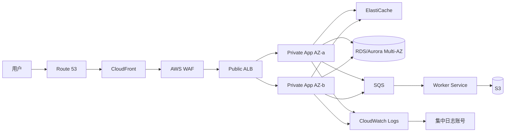

# AWS 企业架构从零建设与高频面试题

这份文档面向需要回答 AWS 云平台、云架构、DevOps、平台工程和生产运维问题的候选人。重点不是罗列服务名称，而是从企业第一次落地 AWS 的角度，说明资源如何组织、流量如何流动、风险如何控制，以及每一个关键选择背后的原因。

---

## 一、面试回答的主线

遇到“请你从零设计一个 AWS 平台”这类开放题，可以按下面的顺序回答：

1. **业务目标**：用户在哪里，流量和数据规模多大，延迟、可用性、合规和 RTO/RPO 是什么。
2. **组织模型**：如何划分 Organization、OU、账号、环境和责任边界。
3. **基础治理**：身份、权限、日志、审计、预算、策略和自动化护栏。
4. **网络基座**：Region、Availability Zone、VPC、子网、路由、出口、DNS 和跨网络连接。
5. **应用平台**：根据工作负载选择 EC2、ECS、EKS、Lambda 或其他托管服务。
6. **数据平台**：分别判断对象、关系、键值、缓存、文件和消息数据的特点。
7. **可靠性与安全**：消除单点故障，建立备份、恢复、故障转移和纵深防御。
8. **交付与运营**：IaC、CI/CD、监控、告警、变更、回滚和成本管理。
9. **验证取舍**：说明为什么选择某个服务，以及规模、成本或合规变化时如何演进。

面试中不要只说“使用高可用架构”。要说清楚：**故障域是什么、故障如何被发现、流量如何切换、数据如何恢复、恢复目标是什么**。

---

## 二、企业从零搭建 AWS 的参考架构

### 2.1 推荐的企业分层

建议使用 AWS Organizations 管理多个账号，而不是把生产、测试和安全资源全部放进一个账号：

| 账号或 OU | 主要职责 | 典型资源 |
|---|---|---|
| Management | 组织级管理和账单，尽量不承载业务 | Organizations、Billing、IAM 管理 |
| Security OU | 安全检测、审计和合规 | Log Archive、Security Tooling、CloudTrail、Config、GuardDuty |
| Infrastructure OU | 共享网络和平台能力 | Network、Transit Gateway、DNS、镜像、共享服务 |
| Workloads OU | 业务工作负载 | Production、Staging、Development、Sandbox |
| Suspended OU | 隔离待处理账号 | 账号停用和调查 |

推荐的基本原则：

- 生产、非生产和安全审计至少按账号隔离；重要业务可以按业务域继续拆分。
- 使用 **IAM Identity Center** 统一员工登录，通过 permission set 分配权限，避免长期使用 IAM 用户访问生产。
- 使用 **SCP** 作为组织级权限护栏。SCP 只能限制最大权限，不能直接授予权限。
- 使用 CloudTrail、AWS Config 和安全服务把关键日志集中写入专门的日志账号，并启用加密、版本控制和防篡改保护。
- 账号创建、基线、网络、日志和权限尽量通过 IaC 自动化，减少手工漂移。

### 2.2 企业网络基座

一个常见的生产 VPC 可以按以下方式划分：

- **Public subnet**：只放必须接受互联网流量的入口组件，例如 internet-facing ALB、NAT Gateway 的弹性 IP 所在出口路径；应用实例通常不直接放这里。
- **Private application subnet**：放 ECS、EKS、EC2 或内部服务，默认不接受来自互联网的入站流量。
- **Private data subnet**：放 RDS、ElastiCache 等数据服务的网络接口和安全边界。
- 每个层级至少跨两个 Availability Zone；跨 AZ 的资源应考虑流量费用和故障切换行为。
- 通过 Internet Gateway 提供公网上行入口；私有子网通过 NAT Gateway 访问公网更新源。高可用生产环境通常每个 AZ 部署 NAT Gateway，避免单 AZ 出口成为故障点。
- 对 S3、DynamoDB 等 AWS 服务优先使用 VPC Endpoint，降低公网暴露面和 NAT 流量成本。接口型 Endpoint 还可以访问更多 AWS API 服务。
- 使用 Security Group 做实例级有状态访问控制，使用 Network ACL 做子网级无状态边界控制。通常先用 Security Group 表达主要访问关系。
- 使用 Route 53 Private Hosted Zone 管理内部 DNS；跨 VPC 可通过 Route 53 Resolver 或共享 DNS 方案解析。
- 多 VPC 或多账号规模较大时，使用 Transit Gateway 统一连接；少量 VPC 可使用 VPC Peering，但要注意非传递路由和连接数量管理。

### 2.3 参考流量路径

下面是一条典型的互联网业务路径。实际实现时，入口也可以替换为 CloudFront、API Gateway 或私有接入方式：

这张图不能代替设计说明。面试时应补充：

- ALB 只把流量转发到健康目标，应用实例位于私有子网。
- WAF 负责常见 Web 攻击规则、速率限制和 IP/地理策略，不能代替应用自身的认证授权。
- 同步请求和异步任务分开：用户请求只完成必要动作，耗时任务进入 SQS，由 Worker 消费。
- 数据库访问通过最小化的 Security Group 关系控制；应用不直接使用数据库主账号密码。
- 所有组件跨 AZ 部署，但数据库、缓存、队列和存储的故障语义仍然要单独验证。

### 2.4 服务选型速查

| 需求 | 首选方向 | 需要说明的取舍 |
|---|---|---|
| 稳定运行的虚拟机工作负载 | EC2 + Auto Scaling | 控制力强，但需要管理补丁、容量和 AMI |
| 容器化 Web/API，团队不想管理节点 | ECS on Fargate | 运维简单，单任务成本和底层控制力需要评估 |
| 容器平台和 Kubernetes 生态 | EKS | 能力强，但控制面之外的节点、升级和运维复杂度更高 |
| 短时、事件驱动任务 | Lambda | 免服务器管理，但要关注超时、并发、冷启动和运行时限制 |
| 托管关系数据库 | RDS/Aurora | 适合事务和 SQL；仍需设计连接、备份、扩展和故障转移 |
| 高吞吐键值访问 | DynamoDB | 需要提前设计分区键、访问模式和容量策略 |
| 对象和数据湖 | S3 | 高耐久对象存储，需配置生命周期、权限、版本和删除保护 |
| 解耦和削峰 | SQS | 消费者需要幂等；标准队列至少一次，FIFO 提供顺序和去重能力但有约束 |
| 多播通知 | SNS | 发布订阅；复杂路由和事件规则通常考虑 EventBridge |
| 事件总线和跨系统集成 | EventBridge | 规则路由、事件归档和 SaaS/账号集成更方便 |
| 缓存和会话 | ElastiCache | 不能把缓存当作唯一数据源，需设计失效和故障降级 |

---

## 三、AWS 基础高频面试题

### 3.1 云和 AWS 基础概念

#### 1. 什么是 Region、Availability Zone 和 Edge Location？

- **Region** 是 AWS 的地理区域，包含多个隔离的 Availability Zone。
- **Availability Zone** 是 Region 内具有独立供电、网络和基础设施的故障域；AZ 之间低延迟互联，但不等于绝对不会同时故障。
- **Edge Location** 是 CloudFront 等边缘服务靠近用户的缓存或接入点。
- 选择 Region 时需要同时考虑用户延迟、服务可用性、数据驻留、合规、价格和灾备距离。

#### 2. AWS 的共享责任模型是什么？

AWS 负责云本身的安全，例如数据中心、硬件、基础设施和托管服务的底层部分。客户负责云中的安全，例如 IAM 权限、操作系统补丁、网络规则、应用漏洞、数据加密和备份。使用托管服务并不意味着客户完全不负责安全。

#### 3. AWS 高可用和高耐久有什么区别？

- **可用性**关注服务在需要时是否能正常访问，通常通过多 AZ、健康检查、自动切换和冗余提升。
- **耐久性**关注数据是否长期不丢失，例如 S3 的多份底层冗余、备份和跨区域复制。
- 高耐久不代表应用一定高可用；数据可能没丢，但恢复过程仍需要时间。

#### 4. Multi-AZ 和 Multi-Region 的区别是什么？

Multi-AZ 主要防范单个 AZ 的故障，通常延迟低、实现成本可控，适合作为同一区域生产高可用基线。Multi-Region 主要应对区域级故障、全球访问或数据驻留需求，但会引入跨区域复制、数据一致性、DNS 切换、运维和成本复杂度。没有 RTO/RPO 和业务理由时，不应为了“看起来更高级”直接上 Multi-Region。

#### 5. 什么是 Well-Architected Framework？

六个核心支柱是：**运营卓越、安全性、可靠性、性能效率、成本优化、可持续性**。回答架构题时可以用它检查是否遗漏了非功能需求，但不能只背支柱名称，要把支柱落到具体控制措施和验证方式上。

#### 6. 什么是弹性、可扩展性和高可用？

- **可扩展性**是应对负载增长的能力，可以是纵向扩展或横向扩展。
- **弹性**是负载变化或故障发生后，系统能够自动恢复或调整资源的能力。
- **高可用**是降低服务不可用时间的设计目标。
- 例如 Auto Scaling 能提升扩展和弹性，但还需要多 AZ、健康检查、无状态应用和数据层方案才能形成高可用架构。

---

### 3.2 IAM 与安全基础

#### 7. IAM User、Role、Group 和 Policy 有什么区别？

- User 代表长期身份，适合极少数特殊场景，不应作为应用运行身份。
- Role 是可被 AWS 服务、用户或其他账号临时承担的身份，优先用于 EC2、ECS Task、Lambda 和跨账号访问。
- Group 用于组织 IAM 用户；企业员工登录更推荐 IAM Identity Center。
- Policy 是 JSON 权限策略，决定允许或拒绝哪些动作、资源和条件。

#### 8. 什么是最小权限？如何落地？

先按真实工作流授予所需动作和资源，再通过条件限制 Region、标签、来源 VPC Endpoint、MFA 或时间等。使用 IAM Access Analyzer、CloudTrail 和定期权限审查发现过宽权限。应用使用专用 Role，跨账号通过 AssumeRole，并避免把 `AdministratorAccess` 当作默认解决方案。

#### 9. Identity Policy 和 Resource Policy 有什么区别？

Identity Policy 绑定在 User、Group 或 Role 上；Resource Policy 直接绑定到 S3 Bucket、SQS Queue、KMS Key 等资源上。跨账号访问通常需要身份侧和资源侧都允许，且不能被显式 Deny、SCP 或权限边界阻断。显式 Deny 优先于 Allow。

#### 10. KMS、Secrets Manager 和 Parameter Store 如何选择？

- KMS 负责密钥和加解密操作，不是通用密码库。
- Secrets Manager 适合数据库密码、API Token 等需要安全存储、版本和轮换的机密。
- Systems Manager Parameter Store 适合配置参数，也支持 SecureString；简单参数成本和使用方式更直接。
- 应用应通过 Role 在运行时读取，不把密钥写入代码、镜像、AMI 或日志。

#### 11. CloudTrail、CloudWatch、AWS Config、GuardDuty 分别做什么？

- CloudTrail：记录 AWS API 调用，回答“谁在什么时候对哪个资源做了什么”。
- CloudWatch：指标、日志、告警、事件和运行时观测。
- AWS Config：记录资源配置状态和合规规则，回答“资源是否符合基线”。
- GuardDuty：基于日志和威胁情报检测可疑行为。
- Security Hub：聚合安全发现并进行安全标准检查。

#### 12. 如何保护 S3 Bucket？

启用 Block Public Access，使用 Bucket Policy 和 IAM 最小权限，开启默认加密、版本控制和必要的删除保护。敏感数据可以使用 SSE-KMS、访问日志或 CloudTrail Data Events、Macie 分类和生命周期策略。跨账号访问要明确资源策略、组织条件和审计需求，不能只依赖“Bucket 不公开”这一层保护。

#### 13. WAF、Shield 和 Security Group 的边界是什么？

- WAF 过滤 HTTP/HTTPS 请求，可做托管规则和速率限制。
- Shield 主要提供 DDoS 防护，Shield Advanced 适用于更高等级的保护与响应能力。
- Security Group 在 ENI/实例级控制网络连接，不理解 HTTP 业务语义。
- 三者分别位于不同层次，不能互相替代。

---

### 3.3 VPC 与网络高频题

#### 14. 公有子网和私有子网如何判断？

子网是否“公有”取决于其路由表是否有到 Internet Gateway 的路由，而不是子网名称。私有子网没有到 IGW 的直接路由；如果通过 NAT Gateway 访问互联网，它仍然是私有子网。数据库通常放在无互联网出口或受控出口的数据子网中。

#### 15. Internet Gateway、NAT Gateway 和 NAT Instance 有什么区别？

Internet Gateway 是 VPC 与互联网之间的水平扩展网关。NAT Gateway 允许私有子网主动访问公网，但不接受公网主动入站连接，属于托管服务，生产环境通常按 AZ 部署。NAT Instance 是用户管理的 EC2，控制力更强但需要补丁、扩展、故障转移和运维，不是默认首选。

#### 16. Security Group 和 Network ACL 的区别？

Security Group 有状态，允许返回流量自动通过，只能写 Allow；适合实例或 ENI 的精细访问控制。NACL 作用于子网，无状态，需要分别允许入站和返回流量，并支持显式 Deny。排错时先检查路由、Security Group、NACL、DNS 和应用监听端口的完整链路。

#### 17. VPC Peering 和 Transit Gateway 如何选择？

VPC Peering 适合少量 VPC 的点到点互联，不支持传递路由。Transit Gateway 是中心化网络枢纽，适合大量 VPC、多个账号、共享网络和统一路由策略，但要考虑路由表隔离、跨区域费用和集中式故障影响。

#### 18. VPC Endpoint 有哪些价值？

它允许 VPC 内资源通过 AWS 私网访问 AWS 服务，减少通过 NAT 或公网的路径，降低暴露面和部分网络成本。Gateway Endpoint 主要用于 S3 和 DynamoDB；Interface Endpoint 基于 PrivateLink，可访问更多服务。仍需配置 Endpoint Policy、Security Group、DNS 和路由，并确认服务是否支持该访问方式。

#### 19. ALB、NLB 和 Gateway Load Balancer 如何区别？

- ALB 工作在七层，支持 HTTP/HTTPS、路径和主机名路由、TLS 终止，适合 Web/API。
- NLB 工作在四层，性能高、延迟低，支持 TCP/UDP/TLS 和静态 IP，适合非 HTTP 或极高吞吐场景。
- Gateway Load Balancer 用于透明插入防火墙、入侵检测等网络虚拟设备。
- 选择时从协议、路由能力、源 IP、连接模型、性能和安全设备集成需求判断。

#### 20. 如何排查 EC2 无法访问某个服务？

按数据路径检查：DNS 是否解析正确；目标端口是否监听；源实例和目标资源的 Security Group 是否允许；NACL 是否允许双向临时端口；路由表、IGW/NAT/Endpoint 是否正确；目标服务是否有应用层拒绝或认证问题；最后查看 VPC Flow Logs、CloudTrail、应用日志和系统日志。不要一开始就盲目放开 `0.0.0.0/0`。

---

### 3.4 计算、容器与无服务器

#### 21. EC2 Auto Scaling Group 如何实现高可用？

将实例分布到多个 AZ，使用 Launch Template 固化 AMI、实例类型、IAM Role、网络和启动配置；接入 ALB Target Group 健康检查；配置最小、期望和最大容量，并结合 CPU、请求数、队列长度等指标扩缩容。还要考虑实例启动时间、连接排空、生命周期钩子、Spot 中断和应用无状态化。

#### 22. ECS、EKS 和 Lambda 如何选择？

- ECS 适合希望使用 AWS 原生容器编排、降低平台运维复杂度的团队。
- EKS 适合已经有 Kubernetes 能力、需要 Kubernetes 生态或跨环境一致性的组织，但集群和插件运维成本更高。
- Lambda 适合事件驱动、执行时间可控、无状态的函数工作负载。
- 判断标准包括团队技能、运行时限制、发布方式、网络需求、稳定负载成本、可移植性和合规。

#### 23. ECS Service、Task Definition 和 Task 有什么关系？

Task Definition 是容器运行模板，声明镜像、CPU/内存、端口、环境变量、日志和 Task Role。Task 是一次运行实例。Service 负责维持期望的 Task 数量、部署新版本、关联负载均衡和健康检查。生产部署还要设置滚动或蓝绿策略、容量提供方、自动扩缩容和日志。

#### 24. Lambda 的常见限制和设计注意点是什么？

函数有执行超时、并发、临时磁盘和运行时资源限制，适合短时无状态任务。需要处理重试和重复投递，使用幂等键；避免把大量连接直接打到数据库，必要时使用 RDS Proxy；通过 reserved concurrency 保护下游；把长任务拆成 Step Functions、SQS 或容器任务；对 VPC、冷启动和依赖包大小进行测试。

#### 25. 什么是蓝绿、滚动和金丝雀发布？

- 滚动发布逐步替换实例，成本较低，但新旧版本可能同时服务。
- 蓝绿发布保留两套环境，通过负载均衡或 DNS 切换，回滚清晰但成本更高。
- 金丝雀发布先将少量流量给新版本，根据错误率、延迟和业务指标逐步扩大，适合降低发布风险。
- 发布策略必须配合数据库兼容、迁移回滚和自动验收。

---

### 3.5 存储、数据库和消息

#### 26. S3、EBS、EFS 分别适合什么场景？

- S3 是区域级对象存储，适合静态文件、备份、日志和数据湖，不以文件系统挂载为主要访问模型。
- EBS 是绑定到单个 AZ 内 EC2 的块存储，适合操作系统和数据库磁盘；快照存储在 S3 管理的底层体系中。
- EFS 是可被多个 AZ 的实例并发挂载的托管文件系统，适合共享文件，但需评估吞吐、延迟和成本。
- 选择依据是访问语义、共享方式、性能、耐久性、备份和成本，而不是简单比较“哪个更快”。

#### 27. RDS Multi-AZ 和 Read Replica 的区别？

Multi-AZ 主要用于高可用和故障转移，通常是同步复制的备用实例，备用实例不作为普通读流量目标。Read Replica 主要用于读扩展和报表隔离，通常是异步复制，可以跨 Region，但存在复制延迟。二者可以同时使用，分别解决可用性和读取扩展问题。

#### 28. RDS 和 DynamoDB 如何选择？

需要复杂 JOIN、事务、成熟 SQL 生态和关系约束时优先考虑 RDS/Aurora。需要大规模低延迟键值访问、弹性扩展并且访问模式可以提前建模时考虑 DynamoDB。DynamoDB 不是“没有 Schema 的关系数据库”，分区键设计、热点、二级索引、条件写和容量模式决定了系统质量。

#### 29. 如何设计数据库高可用和连接保护？

应用跨 AZ 部署，通过数据库连接池、合理超时和重试访问数据库；数据库采用 Multi-AZ、自动备份和跨区域备份需求。避免每个容器或 Lambda 无限建立连接；使用 RDS Proxy 或连接池方案；只读流量使用 Read Replica 或缓存；为故障切换验证 DNS、连接重建和事务重试行为。

#### 30. SQS Standard 和 FIFO 如何选择？

Standard 提供高吞吐，但消息可能重复或乱序，因此消费者必须幂等。FIFO 用于需要消息顺序和去重的场景，但吞吐、分组键和实现约束需要评估。无论哪种队列，都应设置 Visibility Timeout、Dead Letter Queue、重试次数和监控指标。

#### 31. 为什么消息消费者必须幂等？

SQS、Lambda 触发器、网络重试和部署故障都可能使同一业务消息被处理多次。可使用业务唯一 ID、幂等记录表、DynamoDB 条件写、数据库唯一约束或状态机记录处理结果。幂等不仅是“判断日志是否存在”，还要保证业务写入与幂等状态更新的一致性。

---

### 3.6 可观测性、交付与运营

#### 32. 如何设计 CloudWatch 监控？

按 **基础设施、平台、应用、业务** 四层建立指标：CPU、内存、网络和磁盘；ALB 5xx、目标健康数和延迟；容器重启、队列积压、Lambda 错误和节流；订单成功率、支付失败率等业务指标。告警应区分症状和原因，设置分级通知、去重、维护窗口和 Runbook，避免只监控 CPU。

#### 33. 日志应该如何建设？

应用使用结构化 JSON 日志，包含 request ID、trace ID、服务名、版本、环境和业务关联 ID，避免写入密码、Token 和敏感个人数据。通过 CloudWatch Logs 采集，按保留期和成本分层，重要审计日志集中到日志账号并设置访问隔离。日志要能支持排错、审计和合规，而不是无限期保存所有内容。

#### 34. CloudTrail 如何做企业级审计？

组织级 Trail 覆盖所有账号和 Region，将日志写入专用 Log Archive 账号；启用必要的 S3 和 Lambda 数据事件，谨慎评估数据事件量和费用；使用 KMS、Bucket Policy、版本控制和对象锁等方式保护日志；配置异常 API 调用、根用户使用、CloudTrail 停止等告警。

#### 35. 为什么企业需要 IaC？

IaC 让网络、IAM、计算和监控配置可审查、可复现、可测试和可回滚，减少控制台手工变更和环境漂移。可以使用 CloudFormation、CDK、Terraform 或组织已经标准化的工具。生产上应使用远程状态、状态锁、模块版本、计划审批、漂移检测和最小化部署权限。

#### 36. 如何设计 AWS CI/CD？

典型阶段包括：代码检查和单元测试、镜像或制品构建、依赖和安全扫描、部署到测试环境、集成测试、人工或策略审批、生产渐进式发布、自动验收和回滚。代码管道的 Role 要最小权限，制品应不可变并带版本，数据库迁移要向前向后兼容，部署结果和审计记录需要可追踪。

#### 37. 如何管理 AWS 成本？

先建立账号、环境、业务、成本中心和应用标签标准，再使用 Cost Explorer、Budgets、Cost Anomaly Detection 和 CUR 分析。重点关注 NAT Gateway、跨 AZ/Region 流量、未使用 EBS、闲置 Elastic IP、日志保留、数据库实例和过度预留容量。结合 Auto Scaling、S3 生命周期、Graviton、Savings Plans 或 Reserved Instances 做优化，但不能牺牲 RTO、性能和合规。

---

## 四、企业从零建设的实施顺序

### 阶段 0：确认约束

- 盘点业务域、数据分类、用户位置、依赖系统和合规要求。
- 定义 SLI/SLO、SLA、RTO、RPO、峰值流量、增长率和预算。
- 确认哪些工作负载可以迁移，哪些必须保留或采用混合云。

### 阶段 1：建立 Landing Zone

- 创建 Organization 和 OU，拆分管理、安全、网络、日志和工作负载账号。
- 配置 IAM Identity Center、permission set、SCP、权限边界和 break-glass 流程。
- 建立组织级 CloudTrail、Config、GuardDuty、Security Hub 和集中日志。
- 建立账号、VPC、日志、加密、标签和备份的自动化基线。

### 阶段 2：建设网络和连接

- 规划不重叠的 CIDR，划分多 AZ 的公有、应用和数据子网。
- 配置路由表、IGW、按 AZ 的 NAT Gateway、VPC Endpoint、DNS 和流日志。
- 根据需要接入 VPN 或 Direct Connect，并定义本地到云、账号间和 VPC 间的路由边界。
- 用 Network Firewall、AWS Firewall Manager 或现有企业安全设备满足集中检查需求。

### 阶段 3：建设平台和交付能力

- 标准化 AMI、容器镜像、ECS/EKS 集群、运行时 Role、日志和密钥读取方式。
- 建立代码仓库、构建、制品、扫描、部署、审批和回滚流程。
- 通过 CloudFormation/CDK/Terraform 管理环境，禁止生产依赖个人控制台操作。

### 阶段 4：迁移业务和数据

- 先做依赖梳理、数据分级和迁移演练，再选择重托管、平台迁移、重构或保留策略。
- 设计数据库迁移的全量、增量、校验、切换和回滚方案。
- 为每个服务建立健康检查、超时、重试、幂等、限流、降级和告警。

### 阶段 5：验证运营能力

- 执行故障演练：实例故障、AZ 故障、数据库切换、队列积压、密钥轮换、Region 级恢复。
- 验证备份不是“配置成功”，而是能在目标时间内恢复并通过数据校验。
- 定期做 Well-Architected Review、权限审查、成本审查和架构演进评估。

---

## 五、场景题的回答模板

### 场景一：电商网站需要承受促销流量

可以这样回答：

1. Route 53 做 DNS，CloudFront 缓存静态内容，WAF 做 Web 规则和速率限制。
2. ALB 跨 AZ 分发到私有子网中的无状态 ECS/EC2 服务，并基于请求数或延迟自动扩容。
3. 秒杀、邮件、库存同步等非同步工作进入 SQS，通过 Worker 削峰；消费者必须幂等并配置 DLQ。
4. 热点数据使用 ElastiCache，但订单最终状态落到事务数据库；库存扣减需要事务、条件更新或专门的并发控制。
5. 预先压测缓存命中、数据库连接数、队列吞吐、扩容时间和限流行为，而不是只看实例 CPU。

### 场景二：生产数据库发生故障

先确认故障范围和业务影响，避免未经判断的手工切换造成数据损坏。检查 RDS 事件、CloudWatch、连接错误和应用日志；如果是 Multi-AZ 故障转移，确保应用连接池能重新建立连接。若需要从备份恢复，要按 RTO 执行恢复、数据校验、应用切换和业务确认。最后完成根因分析、告警改进和故障演练，而不是只记录“重启后恢复”。

### 场景三：要求满足 RPO 近似 0 和 RTO 低于 1 小时

先澄清业务是否真的需要“近似 0”，以及数据写入顺序、跨 Region 一致性和预算。可以评估跨 AZ 的同步高可用、跨 Region 的数据库复制或全球数据库、S3 跨 Region Replication、Route 53 健康检查与故障切换，以及 IaC 快速重建。最终必须通过实际演练证明 RPO/RTO，不能只凭架构图承诺。

### 场景四：发现某个 IAM Role 权限过大

先从 CloudTrail 和 Access Analyzer 识别实际使用的动作和资源，生成收敛后的候选策略；在非生产验证后分阶段替换，保留回滚方案和 break-glass 访问。确认没有依赖隐藏在定时任务、故障恢复脚本或跨账号流程中，再移除宽权限并持续监控 AccessDenied 和异常调用。

---

## 六、面试官常见追问与答题要点

| 追问 | 不够好的回答 | 更好的回答方向 |
|---|---|---|
| 为什么不用一个大账号？ | 管理方便 | 说明故障、权限、账单、审计和环境隔离边界 |
| 为什么应用放私有子网？ | 更安全 | 说明入口、出口、路由、Endpoint 和运维访问路径 |
| 为什么用了 NAT Gateway？ | 私有实例需要上网 | 说明用途、按 AZ 高可用、成本和 Endpoint 优化 |
| 为什么不用 Multi-Region？ | 太复杂 | 用 RTO/RPO、数据一致性、用户位置、成本和运维能力解释 |
| 为什么选择 ECS 不选 EKS？ | ECS 更简单 | 结合团队技能、生态需求、运行时、可移植性和运维成本 |
| 数据库如何扩展？ | 加大实例 | 区分读写、连接、缓存、分片、Read Replica 和业务访问模式 |
| 如何保证消息不重复？ | SQS 会去重 | 说明 Standard 至少一次语义和消费者幂等设计 |
| 如何证明备份可用？ | 已开启自动备份 | 说明恢复演练、数据校验、RTO 测量和定期演练 |
| 如何防止误删生产资源？ | 依靠管理员小心操作 | 说明 SCP、权限边界、审批、删除保护、备份和 break-glass 审计 |
| 成本为什么突然上涨？ | 看账单 | 从服务、账号、Region、标签、用量、网络流量和异常检测定位 |

---

## 七、面试前必须能画出的五张图

1. **多账号 Landing Zone 图**：Management、Security、Log Archive、Network 和 Workload 账号的关系。
2. **多 AZ VPC 图**：公有、应用、数据子网，路由表、NAT、Endpoint 和安全边界。
3. **典型 Web 请求图**：Route 53、CloudFront、WAF、ALB、应用、缓存、数据库和队列。
4. **跨账号交付图**：代码仓库、构建、制品、审批、部署 Role 和多环境发布。
5. **灾备与恢复图**：备份、复制、健康检查、故障切换、数据校验和回滚路径。

每张图都要能够回答四个问题：**正常流量怎么走、故障发生在哪里、谁负责恢复、如何证明恢复目标达成**。

---

## 八、常见误区

- 把“多 AZ”当成完整灾备，忽略备份恢复和区域级故障。
- 只画服务图，不写流量方向、端口、路由、权限和故障切换。
- 让应用使用长期 Access Key、数据库主账号或写死在代码中的 Secret。
- 把安全组全部放开，把 WAF 当成身份认证，把 CloudTrail 当成实时应用监控。
- 把 DynamoDB 当作无需设计的数据库，把缓存当作唯一真相源。
- 只用 CPU 做扩缩容指标，忽略请求延迟、并发、队列积压和业务成功率。
- 只说“配置了备份”，却没有恢复演练、数据校验和 RTO 证据。
- 为了追求技术先进而使用 EKS、Multi-Region 或复杂网络，却无法说明业务收益。
- 忽略 NAT、跨 AZ 流量、日志、未使用资源和数据传输带来的成本。

---

## 九、最终检查清单

- [ ] 能解释为什么需要多账号，以及 SCP、IAM Role 和 Identity Center 的边界。
- [ ] 能从公网入口一直讲到应用、缓存、数据库和异步队列的流量路径。
- [ ] 能区分 Multi-AZ、Read Replica、备份、跨 Region 复制和故障切换。
- [ ] 能根据工作负载解释 EC2、ECS、EKS、Lambda、RDS、DynamoDB 和 S3 的选择。
- [ ] 能说明最小权限、密钥管理、集中审计、WAF 和安全检测如何配合。
- [ ] 能讲出一套可执行的 IaC、CI/CD、监控、告警和回滚流程。
- [ ] 能用真实指标解释 SLO、RTO、RPO、性能、成本和恢复演练结果。
- [ ] 面对开放题时先澄清约束，再给架构，再讲取舍和验证方式。

> 面试的高分答案不是“我知道多少 AWS 服务”，而是能把业务目标、故障模型、安全边界、数据一致性、运维流程和成本约束连成一个可落地的系统。
