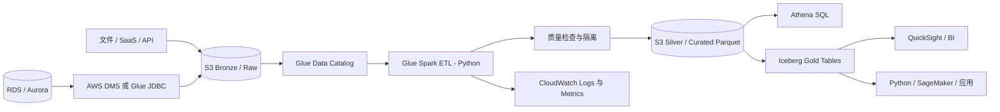

# AWS 数据平台开发：Glue ETL、Python、SQL 与数据库实战指南

> 面向 Python 和 AWS 开发人员。本指南以可生产化的数据链路为主线，讲解 AWS Glue ETL、Python/PySpark、SQL、关系数据库和数据湖如何协同工作，并覆盖基础使用、进阶模式、安全、性能、成本和运维。

## 一、问题全景：数据平台不是单个 Glue Job

一个可用的数据平台，需要把数据采集、存储、建模、计算、治理和消费组织成可追溯的闭环：

```text
业务数据库 / SaaS / 文件 / 流
        -> 落地与保留原始证据
        -> 目录、模式和权限治理
        -> 清洗、校验、标准化、关联
        -> 分层数据集与指标
        -> SQL 分析、BI、机器学习、应用回写
        -> 质量、成本、血缘、告警和重跑
```

在 AWS 上，典型职责分工如下：

| 层次 | 常用服务与技术 | 主要职责 |
|---|---|---|
| 数据源 | RDS/Aurora、DynamoDB、SaaS、文件、事件流 | 产生事务、日志、主数据和事件 |
| 采集 | AWS DMS、Glue JDBC、Lambda、DataSync、Kinesis | 批量导入、CDC、文件和流式摄取 |
| 数据湖 | Amazon S3、KMS、Lake Formation | 低成本保存原始与处理后数据，治理访问 |
| 元数据 | Glue Data Catalog、Crawler、Schema Registry | 表、分区、字段和模式发现 |
| ETL | Glue Spark Job、Glue Python Shell、Glue Studio | 清洗、转换、聚合、质量检查和写入 |
| 查询与服务 | Athena、Redshift、RDS/Aurora、OpenSearch | SQL 分析、数仓、在线服务与检索 |
| 编排与观测 | EventBridge、Step Functions、Glue Workflow、CloudWatch | 调度、重试、依赖、日志、告警与审计 |

核心原则是：**S3 保存不可变的事实，Glue 管理元数据并执行可重复转换，Python 实现规则和计算，SQL 表达集合逻辑与消费语义，数据库负责各自适合的事务或查询负载。**

---

## 二、参考架构与数据分层

### 2.1 一条端到端的数据路径



### 2.2 Bronze、Silver、Gold 分层

| 层 | 数据特性 | 典型动作 | 关键规则 |
|---|---|---|---|
| Bronze / Raw | 尽量接近来源，保留原始证据 | 按来源和到达时间落盘 | 不覆盖、不随意修正、保留摄取元数据 |
| Silver / Curated | 标准化、去重、可关联 | 类型转换、字段命名、脏数据隔离、主键校验 | 可重跑、口径统一、Parquet 分区 |
| Gold / Serving | 面向指标和业务消费 | 聚合、宽表、维度模型、特征表 | 访问稳定、文档化、性能优先 |

推荐的 S3 路径约定：

```text
s3://company-data-raw/orders/source=aurora/ingest_date=2026-09-30/...
s3://company-data-curated/orders/order_date=2026-09-30/...
s3://company-data-serving/sales_daily/business_date=2026-09-30/...
s3://company-data-quarantine/orders/reason=invalid_amount/...
```

不要把分区设计成每个 `customer_id`、`request_id` 或秒级时间戳。分区过细会产生大量小文件和元数据开销。优先选择最常见查询过滤条件，如日期、区域或业务域，并用文件大小和真实查询计划验证设计。

### 2.3 数据格式选择

| 格式 | 适用场景 | 注意点 |
|---|---|---|
| CSV / JSON | 原始接入、交换、调试 | 类型弱、体积大、查询成本高，不宜作为长期分析主格式 |
| Parquet | 批处理、Athena、Glue、列式分析 | 列裁剪和压缩好，适合数据湖表 |
| Avro | 事件和模式演进 | 常用于消息或行式序列化 |
| Apache Iceberg | 支持更新、删除、时间旅行的数据湖表 | 需要维护快照、压缩和并发写入策略 |

Parquet 是大多数 Glue/Athena 分析表的合理默认值。需要可靠的 `MERGE`、行级删除、模式演进和快照回溯时，评估 Iceberg；不要为了“支持更新”而把分析数据重新塞回事务数据库。

---

## 三、AWS Glue 基础：目录、连接与任务

### 3.1 Glue Data Catalog 的角色

Glue Data Catalog 是元数据层，不保存业务数据本身。它记录数据库、表、列、分区和 S3 位置，使 Glue、Athena、EMR 和部分 BI 工具对同一份湖中数据使用一致的表定义。

创建表有两种常见方式：

- **Crawler**：适合探索阶段、来源结构相对稳定且文件布局规范的场景。
- **显式 DDL / IaC**：适合生产表。字段、分区、表属性和位置明确受代码审查和发布流程控制。

Crawler 方便但不应成为生产模式管理的唯一来源。它可能把异常文件推断成错误类型，或在未经评审的情况下变更模式。生产数据集应有模式契约、变更流程和回滚策略。

### 3.2 Glue Job 类型如何选择

| Job 类型 | 使用场景 | 不适合的场景 |
|---|---|---|
| Glue Spark Job | 大规模关联、聚合、分区读写、复杂 ETL | 只需几十秒 API 调用或轻量脚本 |
| Glue Python Shell | 轻量 Python 脚本、SDK 调用、小型文件处理 | 大规模分布式 DataFrame 转换 |
| Glue Streaming | 持续处理 Kinesis/Kafka 流 | 每日一次的简单批任务 |
| Lambda | 短时间事件响应、轻量编排 | 大文件 ETL 和长时间 Spark 计算 |

不要把 Glue 看作“一个能跑 Python 的地方”。Glue Spark Job 的核心是由 Spark 执行分布式计算：数据布局、分区、shuffle、倾斜和小文件问题会直接决定成本与稳定性。

### 3.3 任务基础配置清单

一个生产 Glue Job 至少应明确：

1. **IAM Role**：只允许访问任务需要的 S3 前缀、Catalog 表、KMS 密钥和日志资源。
2. **运行时与依赖**：选定团队验证过的 Glue runtime；第三方依赖使用版本固定的 wheel/requirements，并测试兼容性。
3. **网络**：访问私有 RDS 时配置 Glue Connection、子网和 Security Group；确认到 S3、Secrets Manager、CloudWatch 的网络路径。
4. **作业参数**：传入环境、业务日期、输入/输出位置、回填窗口等，不将其写死在脚本中。
5. **容量与超时**：从小规模和真实数据基准开始；设置超时、并发限制、失败重试和成本预算告警。
6. **日志与指标**：使用 CloudWatch Logs，记录输入行数、输出行数、拒绝行数、水位线和执行版本。

建议将脚本、Catalog 表、Connection、IAM Policy、KMS、S3 Bucket Policy 和告警全部用 CDK、CloudFormation 或 Terraform 管理，避免控制台手工配置漂移。

---

## 四、Python 与 PySpark：在 Glue 中正确处理数据

### 4.1 最小 Glue Spark Job

下面的例子读取 Catalog 表，清洗订单数据并写入 Parquet。它展示了 Glue 上常用的 Python/PySpark 结构：

```python
import sys
from awsglue.context import GlueContext
from awsglue.job import Job
from awsglue.utils import getResolvedOptions
from pyspark.context import SparkContext
from pyspark.sql import functions as F

arguments = getResolvedOptions(
    sys.argv,
    ["JOB_NAME", "RUN_DATE", "SOURCE_DATABASE", "SOURCE_TABLE", "TARGET_PATH"],
)

spark_context = SparkContext.getOrCreate()
glue_context = GlueContext(spark_context)
spark = glue_context.spark_session
job = Job(glue_context)
job.init(arguments["JOB_NAME"], arguments)

source = glue_context.create_dynamic_frame.from_catalog(
    database=arguments["SOURCE_DATABASE"],
    table_name=arguments["SOURCE_TABLE"],
    push_down_predicate=f"ingest_date = '{arguments['RUN_DATE']}'",
)

orders = source.toDF()
valid_orders = (
    orders
    .withColumn("order_id", F.col("order_id").cast("string"))
    .withColumn("customer_id", F.col("customer_id").cast("string"))
    .withColumn("amount", F.col("amount").cast("decimal(18,2)"))
    .withColumn("order_timestamp", F.to_timestamp("order_timestamp"))
    .filter(F.col("order_id").isNotNull())
    .filter(F.col("amount") >= F.lit(0))
    .dropDuplicates(["order_id"])
    .withColumn("order_date", F.to_date("order_timestamp"))
)

(
    valid_orders.write
    .mode("append")
    .partitionBy("order_date")
    .parquet(arguments["TARGET_PATH"])
)

job.commit()
```

这个脚本需要在真实项目中补充模式校验、异常行隔离、幂等写入、输入输出计数和数据质量指标。核心理念是：**Spark 的转换是声明式和惰性的，只有 `write`、`count`、`collect` 等 action 才会触发计算。**

### 4.2 DynamicFrame 与 DataFrame

| 对象 | 更适合 | 特点 |
|---|---|---|
| `DynamicFrame` | 半结构化、模式不稳定、Glue 原生转换 | 对嵌套和类型冲突容忍度更高，直接集成 Catalog |
| Spark `DataFrame` | 大部分结构化 ETL、复杂 SQL/窗口/性能调优 | API 丰富、优化器能力强、资料更多 |

常见做法是用 `DynamicFrame` 从 Catalog 或 Glue 连接读取，然后尽早转换为 Spark `DataFrame` 完成主要变换。不要混淆 pandas DataFrame 与 Spark DataFrame：前者通常在单机内存计算，后者是分布式、惰性执行的集合。

### 4.3 Python UDF 的边界

优先使用 `pyspark.sql.functions` 中的原生表达式：

```python
from pyspark.sql import functions as F

enriched = (
    valid_orders
    .withColumn("amount_bucket", F.when(F.col("amount") >= 1_000, "high").otherwise("standard"))
    .withColumn("customer_order_rank", F.row_number().over(
        Window.partitionBy("customer_id").orderBy(F.col("order_timestamp").desc())
    ))
)
```

原生函数能被 Spark 优化和分发。逐行 Python UDF 往往引入跨语言序列化开销、降低查询优化能力，也更难调试。只有没有原生等价表达式且基准测试证明必要时，再考虑 pandas UDF 或标准 UDF。

上例需要额外导入窗口函数：

```python
from pyspark.sql.window import Window
```

### 4.4 Python 工程实践

- 将纯转换规则拆分为无副作用函数，并在本地 PySpark/pytest 中测试。
- 用 `getResolvedOptions` 读取 Job 参数；任何业务日期、路径和环境都不应写死。
- 不记录 PII、密码、完整 token 或原始敏感行到 CloudWatch。
- 每次运行记录 `job_run_id`、代码版本、输入分区、输出位置和数据质量统计。
- 对外部 API、数据库连接和 S3 操作设置超时和可控重试；重试前确保写入幂等。

---

## 五、SQL：连接数据湖、数仓与业务语义

### 5.1 Athena SQL 基础

Athena 直接查询 S3 上由 Glue Catalog 描述的数据。它适合交互式分析、数据验证、报表和临时调查，不适合高频、低延迟的在线事务请求。

```sql
SELECT
    order_date,
    region,
    COUNT(*) AS order_count,
    SUM(amount) AS gross_revenue,
    SUM(amount) / NULLIF(COUNT(DISTINCT customer_id), 0) AS revenue_per_customer
FROM analytics_curated.orders
WHERE order_date BETWEEN DATE '2026-09-01' AND DATE '2026-09-30'
GROUP BY order_date, region
ORDER BY order_date, region;
```

Athena 的成本主要与扫描的数据量有关。有效 SQL 应尽早筛选分区列、只选择所需列、使用 Parquet/ORC，并避免对分区字段套函数导致分区裁剪失效。

### 5.2 SQL 数据处理模式

```sql
WITH ranked_orders AS (
    SELECT
        customer_id,
        order_id,
        order_timestamp,
        amount,
        ROW_NUMBER() OVER (
            PARTITION BY order_id
            ORDER BY ingest_timestamp DESC
        ) AS latest_record_rank
    FROM analytics_curated.orders
),
latest_orders AS (
    SELECT *
    FROM ranked_orders
    WHERE latest_record_rank = 1
)
SELECT
    customer_id,
    DATE_TRUNC('month', order_timestamp) AS order_month,
    SUM(amount) AS monthly_revenue
FROM latest_orders
GROUP BY customer_id, DATE_TRUNC('month', order_timestamp);
```

常用 SQL 构件及作用：

| 构件 | 场景 | 注意事项 |
|---|---|---|
| `JOIN` | 事实表关联维度表 | 先确认连接键唯一性；避免多对多意外放大 |
| `GROUP BY` | 指标汇总 | 明确分母、空值和重复记录规则 |
| `CASE WHEN` | 分类、缺失值和业务规则 | 规则应集中管理和测试 |
| `ROW_NUMBER` | 去重、最新快照、Top N | 排序字段必须反映业务上的“最新” |
| Window Function | 累计值、排名、环比 | 注意分区与排序导致的计算开销 |
| `MERGE` | Iceberg 等支持表格式的增量更新 | 要验证源键唯一、并发与写入提交语义 |

### 5.3 Python 与 SQL 如何分工

| 更适合 SQL | 更适合 Python/PySpark |
|---|---|
| 指标定义、集合运算、关联、窗口函数 | 复杂文件解析、外部 API、复用的业务库、Spark 分布式转换 |
| 数据库内的过滤与聚合下推 | 调用 AWS SDK、质量规则、机器学习特征和模型 |
| BI 可读的语义层和视图 | 调度参数、异常处理、结构化日志和测试 |

实际项目中经常组合使用：Glue Python 读取和标准化原始数据，将结构化数据写入数据湖；Athena SQL 定义可审查的业务指标；Python 再调用 Athena 查询结果用于报表生成、模型训练或质量告警。不要把本可在数据库或 Athena 中高效完成的聚合，先全量下载到 pandas 后再计算。

---

## 六、数据库基础：为 Glue 设计正确的数据接口

### 6.1 OLTP 与 OLAP 不能混为一谈

| 属性 | OLTP：RDS/Aurora 等事务库 | OLAP：S3 + Athena/Redshift 等分析系统 |
|---|---|---|
| 主要目标 | 正确、快速地处理小粒度业务事务 | 扫描和聚合大量历史数据 |
| 数据模型 | 高度规范化，表之间关系清晰 | 宽表、星型/雪花模型、列式格式 |
| 访问模式 | 单行读写、短事务、低延迟 | 大范围扫描、关联和聚合 |
| 一致性 | 强调 ACID、约束和隔离级别 | 强调批量吞吐、分区和查询效率 |

不要让 Glue 对生产主库执行无约束的全表扫描。它会争抢连接、I/O 和锁资源，影响线上业务。优先使用只读副本、DMS CDC、导出快照或经过容量评估的增量读取。

### 6.2 数据库核心概念

- **主键**：稳定标识一行。增量合并和去重通常依赖它；缺少主键时要明确自然键或复合键策略。
- **外键**：表达引用完整性；分析副本可不强制物理外键，但应验证引用关系。
- **索引**：加速指定访问模式，也会增加写入成本。不要因为 Glue 要读取就盲目加索引，要根据 `WHERE`、连接键和执行计划设计。
- **事务与隔离级别**：决定并发读写看到的数据一致性。ETL 抽取应定义一致性边界，避免跨表读到不一致快照。
- **规范化**：减少事务系统的更新异常；**反规范化**和星型模型可减少分析查询中的复杂关联。

### 6.3 JDBC 增量读取

对于能保证单调或可靠修改时间的表，可使用水位线进行增量抽取：

```sql
SELECT order_id, customer_id, amount, updated_at
FROM orders
WHERE updated_at >= :last_successful_watermark
  AND updated_at < :current_run_cutoff;
```

其中 `current_run_cutoff` 应在任务开始时确定并持久化，不能在多次重试时不断用“当前时间”。否则边界可能漂移，造成漏数或重复。

大表 JDBC 读取可用数值主键并行分区，但前提是范围分布合理：

```python
jdbc_options = {
    "url": jdbc_url,
    "dbtable": "orders",
    "user": database_user,
    "password": database_password,
    "driver": "org.postgresql.Driver",
    "partitionColumn": "order_id",
    "lowerBound": "1",
    "upperBound": "50000000",
    "numPartitions": "16",
    "fetchsize": "10000",
}

orders = spark.read.format("jdbc").options(**jdbc_options).load()
```

不要将示例中的用户名和密码硬编码到 Glue 脚本。生产中使用 Glue Connection 或 Secrets Manager，通过 Glue Role 取得临时访问权限，并对 RDS 使用专用只读账户和最小权限。

### 6.4 CDC、Watermark 与幂等性

仅以 `updated_at` 读取增量有局限：时钟偏差、晚到数据、删除记录、回填和时间戳被错误维护都会导致数据不一致。高要求场景优先评估 AWS DMS 的 CDC 或来源数据库原生日志能力。

无论使用 watermark 还是 CDC，都应具备：

1. **可重放**：保留原始变更或输入分区，允许从指定时间点重新处理。
2. **幂等**：同一批次运行两次，最终结果不应重复。使用稳定业务键、批次 ID 和去重/合并逻辑。
3. **原子推进状态**：成功写入目标并通过质量校验后，再更新水位线。
4. **删除语义**：明确软删除、墓碑记录或全量对账的处理方式。

---

## 七、无缝衔接：一个生产级增量 ETL 设计

### 7.1 将契约放在边界上

系统衔接失败常常不是代码错误，而是系统间对“数据是什么、何时可用、重复如何处理”的理解不同。每个边界都应定义数据契约：

| 边界 | 必须定义的契约 |
|---|---|
| 数据库 -> Raw S3 | 抽取范围、主键、变更语义、时区、字段类型、删除策略 |
| Raw -> Curated | 模式版本、拒绝规则、去重键、空值和异常值策略 |
| Curated -> Gold | 指标口径、刷新频率、历史重算范围、分区策略 |
| Gold -> 消费者 | SLA、字段含义、访问权限、兼容性和弃用计划 |

例如，不能只说“订单表每天同步一次”，还要说明：任务截点是否是 UTC、同一订单重复到达时按哪个字段选最新记录、退款是否生成负金额还是状态变更、失败重跑是否会重复计数。

### 7.2 增量任务执行顺序

```text
1. 生成固定 run_id、cutoff 和输入范围
2. 从来源或 Raw 层读取本批数据
3. 校验模式、主键、数值范围和行数异常
4. 将无效记录写入 quarantine 并记录原因
5. 对有效记录标准化、去重、关联维度
6. 原子或幂等地写入 Curated/Gold 表
7. 执行 SQL 对账和业务质量断言
8. 仅在成功后提交 watermark 与发布成功事件
```

### 7.3 用 Iceberg 承接可变分析表

对于需要更新和删除的 Gold 表，Iceberg 能避免“覆盖整个目录”的脆弱做法。以下为概念性合并 SQL；具体 Catalog、引擎和权限配置应以当前 Glue/Athena 环境验证：

```sql
MERGE INTO lakehouse.analytics.customer_orders AS target
USING staging.customer_orders_delta AS source
ON target.order_id = source.order_id
WHEN MATCHED AND source.operation = 'DELETE' THEN DELETE
WHEN MATCHED THEN UPDATE SET
    customer_id = source.customer_id,
    amount = source.amount,
    updated_at = source.updated_at
WHEN NOT MATCHED AND source.operation <> 'DELETE' THEN
    INSERT (order_id, customer_id, amount, updated_at)
    VALUES (source.order_id, source.customer_id, source.amount, source.updated_at);
```

合并前必须保证 `source.order_id` 在本批中唯一，否则一个目标行可能匹配多条来源记录。对高频、小批量更新，应评估文件膨胀、compaction、快照过期和并发写入冲突，而不是只关注 `MERGE` 能否运行。

### 7.4 Job Bookmark 的正确定位

Glue Job Bookmark 可帮助某些 S3/JDBC 读取场景跳过已处理数据，但它不是完整的数据一致性方案：

- 它不了解业务主键、晚到事件、来源更新和删除语义。
- 改变输入路径、转换逻辑或回填策略前要验证 Bookmark 行为。
- 需要精确重放、审计或跨来源一致性时，使用显式批次表/水位线和幂等目标逻辑。

可以将 Bookmark 作为读取优化，而把正确性建立在 Raw 保留、稳定键去重、批次状态和可重放设计上。

---

## 八、数据质量、治理与安全

### 8.1 可自动化的数据质量维度

| 维度 | 示例规则 |
|---|---|
| 完整性 | `order_id`、`customer_id` 不能为空；关键分区必须到齐 |
| 唯一性 | `order_id` 在当前快照中唯一 |
| 有效性 | `amount >= 0`、货币在允许集合中、日期不可超过合理未来范围 |
| 一致性 | 订单金额合计与来源对账误差在阈值内 |
| 及时性 | 昨日分区在 SLA 前到达，最大事件时间不滞后 |
| 体量异常 | 本批行数相对历史基线没有异常下降或暴涨 |

可以使用 Glue Data Quality、Deequ、Spark 断言或 SQL 审计查询实现。重要的是：失败时应该阻断发布、写入 quarantine 或触发人工处置，而不是只在日志中打印 warning。

### 8.2 权限与敏感数据

1. S3 Bucket 启用 Block Public Access、版本控制、默认 SSE-KMS 加密和生命周期策略。
2. Glue Role 按 bucket/prefix、Catalog table 和 KMS key 授予最小权限，不使用通配的管理员权限。
3. 使用 Lake Formation 或明确的 IAM/S3 Policy 管理表级、列级和数据位置访问。
4. 数据库凭据放在 Secrets Manager；应用通过 Role 获取，启用轮换时测试连接兼容性。
5. 对 PII 做分类、脱敏或令牌化；生产数据不应无控制复制到开发环境。
6. CloudTrail 记录控制面操作，CloudWatch 保存 Job 日志，并定义保留期限和审计访问边界。

### 8.3 网络与私有数据库访问

Glue 访问私有 RDS/Aurora 时，需要同时满足：

- Glue Connection 选定的子网能路由到数据库所在子网。
- Security Group 允许 Glue 任务使用的安全组访问数据库端口。
- DNS、网络 ACL、路由表和数据库账号权限均正确。
- 任务需要访问 S3、Secrets Manager、CloudWatch 等服务时，配置 NAT Gateway 或所需 VPC Endpoint。

网络连通不等于权限正确；权限正确也不等于数据语义正确。故障排查应从 DNS/路由/Security Group、认证、SQL 权限、连接池/并发、数据范围逐层验证。

---

## 九、编排、监控与故障处理

### 9.1 编排选择

| 工具 | 合适场景 |
|---|---|
| EventBridge Scheduler / Rule | 定时运行或响应 S3、DMS、业务事件 |
| Glue Workflow | 以 Glue 任务和触发器为主的简单依赖图 |
| Step Functions | 多步骤状态、分支、重试、人工审批、跨服务编排 |
| MWAA / Airflow | 团队已有复杂 DAG、跨云/跨系统调度需要 |

推荐由 EventBridge 或 Step Functions 触发任务，并将业务日期、输入位置、run_id 等作为显式参数传入。只依赖“每天凌晨跑一次”而不检查上游数据是否完整，会产生看似成功但内容错误的数据集。

### 9.2 应观测什么

- **运行健康**：状态、时长、DPU/资源消耗、重试次数、队列等待时间。
- **数据健康**：输入/输出行数、拒绝比例、空值率、重复率、最新分区时间、水位线。
- **业务健康**：订单量、收入、活跃用户等核心指标相对历史的异常变化。
- **成本健康**：扫描字节数、Athena 查询成本、Glue 运行时长、小文件数量、存储增长。

结构化日志中至少包含 `run_id`、`dataset`、`source_partition`、`target_partition`、`input_rows`、`output_rows`、`rejected_rows` 和 `code_version`。这让一次异常可以沿数据链路定位，而不必靠人工猜测。

### 9.3 失败、重试与回填

| 故障类型 | 推荐策略 |
|---|---|
| 临时网络/API 故障 | 有上限的指数退避重试，记录最终失败原因 |
| 源数据迟到 | 等待窗口、重跑指定分区或延迟发布 |
| 模式突变 | 阻断发布，隔离异常数据，评审模式演进 |
| 任务部分写入 | 使用临时位置/事务表或幂等合并，避免半成品被消费者读取 |
| 历史逻辑修复 | 参数化回填窗口，写入版本化输出或原子替换，保留审计记录 |

重试并不自动安全。若写入是 append 且没有稳定去重键，重试会制造重复数据。每个任务都应先设计“相同输入运行 $n$ 次，最终输出如何保持一致”。

---

## 十、性能与成本优化

### 10.1 读取与计算

- 在读取阶段尽早做列裁剪和分区过滤；对 Glue Catalog 分区使用 `push_down_predicate`。
- 数据库读取优先下推过滤条件；需要并行 JDBC 时选择分布较均匀的数值列。
- 避免不必要的 `count()`、`collect()` 和把大 DataFrame 转为 pandas。
- 关联大表时关注 shuffle；小维表确实足够小时才使用 broadcast join。
- 用 Spark UI 和 CloudWatch 找到真实慢点，再调整 worker、并行度、分区数或数据布局。

### 10.2 文件与分区

- 小文件会增加 S3 请求、任务调度和 Athena 元数据开销。定期 compact，或在写入时控制分区内文件数。
- 单个超大文件会降低并行度。目标文件大小需要基于引擎、查询和数据量测试，没有万能固定值。
- 不要为“分区越多越快”而过度分区。查询模式、文件数、分区基数和数据增长速度共同决定最优方案。
- 对频繁查询的宽表先测量是否应创建聚合表、物化视图或转入 Redshift，而不是无限堆叠复杂 SQL。

### 10.3 成本治理

| 成本来源 | 优化动作 |
|---|---|
| Glue 计算 | 减少全表扫描与重复 action，选择合适容量，设置超时 |
| Athena 扫描 | Parquet、列裁剪、分区过滤、压缩、合理生命周期 |
| S3 存储 | 原始/中间/服务层保留策略，避免无用副本和小文件 |
| NAT Gateway | 对 AWS 服务尽量用 VPC Endpoint，审查跨 AZ 流量 |
| RDS 压力 | 使用只读副本、CDC 或导出，限制 Glue 并发和查询范围 |

成本优化不能以破坏可恢复性为代价。删除 Raw 层或关闭日志可能短期省钱，却会在质量问题和审计需求出现时付出更高代价。

---

## 十一、端到端开发步骤

以下步骤适用于从 RDS/Aurora 订单数据到 Athena 分析表的首个生产数据集：

1. **澄清消费需求**：定义消费者、刷新 SLA、粒度、历史范围、指标口径和敏感字段。
2. **定义来源契约**：确认主键、变更字段、时区、删除语义、表间一致性和可承受的读取压力。
3. **创建安全基线**：S3 分层 bucket/prefix、KMS、最小权限 Glue Role、Secrets Manager、日志和告警。
4. **建立 Raw 摄取**：优先 DMS CDC 或受控的增量 JDBC，将输入按来源和摄取日期保存到 S3。
5. **注册生产元数据**：使用 IaC 创建 Glue Catalog 数据库/表、明确字段和分区；仅把 Crawler 用于受控场景。
6. **实现 Curated Glue Job**：用 PySpark 强制类型、校验、去重、隔离异常行，输出 Parquet/Iceberg 和质量指标。
7. **定义 Gold SQL**：用 Athena/Glue Spark SQL 创建经过评审的事实表、维度表和聚合指标。
8. **编排与发布**：由 Step Functions/EventBridge 传入 run_id、cutoff 和业务日期；质量通过后才发布完成事件。
9. **验证与对账**：比较来源与目标行数、金额、主键覆盖、迟到数据和抽样记录；测试重跑与回填。
10. **运行和演进**：监控数据新鲜度、成本、模式变化和业务异常；为字段变更、补数和弃用制定流程。

---

## 十二、常见反模式检查清单

- [ ] Glue Job 对生产数据库执行无过滤的全表扫描。
- [ ] 密码、JDBC URL 或账号被硬编码进脚本、Notebook 或日志。
- [ ] 原始数据被覆盖，导致无法重跑、对账或调查。
- [ ] 依赖 Crawler 自动处理所有模式变更，没有契约和审核。
- [ ] 重试 append 写入却没有稳定主键去重或合并语义。
- [ ] 仅依赖 Glue Bookmark，却忽略晚到数据、删除和业务去重。
- [ ] 先把湖中大数据 `collect()` 到 driver 或 pandas，再进行聚合。
- [ ] Athena 查询使用 `SELECT *` 且不按分区过滤。
- [ ] 为高基数键过度分区，产生大量小文件。
- [ ] 只监控 Job 成功，未监控数据量、空值率、最新分区和业务指标。
- [ ] 在没有数据快照、代码版本和参数记录的情况下手工回填。

## 结语

Glue、Python、SQL 和数据库之间的“无缝”不是把它们堆在同一份脚本里，而是让每个组件承担擅长的职责，并用明确的数据契约将它们连接起来：数据库提供受控、可一致读取的业务事实；S3 保留可重放的数据证据；Glue/PySpark 执行规模化且可测试的转换；SQL 定义透明的分析语义；编排、质量、权限和观测保障整条链路可运营。这样构建的数据平台，才能持续支持报表、分析、机器学习和业务应用，而不随数据量和团队规模增长失控。