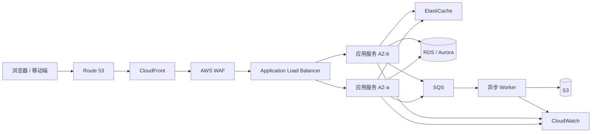
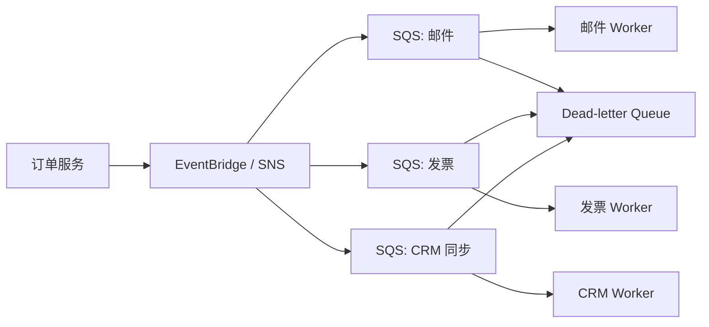

# AWS 高频服务与真实产品架构实战指南

> 本文面向刚开始使用 AWS 的工程师、架构师和技术负责人。它不按 AWS 控制台菜单罗列服务，而是按大多数互联网、SaaS、电商、移动应用和企业内部系统都会遇到的问题组织：用户如何访问系统、应用如何运行、数据如何保存、任务如何解耦、系统如何被保护和运营。

## 一、先建立正确的服务选择视角

AWS 有大量服务，但大多数公司最常使用的并不是全部服务。一个典型产品从原型走到生产，通常会反复用到以下能力：

| 能力层 | 高频服务 | 要解决的问题 |
|---|---|---|
| 全球入口 | Route 53、CloudFront、AWS WAF | 域名解析、低延迟分发、入口防护 |
| 身份与权限 | IAM、IAM Identity Center、KMS、Secrets Manager | 人和程序以什么身份访问资源，如何保护密钥 |
| 网络 | VPC、Security Group、NAT Gateway、VPC Endpoint | 资源是否暴露在公网，服务之间如何安全通信 |
| 计算 | EC2、Auto Scaling、ECS/Fargate、Lambda | Web 服务、后台任务和事件处理代码在哪里运行 |
| 负载均衡 | Elastic Load Balancing（主要是 ALB） | 如何把流量分给多个健康实例或容器 |
| 对象存储 | Amazon S3 | 文件、图片、备份、日志和数据湖如何低成本保存 |
| 事务数据 | Amazon RDS、Amazon Aurora | 订单、用户、账单等关系数据如何可靠读写 |
| 高性能键值数据 | Amazon DynamoDB | 极高并发、低延迟键值访问如何扩展 |
| 缓存 | Amazon ElastiCache | 如何降低数据库压力并减少响应延迟 |
| 异步与事件 | Amazon SQS、Amazon SNS、Amazon EventBridge | 如何削峰、解耦服务并可靠处理后台工作 |
| 可观测与审计 | Amazon CloudWatch、AWS CloudTrail、AWS Config | 如何发现故障、定位问题和追溯变更 |
| 部署与容器供应链 | Amazon ECR、IaC、CI/CD | 如何一致地构建、发布和回滚应用 |

这里的“高频”指跨行业的通用性，而不是某个 AWS 账单上的使用量排名。数据分析团队会更常使用 Athena、Glue、Redshift；机器学习团队会增加 SageMaker；大规模网络场景会使用 Transit Gateway。它们很重要，但不应遮蔽这套基础产品架构。

### 1.1 从业务需求反推服务，而不是反过来

服务选型前至少要明确以下问题：

1. **流量模型**：是稳定 Web 流量、突发活动流量、定时批处理，还是事件流？
2. **状态模型**：数据是文件、关系事务、键值记录、缓存，还是消息？
3. **恢复目标**：可接受的恢复时间目标（RTO）和恢复点目标（RPO）分别是多少？
4. **合规边界**：数据需要在哪个 Region 保存，哪些人员和系统可以访问？
5. **团队能力**：团队是否愿意管理操作系统、Kubernetes 节点和数据库参数？
6. **成本曲线**：是长时间稳定负载，还是请求稀疏、峰谷明显的负载？

没有“最先进”的默认服务，只有在约束下更合适的服务。比如 Lambda 可以免除服务器管理，却不天然适合需要长连接、大量本地磁盘或持续高 CPU 的服务；Aurora 具备高可用能力，却不意味着应用无需设计连接池、索引和查询上限。

### 1.2 AWS 的三个基础故障域

在介绍具体服务前，需要理解 AWS 的地理与隔离层级：

- **Region（区域）**：例如 `ap-northeast-1`。选择时考虑用户延迟、服务可用性、数据驻留和灾备要求。
- **Availability Zone，AZ（可用区）**：一个 Region 包含多个相互隔离的 AZ。生产关键服务通常至少跨两个 AZ 部署，以减少单 AZ 故障影响。
- **Edge Location（边缘站点）**：CloudFront 等边缘服务靠近用户的接入和缓存位置。它不是应用运行的 AZ。

多 AZ 是大多数生产系统的高可用基线；多 Region 是面对区域级灾难、全球低延迟或法律要求时的额外设计。后者会带来跨区域复制、数据一致性、切换演练和成本复杂度，不能只因为“更高级”就默认采用。

---

## 二、典型产品的 AWS 基线架构

下面是一套适用于 SaaS、电商和移动应用后端的常见起点。它不是唯一答案，但能帮助理解后续服务各自的位置。



这条链路的关键思想是：入口层承担域名、缓存和防护；无状态应用层可以横向扩缩；缓存和数据库保存不同类型的状态；用户不必同步等待的工作进入队列；日志、指标和审计独立收集。这样某个消费者暂时故障时，前台请求不必跟着失败，也不会因一次发布就丢失排队任务。

---

## 三、身份、权限与密钥：IAM、KMS、Secrets Manager

### 3.1 IAM 是什么

AWS Identity and Access Management（IAM）决定“谁可以对什么资源做什么动作，在什么条件下可以做”。它是所有 AWS 服务的安全基础。

常见对象如下：

| 对象 | 含义 | 推荐使用方式 |
|---|---|---|
| IAM User | 长期身份和访问密钥 | 仅保留极少数特殊场景；不作为应用身份 |
| IAM Role | 可临时承担的身份 | EC2、ECS Task、Lambda 和跨账号访问的首选 |
| IAM Policy | JSON 权限规则 | 按动作、资源和条件定义最小权限 |
| IAM Identity Center | 企业员工统一登录和权限集 | 管理人类访问，替代大量 IAM User |
| Service Control Policy，SCP | Organizations 的组织级护栏 | 限制账号最大权限，不能直接授予权限 |

权限判断时，显式 `Deny` 的优先级高于任何 `Allow`。一个请求即使 IAM Role 有权限，也可能被 SCP、权限边界、资源策略或 VPC Endpoint 策略拒绝。

### 3.2 真实场景：应用上传用户头像到 S3

假设一个社交或电商应用需要上传用户头像。正确的设计不是把具有 S3 管理权限的 Access Key 写进前端或后端配置文件，而是：

1. 后端通过自身的 ECS Task Role 或 Lambda Execution Role 验证用户身份和上传对象规则。
2. 后端生成仅允许写入指定对象键、有效期很短的 S3 Pre-signed URL。
3. 客户端直接把文件上传到 S3，避免文件流经应用服务器。
4. S3 事件或应用事件进入异步处理链路，生成缩略图和内容审核结果。

| 优点 | 缺点与风险 |
|---|---|
| 不暴露长期凭证，应用权限可限制到特定 Bucket 和前缀 | Pre-signed URL 在有效期内可被持有者使用，必须控制过期时间和对象键 |
| 客户端直接上传，减少应用带宽和计算消耗 | 需要校验 MIME 类型、文件大小、恶意内容和对象归属，不能只相信客户端扩展名 |
| 可通过 CloudTrail 和 S3 日志追溯访问 | 若 Role 权限写成 `s3:*` 和 `Resource:*`，最小权限设计就失效 |

### 3.3 KMS 与 Secrets Manager 各自解决什么

- **AWS KMS**：管理加密密钥并执行加解密相关操作。S3、RDS、EBS、SQS 等许多服务可使用 KMS 密钥做静态加密。
- **AWS Secrets Manager**：保存数据库密码、第三方 API Token 等机密，支持版本、访问审计和部分数据库的自动轮换。
- **SSM Parameter Store**：适合配置参数和较简单的安全字符串；它不是复杂密钥生命周期管理的完整替代品。

真实产品中，应用启动或按需通过其 Role 从 Secrets Manager 获取数据库凭据；凭据轮换需要与数据库、连接池和部署方式一起测试。只“启用自动轮换”但不验证旧连接如何断开、应用如何重新取密钥，仍可能在轮换时造成生产故障。

---

## 四、网络隔离：VPC、子网与 Security Group

### 4.1 VPC 的基本组成

Amazon VPC 是 AWS 中的逻辑私有网络。一个生产 VPC 常被划分为三类子网：

| 子网 | 典型资源 | 是否有公网 IP | 核心原则 |
|---|---|---:|---|
| Public subnet | Internet-facing ALB、NAT Gateway | 可能有 | 只承载确实需要接受公网流量的入口 |
| Private application subnet | EC2、ECS、EKS、Lambda 的 VPC 网卡 | 通常没有 | 应用不直接暴露给互联网 |
| Private data subnet | RDS、ElastiCache 等数据层网卡 | 没有 | 仅允许应用层通过明确端口访问 |

**Internet Gateway（IGW）** 允许 VPC 连接互联网。私有子网若需要下载补丁或调用公网 API，通常通过 **NAT Gateway** 出站；NAT Gateway 不是入站防火墙，也不能让公网直接访问私有实例。

### 4.2 Security Group 与 Network ACL 的区别

- **Security Group（SG）**：附加在网卡或资源上，是有状态的。允许入站后，对应返回流量自动被允许。大多数应用访问控制都应主要用它实现。
- **Network ACL（NACL）**：附加在子网上，是无状态的。入站和出站规则都要明确配置，适合较粗粒度的子网边界规则。

生产实践中，应使用“安全组引用安全组”表达服务关系，例如数据库安全组的 `5432` 端口只允许来自应用安全组，而不是开放给整个 `10.0.0.0/8`。这比依赖 IP 地址更容易维护和审计。

### 4.3 真实场景：三层 SaaS 应用

一个 B2B SaaS 的典型网络规则可以是：

```text
Internet -> ALB Security Group: HTTPS 443
ALB Security Group -> App Security Group: HTTP/HTTPS 应用端口
App Security Group -> Database Security Group: PostgreSQL 5432
App Security Group -> Cache Security Group: Redis 6379
```

| 优点 | 缺点与风险 |
|---|---|
| 应用和数据库不暴露公网，缩小攻击面 | NAT Gateway 会按处理流量计费，下载大量公共依赖或访问 AWS API 时成本可能显著 |
| 服务关系清晰，便于审计和环境隔离 | 每个 AZ 都部署 NAT Gateway 可提高可用性，但增加固定成本 |
| Private Subnet 中的应用可安全横向扩展 | 私有网络不自动等于安全，还需要 IAM、加密、补丁、应用认证和日志 |

对于 S3、DynamoDB 等 AWS 服务，优先评估 **VPC Endpoint**。Gateway Endpoint 可为 S3 和 DynamoDB 提供私有访问路径；Interface Endpoint 可私有访问更多 AWS API。它们可以减少经 NAT 的流量，也能结合 Endpoint Policy 限制访问，但会引入 DNS、费用和策略维护工作。

---

## 五、运行应用：EC2、Auto Scaling、ECS/Fargate 与 Lambda

计算服务的选择决定团队需要管理多少底层设施。最常见的误区是把它理解为功能高低，而不是运行模型差异。

### 5.1 EC2：可控制的虚拟服务器

Amazon EC2 提供虚拟机实例。团队选择操作系统、实例规格、磁盘、网络、运行时和部署方式。

**适合场景**：遗留应用迁移、需要特殊驱动或代理的软件、持续运行的长任务、复杂网络代理、高性能计算，以及暂时无法容器化的单体应用。

**真实场景：传统 Java 单体逐步迁移**

一家保险公司的核心报价系统依赖特定 JDK、商业中间件和本地证书模块，短期内难以拆分。可将应用部署在跨两个 AZ 的 EC2 Auto Scaling Group（ASG）中，通过 ALB 分发请求，实例启动时从镜像或配置服务拉取应用配置。

| 优点 | 缺点与风险 |
|---|---|
| 对操作系统、网络和软件栈控制最强，迁移阻力较小 | 团队要负责操作系统补丁、漏洞、容量、AMI、磁盘和实例故障处理 |
| ASG 可按指标或计划扩缩，并替换不健康实例 | 应用若依赖本地会话或本地文件，扩缩和滚动发布会变复杂 |
| 可使用 Savings Plans 或 Reserved Instances 降低稳定负载成本 | 空闲实例仍付费；规格选择和容量预留需要持续治理 |

一个常见的改进路径是先让应用无状态化：会话放入 ElastiCache 或签名令牌，上传文件放入 S3，配置和密钥外置。这样未来迁移到容器或更频繁扩缩的成本会更低。

### 5.2 ECS 与 Fargate：运行容器但少管节点

Amazon ECS 是 AWS 原生的容器编排服务。ECS 可以运行在自管 EC2 节点上，也可以使用 **AWS Fargate**，由 AWS 提供容器运行容量。

- **ECS on EC2**：成本和底层控制更灵活，但需要管理节点容量、补丁和调度余量。
- **ECS on Fargate**：按 Task 所需的 vCPU 和内存计费，不需要管理服务器，适合大多数标准 API 和 Worker。

**真实场景：多租户 SaaS API 与后台 Worker**

将 `api`、`billing-worker`、`email-worker` 制作为不同镜像，放在 Amazon ECR。API 服务运行在 ECS Service 中并挂到 ALB；Worker 根据 SQS 队列深度扩缩。每种 Task 使用独立 IAM Role，使账单任务不能读取用户上传的原始文件。

| 优点 | 缺点与风险 |
|---|---|
| 镜像和运行环境一致，发布和回滚可控 | 容器化不自动解决服务拆分、数据库设计和可观测性问题 |
| Fargate 省去节点补丁和容量管理 | 长期稳定高负载下，Fargate 单位计算成本可能高于良好利用率的 EC2 |
| Task Role 实现细粒度的工作负载身份 | 仍要设计健康检查、最小和最大任务数、滚动策略和镜像漏洞扫描 |
| ECS 与 ALB、CloudWatch、SQS 和 IAM 集成直接 | 需要理解网络模式、服务发现和任务启动失败原因 |

若团队已有成熟 Kubernetes 平台或确实需要 Kubernetes API、Operator 和跨云一致性，可考虑 EKS；但不要因为容器就默认引入 Kubernetes。EKS 控制面托管不等于节点、网络插件、升级、附加组件和运行治理也不需要维护。

### 5.3 Lambda：事件驱动的短时运行代码

AWS Lambda 按调用执行函数代码，不需要持续运行服务器。它最适合请求或事件触发、执行时间有限、可水平并发的任务。

**真实场景：订单完成后的文档生成**

订单服务只完成事务写入和“订单已完成”事件发布。Lambda 被 SQS 或 EventBridge 触发，生成 PDF 发票、保存到 S3，并通过 SNS 或邮件服务通知用户。若文档生成短暂失败，消息会重试，最终可转入死信队列供人工处理。

| 优点 | 缺点与风险 |
|---|---|
| 无需管理服务器，低频任务可按调用付费 | 不适合无限运行任务、复杂长连接或强依赖本地状态的负载 |
| 天然适合 S3、SQS、EventBridge 等事件集成 | 并发突增可能压垮下游数据库，必须设置并发上限和队列缓冲 |
| 单个功能可独立部署和授权 | 冷启动、包大小、执行时长和运行时依赖仍需评估 |

Lambda 不是“任何代码都更便宜”的服务。持续高频、稳定占用 CPU 的服务需要与 ECS/EC2 比较总成本和延迟；依赖较重的运行时也要实测冷启动表现。

---

## 六、接收 Web 流量：ALB、Route 53、CloudFront 与 WAF

### 6.1 Application Load Balancer（ALB）

ALB 是第七层 HTTP/HTTPS 负载均衡器。它通过监听器和规则，按域名、路径、HTTP Header 等把请求路由给不同的 Target Group。

**真实场景：一个域名承载多个服务**

```text
api.example.com/v1/*      -> ECS api-v1 Target Group
api.example.com/admin/*   -> ECS admin Target Group
app.example.com/*         -> 静态站点或前端服务
```

ALB 定期做健康检查，只向健康目标转发流量。部署时可以利用多个 Target Group 执行蓝绿发布或逐步切流。

| 优点 | 缺点与风险 |
|---|---|
| 统一 TLS 终止、健康检查和七层路由 | ALB 不是 API 身份认证、限流和业务授权的完整替代品 |
| 与 ECS、EC2、Lambda 等集成成熟 | 长连接、WebSocket 和超时配置必须按应用行为验证 |
| 可跨多个 AZ 分发流量 | 目标组健康检查路径若依赖数据库等下游，可能引发级联摘除 |

健康检查应尽量验证应用本身是否能接收请求，而不是每次都进行昂贵的跨服务深度检查。否则数据库短暂慢响应可能使 ALB 同时摘除全部应用实例，放大故障。

### 6.2 Route 53：DNS 和流量切换控制

Amazon Route 53 提供域名托管、DNS 记录、健康检查和路由策略。常见记录包括：

- `A/AAAA Alias`：将域名指向 ALB、CloudFront 等 AWS 资源。
- 加权路由：按比例把流量分给两个版本或两个 Region。
- 故障转移路由：主端点健康检查失败后指向备用端点。
- 延迟路由：把用户指向网络延迟较低的 Region。

DNS 切换受客户端、递归 DNS 和 TTL 缓存影响，不能把它当成毫秒级、无状态的流量开关。多 Region 灾备必须演练缓存传播、会话处理和数据一致性。

### 6.3 CloudFront 与 WAF：边缘缓存和入口防护

**Amazon CloudFront** 是内容分发网络（CDN）。它把可缓存内容放到靠近用户的边缘节点，源站可为 S3、ALB 或 API。

**AWS WAF** 在 CloudFront、ALB 或 API Gateway 等入口处检查 Web 请求，可设置托管规则、IP 规则、地理规则、速率规则和自定义匹配条件。

**真实场景：电商大促页面与商品图片**

商品图片、JS、CSS 和可公开缓存的商品详情经 CloudFront 分发；原始图片保存在私有 S3 Bucket，仅允许 CloudFront 使用 OAC 读取。WAF 对登录和结算接口设置速率限制，拦截已知恶意模式；动态下单请求仍回源到应用服务。

| 优点 | 缺点与风险 |
|---|---|
| 大幅降低源站带宽和静态资源延迟 | 缓存策略错误会导致用户看到过期或不应共享的内容 |
| S3 不需公开暴露，可只允许 CloudFront 读取 | Cookie、Query String 和 Header 是否进入缓存键需要精确设计 |
| WAF 可提前阻挡常见攻击和异常流量 | WAF 不能修复 SQL 注入、越权或身份验证等应用漏洞 |

绝不能缓存包含其他用户资料、登录令牌或个性化订单信息的响应，除非缓存键、TTL 和访问控制经过专门设计。对动态 API，应先明确哪些请求能缓存、缓存多久、是否允许共享，再启用缓存。

---

## 七、对象存储：Amazon S3

### 7.1 S3 的定位

Amazon S3 是对象存储，而不是传统文件系统或关系数据库。对象由 Bucket 和 Key 标识，适合保存图片、视频、文档、备份、日志、安装包和数据湖文件。

高频设计能力包括：

| 能力 | 作用 | 常见使用方式 |
|---|---|---|
| Versioning | 保存对象的历史版本 | 防止误覆盖或误删除的重要文件 |
| Lifecycle | 自动在存储类别间迁移或过期删除 | 日志从 Standard 转到低频或归档类别 |
| Encryption | 服务端加密对象 | SSE-S3 或 SSE-KMS；后者带来更细审计和 KMS 成本 |
| Bucket Policy | Bucket 级访问规则 | 限制来源账号、Role、VPC Endpoint 或 CloudFront |
| Event Notification | 对象创建后触发后续处理 | 发送到 SQS、SNS、EventBridge 或 Lambda |

### 7.2 真实场景：用户文件上传与异步处理

一家招聘平台允许企业上传简历和职位附件。可采用以下流程：

1. 应用授权后返回 S3 Pre-signed URL。
2. 客户端上传到 `incoming/tenant-id/upload-id` 前缀。
3. S3 事件写入 SQS，Worker 扫描文件、抽取文本、生成预览图。
4. 通过审核的文件移动或复制到受控前缀；原文件按保留策略归档或删除。
5. 数据库只保存对象键、租户和处理状态，不把大文件放进数据库 BLOB。

| 优点 | 缺点与风险 |
|---|---|
| 存储扩展性高，应用不处理大文件字节流 | S3 的目录只是 Key 前缀概念，不能按传统文件系统权限模型理解 |
| 生命周期可自动控制日志和归档成本 | 归档存储取回可能有延迟和费用，必须匹配实际恢复要求 |
| 版本控制可降低误删风险 | Versioning 会保留旧版本并继续占用容量，需要生命周期清理非当前版本 |

S3 的“高耐久”不等于应用不需要备份方案。要区分误删、恶意删除、错误加密、错误生命周期和区域级恢复需求。关键数据可结合版本控制、Object Lock、跨区域复制以及定期恢复演练。

---

## 八、关系事务数据：RDS 与 Aurora

### 8.1 RDS/Aurora 解决什么

Amazon RDS 托管 MySQL、PostgreSQL、MariaDB、Oracle、SQL Server 等关系数据库引擎。Amazon Aurora 兼容 MySQL 或 PostgreSQL，使用 AWS 设计的分布式存储架构。它们常用于需要 SQL、事务、关联查询和强一致写入的业务数据。

典型数据包括：用户、订单、付款状态、合同、库存、权限关系、账务流水元数据。

| 能力 | RDS / Aurora 中的作用 | 仍由应用负责的部分 |
|---|---|---|
| Multi-AZ | 减少单 AZ 数据库基础设施故障影响 | 重试逻辑、连接重建和故障切换时的应用行为 |
| Read Replica | 扩展适合异步读的负载 | 读写一致性判断，不能把刚写入的数据盲目从副本读取 |
| 自动备份与快照 | 支持时间点恢复和手工恢复 | 备份保留期、跨账号/跨区域副本与恢复演练 |
| 参数组与监控 | 调整数据库运行参数并观察负载 | 索引、SQL、事务边界、数据模型和连接数治理 |

### 8.2 真实场景：订单与支付状态

电商下单服务需要保证订单、支付尝试和库存预留的状态可追踪。关系数据库适合用事务确保同一业务边界内的数据一致性：创建订单、写入订单行、记录支付请求状态。调用外部支付网关不应被包在长数据库事务中，因为网络调用可能缓慢或重试。

更可靠的模式是 **Transactional Outbox**：在同一数据库事务中写入订单数据和待发布事件；后台发布器读取未发送事件并投递到 SQS/EventBridge，成功后标记状态。消费者以业务唯一键实现幂等，即使消息重复也不会重复扣款或重复发货。

| 优点 | 缺点与风险 |
|---|---|
| SQL、事务和约束适合订单等核心实体 | 主库写入能力不是无限的，热点行和长事务会快速成为瓶颈 |
| 托管备份、补丁和 Multi-AZ 降低运维负担 | Multi-AZ 主要是可用性机制，不等于读取能力线性扩展 |
| 可按只读流量使用副本或 Aurora Reader | 副本存在复制延迟，不适合刚写入后必须立即读取的路径 |

最常见的性能问题通常不是实例规格太小，而是缺少索引、全表扫描、N+1 查询、连接数失控、事务过长或把报表查询直接打到主库。应先用慢查询日志、Performance Insights 和实际执行计划定位，再扩容。

### 8.3 连接管理与 RDS Proxy

容器和 Lambda 容易在扩缩时创建大量短连接，耗尽数据库连接数。Amazon RDS Proxy 可以复用和管理连接，降低突发连接风暴的风险，特别适合 Lambda 或大量短生命周期任务。

它不能解决慢 SQL、锁等待或数据库 CPU 饱和。使用 Proxy 前后都要监控连接数、等待事件、事务时间和查询延迟，不能把它当作数据库性能万能药。

---

## 九、高并发键值数据：Amazon DynamoDB

### 9.1 DynamoDB 的核心模型

Amazon DynamoDB 是完全托管的 NoSQL 键值和文档数据库。它的设计起点是访问模式：先知道需要如何按键查询，再设计分区键和排序键，而不是先把关系模型原样搬进去。

| 概念 | 含义 |
|---|---|
| Partition Key | 决定数据如何分布，必须有足够的值分散度 |
| Sort Key | 在同一分区内排序，可支持范围查询和实体聚合 |
| GSI | 使用另一种访问键查询的全局二级索引 |
| LSI | 与主分区键相同、替换排序键的本地二级索引，约束更多 |
| On-demand / Provisioned | 按请求自动计费或预分配读写容量，两者适合不同流量模型 |

### 9.2 真实场景：会话、购物车和请求幂等记录

移动应用登录后的短期会话、用户购物车、API 请求幂等键和限流计数，通常适合 DynamoDB。以订单支付幂等为例，可使用 `idempotency-key` 为主键，写入时使用条件表达式保证首次请求创建记录；后续同一键的请求返回已保存的结果，而不是再次发起扣款。

| 优点 | 缺点与风险 |
|---|---|
| 低运维、高扩展性，适合高并发键值访问 | 不适合临时的多表关联、任意维度报表和复杂 SQL |
| 条件写入和事务 API 可处理特定一致性需求 | 分区键设计错误会产生热点，单个热门键限制吞吐 |
| TTL 适合自动过期会话和临时数据 | TTL 删除是异步的，不可把它当作精确到秒的业务计时器 |

不要用 `Scan` 作为生产查询主路径。它会读取大量不相关数据，成本与延迟随表规模增长。若核心查询无法通过主键或明确的 GSI 表达，应重新审视数据建模，或选择 RDS、OpenSearch、S3/Athena 等更适合的系统。

---

## 十、降低读取延迟：ElastiCache for Redis

### 10.1 缓存的角色

Amazon ElastiCache for Redis 提供托管 Redis。它适合缓存高频读取结果、会话、临时令牌、限流计数、排行榜和轻量级发布订阅等低延迟场景。

缓存的基本原则是：**缓存是可丢失、可重建的加速层，不应是唯一事实来源。** 订单、余额和支付结果等关键事实仍应落在持久数据库中。

### 10.2 真实场景：商品详情和库存展示

商品详情页读多写少且访问量大，可使用 Cache-Aside 模式：

1. 应用先读取 Redis。
2. 缓存未命中时，从 RDS 查询并写入 Redis，设置 TTL。
3. 商品更新后，应用删除或更新对应缓存键。
4. 缓存失效时，下一次请求重新加载。

| 优点 | 缺点与风险 |
|---|---|
| 降低数据库读压力，减少响应时间 | 缓存与数据库短暂不一致是常态，必须由业务接受或专门处理 |
| Redis 支持丰富数据结构，适合计数与限流 | 热门 Key 同时失效会触发缓存击穿，可能压垮数据库 |
| 可把短会话从应用实例移出，方便横向扩缩 | 过大的 Value、无 TTL 或无限增长 Key 会耗尽内存并触发淘汰 |

缓解缓存击穿可使用合理 TTL 加随机抖动、单飞加载、请求合并、预热和限流。对于“绝不能卖超”的库存扣减，缓存最多用于展示和削峰，最终扣减仍需在具备正确并发控制的持久层完成。

---

## 十一、异步解耦：SQS、SNS 与 EventBridge

### 11.1 三种服务的职责

| 服务 | 核心模型 | 典型用途 |
|---|---|---|
| Amazon SQS | 队列，消费者主动拉取并处理 | 后台任务、削峰、可靠重试 |
| Amazon SNS | Topic 发布订阅，主动推送到多个订阅端 | 广播通知、扇出到多个队列或 HTTP 端点 |
| Amazon EventBridge | 事件总线和规则路由 | 领域事件、跨账号集成、SaaS 事件和定时规则 |

**SQS Standard** 提供至少一次投递和尽力排序，因此消费者必须幂等。**SQS FIFO** 提供顺序和去重语义，但吞吐、分组和使用方式有约束，应只在业务确实需要顺序时使用。

### 11.2 真实场景：订单完成后的扇出处理

订单完成后，系统可能需要发邮件、同步 CRM、积分入账、生成发票、写分析数据。若订单服务同步调用这些下游，任一慢服务或故障都会拖慢下单路径。

可让订单服务发布 `OrderCompleted` 事件到 EventBridge 或 SNS，再由不同目标路由到独立 SQS 队列。每个 Worker 独立重试和扩缩：邮件失败不会阻塞发票生成；CRM 限流不会影响积分处理。



| 优点 | 缺点与风险 |
|---|---|
| 削平流量峰值，下游故障不直接阻塞前台请求 | 系统转为最终一致性，用户可能先看到订单完成、后收到邮件 |
| 每个消费者独立部署、限流和扩缩 | 重复投递、乱序和部分失败要求消费者幂等 |
| DLQ 可保留反复失败的消息供排查 | DLQ 不是“自动修复”；必须有告警、重放流程和失败原因处理 |

**Visibility Timeout** 要大于消费者正常处理时间，并与重试策略协调。如果处理尚未完成而可见性超时，另一消费者可能再次收到同一消息；如果设置过长，真实失败的消息又会很久才重试。

---

## 十二、观测、审计与合规：CloudWatch、CloudTrail、Config

### 12.1 三类信号要分清

| 服务 | 主要回答的问题 | 常见内容 |
|---|---|---|
| CloudWatch | 系统现在是否健康，为什么变慢或报错 | Metrics、Logs、Alarms、Dashboards、Synthetics |
| CloudTrail | 谁通过 AWS API 做了什么变更 | 控制面和数据面 API 调用记录 |
| AWS Config | 资源当前或历史配置是否合规 | 配置快照、变更历史、规则评估 |

它们相互补充。CloudWatch 可以发现 API 5xx 增加；CloudTrail 可调查谁修改了安全组或删除了资源；Config 可发现某个 S3 Bucket 是否长期不符合“禁止公开访问”的基线。

### 12.2 真实场景：发布后 API 错误率升高

一次新版本发布后，ALB 的 `HTTPCode_Target_5XX_Count` 增长。一个完整的排障路径是：

1. CloudWatch Alarm 触发，附带 Region、服务、版本和错误率上下文。
2. 查询应用结构化日志，用 `request_id`、`trace_id`、版本号和错误码聚合。
3. 对照部署时间、ECS 任务事件、数据库连接数、队列积压和下游错误率。
4. 若怀疑配置被手动修改，查 CloudTrail 和 Config 历史。
5. 根据证据回滚、扩容、修复配置或降级某个非核心依赖。

| 优点 | 缺点与风险 |
|---|---|
| 托管指标、日志和告警可形成统一运营面 | 日志无结构、无关联 ID 时，拥有日志也很难定位一次用户请求 |
| CloudTrail 对安全调查和变更追溯非常关键 | 日志长期保存会有成本，需要明确保留期、归档和访问权限 |
| Config 可把安全基线从人工检查变成持续检测 | 合规规则告警不等于自动修复，修复自动化需谨慎测试 |

建议所有应用日志至少包含时间、级别、服务名、环境、版本、请求或追踪 ID、租户或用户的非敏感标识、错误码。不要写入密码、Token、完整支付信息或不必要的个人敏感数据。

---

## 十三、镜像、基础设施与发布：ECR、IaC、CI/CD

### 13.1 ECR：容器镜像的私有仓库

Amazon ECR 用于保存应用容器镜像。ECS、EKS 和其他 AWS 计算服务可以通过 IAM 拉取镜像。

生产镜像实践：

- 使用不可变版本标签，例如 Git commit SHA，而不是只用 `latest`。
- 构建后进行依赖和镜像漏洞扫描，并设定高危漏洞处置策略。
- 通过生命周期策略清理不再需要的旧镜像，但保留可回滚版本。
- 运行镜像时使用最小权限的 Task Role，镜像本身不包含生产密钥。

### 13.2 基础设施即代码（IaC）

VPC、IAM Role、数据库参数、告警、队列和服务定义应使用 CloudFormation、AWS CDK、Terraform 等 IaC 工具声明，而不是长期手工点击控制台。

**真实场景：多环境一致部署**

同一套 IaC 模板针对开发、预发和生产传入不同参数：开发只部署单 AZ 小规格资源，生产跨 AZ 并启用备份、告警和删除保护。应用 Pipeline 在测试通过后构建镜像，更新服务定义，并使用滚动或蓝绿策略发布。

| 优点 | 缺点与风险 |
|---|---|
| 环境可重复创建，变更可审查、追踪和回滚 | 模板错误会批量放大，生产变更需要审批、变更集和分阶段发布 |
| 减少手工漂移，审计更完整 | 状态管理、敏感变量和跨团队模块边界需要明确治理 |
| 新账号和灾备环境的准备速度更快 | IaC 不会替代架构评审，错误的网络或权限模型会被稳定地复制 |

发布策略必须包含失败路径：健康检查失败如何停止扩散，数据库变更是否向后兼容，镜像如何回滚，异步消息消费者版本不兼容时如何处理。能“部署成功”并不表示产品已经具备可恢复性。

---

## 十四、三种真实产品组合与取舍

### 14.1 早期 B2B SaaS

**典型组合**：Route 53 + CloudFront + WAF + ALB + ECS Fargate + RDS PostgreSQL + S3 + SQS + CloudWatch。

适合有稳定 Web/API 流量、关系数据模型明确、团队规模不大但希望减少服务器运维的产品。先用模块化单体和一个关系数据库通常更符合交付速度；把邮件、导入导出和文件处理放入 SQS 后台任务，避免请求超时。

优点是系统边界清晰、托管程度高、可按服务扩展。缺点是服务数量增加后 IAM、网络、成本标签和告警不能再靠个人记忆管理，需要尽早建立 IaC 和账号基线。不要过早拆成十几个微服务，否则排障、发布和数据一致性成本可能超过业务收益。

### 14.2 电商或内容平台的大促流量

**典型组合**：CloudFront + WAF + ALB + ECS/EC2 Auto Scaling + ElastiCache + RDS/Aurora + DynamoDB + SQS + EventBridge。

商品图和静态资源由 CloudFront 承担；高频商品查询用 Redis 缓存；购物车、会话、请求幂等或高并发键值状态可用 DynamoDB；订单核心事务落在 RDS/Aurora；履约、通知、积分和分析通过事件异步化。

优点是入口、读取和异步处理都可独立扩展，峰值更不容易直接压垮主数据库。缺点是数据一致性复杂：缓存会陈旧、消息会重复、读副本可能延迟。库存和支付等强约束路径要有明确的数据库事务或条件写入方案，不能依赖“最终都会同步”的乐观假设。

### 14.3 移动应用的媒体处理后端

**典型组合**：Cognito 或外部身份提供商 + API Gateway/ALB + Lambda/ECS + S3 + SQS + Step Functions + DynamoDB/RDS + CloudWatch。

移动端通过临时授权直接上传照片和视频到 S3；事件进入 SQS；Worker 或 Lambda 做转码、缩略图、内容审核和元数据抽取。处理时间长、步骤多或需要人工审核回调时，可以用 Step Functions 表达状态与重试。

优点是上传不占用 API 服务带宽，媒体处理能按积压量扩缩。缺点是视频转码等重计算任务可能不适合 Lambda，需要 ECS/Batch 等更合适的运行环境；S3 事件、重试和多步骤处理还必须设计幂等键，防止同一个媒体被重复收费或重复通知。

---

## 十五、成本、可靠性与安全的共通检查清单

### 15.1 成本

- 为账号、应用、环境、成本中心和负责人制定统一标签，并把标签纳入 IaC 审查。
- 区分稳定基线与突发负载：稳定计算评估 Savings Plans；短期突发使用 Auto Scaling、Fargate 或 Lambda。
- 审查 NAT Gateway 流量、跨 AZ 流量、CloudWatch 日志摄入、未使用 EBS/EIP、旧快照和无生命周期规则的 S3 Bucket。
- 为每个生产账号设置 AWS Budgets 和异常检测告警；成本异常要有负责人和处置流程。

### 15.2 可靠性

- 所有关键入口、计算和数据库是否至少跨两个 AZ，单个 AZ 失效后系统会怎样？
- 每个异步消费者是否幂等，重试和 DLQ 是否有告警与重放程序？
- 是否明确 RTO/RPO，并实际演练过数据库恢复、对象恢复和故障切换？
- 应用是否设置超时、重试上限、退避和熔断，避免下游故障级联？

### 15.3 安全

- 人类身份是否通过 IAM Identity Center 和 MFA 登录，生产权限是否按角色授予？
- 工作负载是否使用 IAM Role，而不是长期 Access Key？
- 数据是否按需要启用传输中 TLS 与静态加密，密钥和密钥访问是否受控？
- S3、数据库、缓存和内部 API 是否避免了不必要的公网暴露？
- CloudTrail、Config、GuardDuty/Security Hub 等安全基线是否集中到独立安全账号，并有人处理发现项？

---

## 十六、结语：先建立可演进的最小生产闭环

大多数公司开始使用 AWS 时，不需要立即部署每一种托管服务。更实用的路线是先建立一个可恢复、可观测、可审计的最小生产闭环：

1. 用多 AZ VPC、IAM Role 和安全组建立网络与权限边界。
2. 用 ALB 和 ECS/EC2/Lambda 运行无状态应用，并有健康检查与自动扩缩策略。
3. 用 RDS/Aurora 保存核心事务，用 S3 保存对象，用 SQS 处理非同步任务。
4. 用 CloudWatch、CloudTrail 和备份恢复流程确保能够发现、解释和恢复故障。
5. 用 IaC、镜像仓库和受控 Pipeline 让基础设施和应用变更可重复、可回滚。

随后再根据真实瓶颈引入 CloudFront、ElastiCache、DynamoDB、EventBridge、多 Region 或更复杂的数据平台。架构成熟的标志不是 AWS 服务数量多，而是每个服务都有明确责任、权限边界、故障行为、成本归属和退出或演进路径。