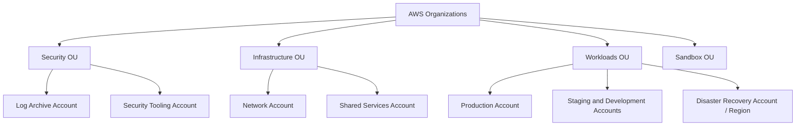
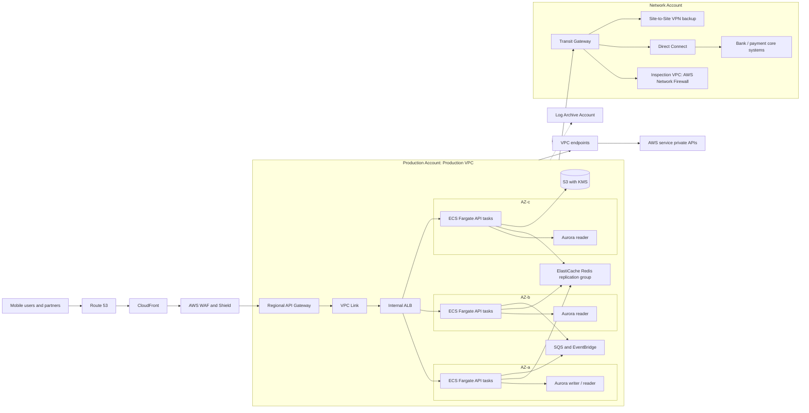
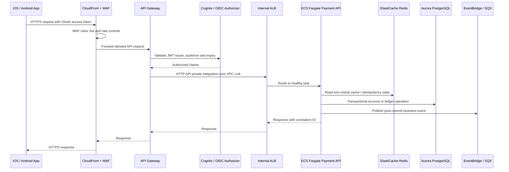
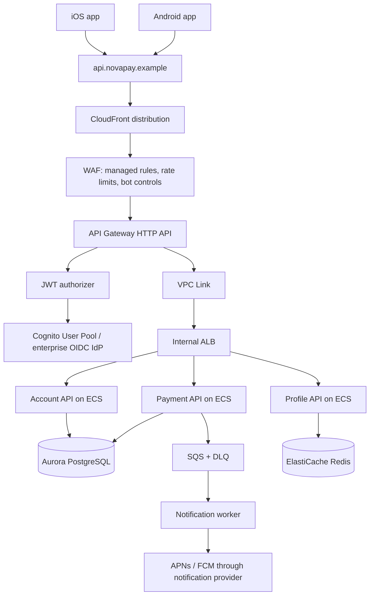

# 金融科技公司 AWS 网络架构与移动应用上线实战指南

本文以虚构的金融科技公司 **NovaPay** 为例，设计其在 AWS 上承载账户、支付、风控和移动端服务的网络与应用平台。目标是为受监管的互联网业务提供安全隔离、跨可用区高可用、可审计操作、可控的第三方连接，以及可以持续扩展的移动 API 能力。

> 说明：本文是技术架构参考，不构成 PCI DSS、SOC 2、ISO 27001、GDPR、当地金融监管或数据驻留要求的合规认证建议。实际控制项、数据分类、保留期限与跨境传输边界必须由公司的安全、法务、风控和审计团队确认。

## 1. 场景、目标与架构取舍

### 1.1 业务假设

NovaPay 已有面向合作商户的支付 API 和内部运营后台，计划服务个人用户。核心交易账本由 Aurora PostgreSQL 承载，支付渠道和银行核心系统仍有部分在本地数据中心（On-premises）。公司需要新上线 iOS/Android 应用，提供注册、登录、余额查询、转账、交易记录、设备绑定和推送通知。

示例非功能目标：

| 维度 | 目标 | 设计影响 |
| --- | --- | --- |
| 可用性 | API 目标 99.95%，单一 AZ 故障不影响服务 | 跨 3 个 AZ 部署入口、计算和数据服务 |
| 延迟 | 同区域 API P95 小于 250 ms | 就近边缘入口、无状态服务、缓存和连接复用 |
| RPO | 核心账本小于 5 分钟；可再生缓存允许丢失 | Aurora 多 AZ、持续备份、跨区域备份复制 |
| RTO | 主要区域不可用后 4 小时内恢复核心服务 | 预置灾备基础设施、演练 DNS 和数据恢复 |
| 合规 | 最小权限、全链路审计、静态/传输加密、数据分区 | 多账号、集中日志、KMS、私网数据层、令牌化 |
| 规模 | 日均 100 万移动活跃用户，支付高峰 5,000 RPS | CDN/WAF、API 限流、容器弹性伸缩、异步削峰 |

### 1.2 为什么选择单区域多 AZ + 异地灾备

初始生产架构以一个主 Region 的三可用区部署为基线，使用异地 Region 保存加密备份、基础设施模板和最小灾备环境。该选择优先解决最常见的实例、可用区、网络链路和部署故障，并控制跨区域双活带来的账本一致性、审计、运维和成本复杂度。

当监管、客户地域或业务连续性目标要求区域级分钟级切换时，才评估多 Region 的读写分区、全球数据库或事件驱动复制。对金融账本，不能因为“多 Region”就接受双主冲突；必须先明确哪个 Region 在任一时刻拥有写入权。

### 1.3 架构原则

1. **账户隔离优先于资源命名隔离**：生产、非生产、安全审计、共享网络和灾备使用独立 AWS 账号。
2. **默认私网**：工作负载和数据层没有公网 IP；对 AWS 服务优先走 VPC Endpoint。
3. **零信任访问**：每个工作负载使用短期 IAM Role、TLS、最小 Security Group 和可审计身份。
4. **核心账本为事实来源**：缓存、队列和搜索索引提高性能，不作为余额或交易事实的唯一记录。
5. **可观测和可恢复是上线条件**：日志、指标、审计、备份和恢复演练与业务功能同时交付。
6. **基础设施即代码**：账号基线、网络、策略、告警和应用资源均通过经审查的 IaC 管理。

## 2. AWS 组织与账号边界

### 2.1 Landing Zone 结构

使用 AWS Organizations 管理账号，通过 AWS Control Tower 或等效 IaC 基线创建和治理账号。Management account 仅承担组织与账单管理，不部署业务资源。

| 账号 | 职责 | 不应放入的资源 |
| --- | --- | --- |
| Log Archive | 集中 CloudTrail、Config、VPC Flow Logs、应用审计日志的长期保存 | 应用计算资源和日常开发权限 |
| Security Tooling | GuardDuty、Security Hub、Inspector、Macie、检测告警与合规汇总 | 生产业务数据库 |
| Network | Transit Gateway、Direct Connect、Route 53 Resolver、集中出口/检查 VPC | 具体支付业务服务 |
| Shared Services | 私有 CA、内部 DNS 自动化、CI/CD 共用组件、镜像代理 | 账本和客户 PII |
| Production | 对外 API、容器、数据库、消息、缓存和生产密钥引用 | 开发实验资源 |
| Non-production | 开发、测试、性能测试、脱敏数据 | 生产数据和生产密钥 |
| DR | 异地备份副本、恢复模板和最小热备资源 | 日常生产写入 |

### 2.2 组织级控制

| 服务/控制 | 如何使用 | 原因 |
| --- | --- | --- |
| AWS Organizations | 用 OU 管理账号，集中账单和策略 | 让隔离、审计和成本归属可规模化 |
| Service Control Policies (SCP) | 阻止关闭 CloudTrail/Config、限制未批准 Region、禁止移除关键标签和公共 S3 桶 | SCP 定义最大权限边界，不能授予权限 |
| IAM Identity Center | 员工通过企业身份提供商单点登录，按角色获得短期权限 | 避免长期 IAM 用户和共享管理员账号 |
| IAM Access Analyzer | 检测外部可访问的资源策略 | 及时发现 S3、KMS、IAM Role 的意外共享 |
| AWS CloudTrail | 在所有 Region、所有账号记录管理与关键数据事件，集中投递到日志账号 | 支持审计、取证和高危操作追踪 |
| AWS Config | 记录配置变更并评估合规规则 | 识别不加密、开放安全组等资源漂移 |
| AWS Audit Manager | 汇总审计证据 | 降低收集控制证据的人工成本，不能替代实际控制执行 |

SCP 示例的目标是保护关键控制，而不是代替应用权限策略。生产账号仍应使用 IAM Role、资源策略、权限边界和条件键来实现最小权限。

## 3. 网络总体架构

### 3.1 网络拓扑图

主 Region 使用三可用区，生产 VPC 与共享网络 VPC 通过 Transit Gateway（TGW）连接。互联网流量仅进入边缘入口；核心服务、账本库和缓存均处于私有子网。本地银行或支付渠道经 Direct Connect，并以 Site-to-Site VPN 作为加密备份链路接入。

### 3.2 CIDR、子网与路由规划

规划阶段预留地址空间，避免将来与并购网络、合作机构或本地数据中心网段重叠。以下仅为示例，实际 CIDR 必须经过企业 IPAM 审查。

| 网络 | 示例 CIDR | 用途 |
| --- | --- | --- |
| Production VPC | `10.40.0.0/16` | 面向客户的生产服务 |
| Shared Services VPC | `10.41.0.0/16` | DNS、镜像、CI/CD 共享服务 |
| Inspection/Egress VPC | `10.42.0.0/16` | 网络防火墙、受控出口 |
| Non-production VPC | `10.50.0.0/16` | 开发、测试和压测 |
| On-premises | `10.0.0.0/12` | 银行或传统系统示例地址段 |

每个 AZ 至少建立以下子网：

| 子网类别 | 示例每 AZ 大小 | 资源与路由 |
| --- | --- | --- |
| Private application | `/20` | ECS 任务、内部 ALB；默认路由经 NAT 或集中出口 |
| Private data | `/22` | Aurora、ElastiCache；无互联网默认路由，仅允许必要的 VPC Endpoint/DNS |
| Private endpoint | `/24` | Interface Endpoint ENI；隔离私有 AWS API 流量 |
| TGW attachment | `/28` | TGW ENI；将跨 VPC/本地流量送至 TGW |
| Public edge | `/24` | 仅 NAT Gateway 等必须具有公网出口的组件；不放业务容器 |

生产应用任务不使用公网 IP。每个 AZ 的私有应用子网默认经同 AZ NAT Gateway 出网，降低跨 AZ 故障耦合；S3、DynamoDB 走 Gateway Endpoint，其余必要 AWS 服务使用 Interface Endpoint。对于需要集中审计的第三方出口，路由到 Inspection VPC 的 AWS Network Firewall，再受控转发到出口 NAT。此设计会带来跨 AZ 与 TGW 流量成本，需基于流量类型决定哪些业务采用本地 NAT、哪些强制经集中检查。

### 3.3 网络组件与详细作用

| 组件 | 使用方式 | 选型原因与注意点 |
| --- | --- | --- |
| Amazon VPC | 每个生产账号一个或多个按业务域划分的 VPC | 形成网络隔离边界；不要把所有生产业务塞进一个无限膨胀的 VPC |
| Subnet / Route Table | 按应用、数据、端点、TGW 附件分层，分别配置路由表 | 路由决定流量路径；子网名称不是安全控制 |
| Internet Gateway | 仅连接需要对公网提供或访问能力的 VPC | 不能直接保护资源，仍需安全组、WAF 和私网部署 |
| NAT Gateway | 私有应用子网访问软件仓库或第三方 API 的出站通道 | 每 AZ 一个提高可用性；优先 Endpoint 减少 NAT 成本与暴露 |
| VPC Endpoint | S3/DynamoDB 使用 Gateway Endpoint；Secrets Manager、ECR、CloudWatch、KMS 等使用 Interface Endpoint | 服务流量保持在 AWS 私网，使用 Endpoint Policy 限制访问 |
| Security Group | 以工作负载身份而不是 CIDR 管理入站规则，例如 API SG 仅允许来自内部 ALB SG | 有状态、细粒度，是主要东西向访问控制 |
| Network ACL | 作为子网级粗粒度拒绝或合规边界 | 无状态，规则需同时放行返回流量；不作为日常应用授权主工具 |
| Transit Gateway | 连接 Production、Shared、Inspection 和本地网络 | 避免 VPC Peering 网状扩展；通过不同 TGW route table 隔离路由域 |
| AWS RAM | 将 TGW 和 Route 53 Resolver 等共享给业务账号 | 保持网络资源集中管理，工作负载账号无需拥有网络管理员权限 |
| Direct Connect | 连接银行核心、HSM 或数据中心，使用专线/VIF | 提供稳定私有链路；仍应设计冗余位置与 VPN 备用 |
| Site-to-Site VPN | 作为 DX 备份，或用于小型合作机构接入 | 加密隧道不等于高带宽；监控隧道状态与 BGP 路由 |
| Route 53 Resolver | 入站/出站端点解析本地和 AWS 私有域名 | 支持混合 DNS；转发规则要避免递归循环 |
| AWS Network Firewall | Inspection VPC 中检查受控出口和跨网络流量 | 用于域名/协议/IPS 规则；规则变更需要测试避免误阻断 |
| VPC Flow Logs | 记录 VPC、子网或 ENI 流量元数据到集中日志 | 用于排障与取证，不含完整请求体或 TLS 内容 |

### 3.4 Security Group 访问矩阵

| 目标 | 来源 | 端口 | 原因 |
| --- | --- | --- | --- |
| API Gateway 私有集成 | API Gateway VPC Link ENI | 443 | 仅允许入口转发到内部 ALB |
| Internal ALB | VPC Link SG | 443 | 由 ALB 终止或重新建立 TLS |
| ECS API task | Internal ALB SG | 8443 | 只接收 ALB 健康检查和业务流量 |
| Aurora | ECS API/Worker SG | 5432 | 数据库不接收任何公网或通用 CIDR 流量 |
| ElastiCache Redis | ECS API/Worker SG | 6379 / TLS 端口 | 仅限应用缓存与会话访问 |
| Interface Endpoint | 对应工作负载 SG | 443 | 私网调用 AWS 控制面 API |
| 管理入口 | 无直接入站 SSH | N/A | 使用 Systems Manager Session Manager 代替跳板机/SSH |

端口和协议仅是最后一道网络限制。应用仍需要身份认证、授权、输入验证、速率限制、审计和数据脱敏。

## 4. 客户端到核心服务的请求路径

### 4.1 移动 API 流量图

### 4.2 边缘和 API 组件

| 组件 | 如何使用 | 为什么选择它 |
| --- | --- | --- |
| Route 53 | 托管 `api.novapay.example`、`app.novapay.example`，提供健康检查和灾备切换记录 | DNS 是受控流量切换点；TTL 与缓存行为必须纳入演练 |
| CloudFront | 为移动 API 与静态内容提供全球 TLS 接入、连接复用、响应头控制和边缘缓存 | 适合全球用户和 DDoS 防护前置；敏感动态 API 默认不缓存或明确设计缓存键 |
| AWS WAF | 附加到 CloudFront，启用托管规则、已知恶意 IP、速率限制和经审查的自定义规则 | 在应用前拦截常见攻击；规则需先 count 再 block 以降低误杀 |
| AWS Shield Standard | 自动保护 CloudFront、Route 53 等常见 DDoS 场景 | 默认基础保护；高风险业务评估 Shield Advanced 与响应支持 |
| ACM | 管理 CloudFront 和 API 自定义域名 TLS 证书，自动续期 | 避免手工证书生命周期；CloudFront 证书必须在 `us-east-1` 创建 |
| API Gateway HTTP API | 提供 API 路由、JWT 授权器、限流配额、请求大小控制、访问日志和版本化 stage | 减少公网负载均衡管理；HTTP API 通过 VPC Link 到内部 ALB |
| VPC Link | API Gateway 到私有 ALB 的托管私网连接 | 不暴露应用 ALB 到公网；需为其 ENI 和目标 SG 放行最小流量 |
| Internal ALB | 按路径/主机将流量路由到多个 ECS 服务，进行健康检查 | 支持 L7 路由与蓝绿发布；只在 VPC 内可访问 |

### 4.3 身份、密钥与数据保护

| 组件 | 如何使用 | 安全边界 |
| --- | --- | --- |
| Amazon Cognito 或企业 OIDC IdP | 管理消费者登录、MFA、设备风险信号和 OAuth/OIDC token；API Gateway 验证 JWT | 对高风险支付动作增加 step-up MFA、设备绑定和风控决策，不能只验证 token 有效 |
| IAM Role | ECS task role、Lambda execution role、CI/CD deployment role 均独立定义 | 不使用 EC2 静态 AK/SK 或共享部署账号；结合权限边界和资源标签 |
| AWS KMS | 每个数据域使用 CMK 加密 Aurora、S3、EBS、日志、Secrets 和备份 | 使用 key policy 限制管理员/使用者；启用轮换和 CloudTrail 审计 |
| AWS Secrets Manager | 保存数据库凭据、渠道密钥、第三方 token，并自动或受控轮换 | 服务通过 task role 按需读取；绝不放入容器镜像、日志或移动应用 |
| ACM Private CA | 为内部服务颁发私有 TLS 证书（需要时） | 管理内部 mTLS 信任链；成本与证书撤销流程需评估 |
| Amazon Macie | 识别 S3 中意外存放的 PII/敏感数据 | 是检测补充，不替代分类、加密和访问控制 |
| Tokenization service | 在支付域令牌化卡号或敏感标识，只让受控服务访问映射 | 降低敏感数据扩散范围；实际 PCI 范围由合规团队确认 |

移动端绝不内嵌 AWS 长期凭据、数据库密码或渠道密钥。应用只持有短期访问令牌；服务端根据 token subject、scope、设备风险、交易上下文和权限做最终授权。

## 5. 工作负载与数据组件

### 5.1 应用计算与交付

| 组件 | 如何使用 | 设计要点 |
| --- | --- | --- |
| Amazon ECR | 私有镜像仓库，开启镜像扫描、不可变标签和跨 Region 复制 | 只部署通过签名/扫描策略的镜像；保留可回滚版本 |
| Amazon ECS on Fargate | 运行无状态 API、风控、通知和 worker 容器任务，跨 AZ 部署 | 不管理节点；按 CPU、内存、队列深度和自定义业务指标伸缩 |
| ECS Service Auto Scaling | API 服务按请求数/CPU 伸缩，worker 按 SQS backlog 伸缩 | 设置最小任务数跨 AZ，防止缩容到不可用；演练扩容速度 |
| AWS Lambda | 承载轻量事件处理、文件扫描、计划任务或 glue logic | 控制并发、超时、重试和 DLQ；关键账务不依赖不透明重试 |
| AWS CodePipeline / CodeBuild 或 GitHub Actions | 从审查、测试、镜像构建、扫描、部署到审计的流水线 | 生产部署使用跨账号 Role，强制审批、变更记录和可回滚制品 |
| AWS AppConfig | 管理特性开关、限额和渐进式配置发布 | 配置也需要审查、版本和回滚；不可存放秘密 |

推荐使用蓝绿或金丝雀部署：ALB/ECS 在新任务健康、合成交易验证和错误率达标后才逐步提升流量。生产变更必须携带可回滚的镜像版本和数据库兼容性计划。

### 5.2 数据与事件组件

| 组件 | 如何使用 | 为什么与风险 |
| --- | --- | --- |
| Aurora PostgreSQL Multi-AZ | 保存账户、账本、交易、审计索引和强一致业务状态 | 多 AZ 解决基础设施故障，不替代备份；使用数据库约束、事务、幂等键和连接池 |
| RDS Proxy | 复用连接并隔离 Lambda/ECS 扩缩容导致的连接风暴 | 需压测连接语义、故障切换和认证；不消除慢 SQL |
| Aurora Reader | 承担允许延迟的交易历史、报表和读模型查询 | 读副本可能延迟；余额确认和刚写数据读取应明确走 writer/一致读策略 |
| DynamoDB | 保存 API 幂等键、设备挑战状态、短期风控状态或高吞吐配置 | 先按访问模式设计分区键，避免热点；不是对关系账本的直接替换 |
| ElastiCache for Redis | 缓存商品/配置、短会话、限流、分布式短期协调 | 配置 Multi-AZ 和自动故障转移；缓存失效必须能回源，不能单独保存账本事实 |
| Amazon S3 | 保存对账文件、加密报告、应用附件和数据导出 | Block Public Access、Versioning、KMS、最小 bucket policy；高价值证据启用 Object Lock |
| SQS + DLQ | 将通知、对账、风控后处理与同步 API 解耦 | 至少一次投递，消费者必须幂等；监控队列年龄、深度和 DLQ |
| EventBridge | 发布交易完成等领域事件并路由给通知、分析和合规消费者 | 事件模式需版本化；核心状态仍由交易库和 outbox/可靠发布模式保证 |
| SNS | 向移动推送/邮件服务或多个订阅者广播简单通知 | 订阅端仍需失败处理与权限策略 |

对账务写入建议采用事务内写入业务记录和 outbox 事件，再由可靠 worker 发布到 EventBridge/SQS。不要先提交事件再提交数据库，也不要假设网络调用与数据库事务能天然原子化。

### 5.3 存储和备份

| 组件 | 如何使用 | 恢复要求 |
| --- | --- | --- |
| AWS Backup | 集中定义 Aurora、EFS、EBS 等资源的备份计划、保留和跨账号/跨区域副本 | 定期在隔离账号执行恢复演练，记录实际 RTO |
| Aurora Automated Backups | 配置备份窗口和时间点恢复，开启删除保护 | 测试 PITR 到指定时间；确认备份保留满足 RPO |
| S3 Versioning + Object Lock | 存储审计证据、对账和关键导出，使用合规模式/保留期前需法务确认 | 防误删与篡改；Object Lock 配置后可能不可逆 |
| AWS Backup Vault Lock | 锁定备份保留策略（需按法规和流程启用） | 防止高权限误删备份；测试紧急恢复授权流程 |
| Cross-Region Replication | 将选定 S3 数据和备份复制到 DR Region | 复制延迟与 KMS 权限需监控；并非所有数据都应跨境复制 |

## 6. 观测、安全运营与事件响应

### 6.1 可观测性组件

| 组件 | 使用方式 | 产出 |
| --- | --- | --- |
| Amazon CloudWatch | 指标、日志、仪表盘、告警和合成探测 | API 延迟、错误率、ECS 容量、队列年龄、数据库连接和业务 SLI |
| AWS X-Ray / OpenTelemetry | 在 API Gateway、容器和 worker 传递 trace ID | 定位一次支付请求经过的服务和慢点 |
| CloudWatch Logs | 结构化 JSON 日志写到按环境隔离的 log group，设置保留期和订阅 | 生产排障；日志中禁止写 token、卡号、密码和完整 PII |
| VPC Flow Logs | 对生产 VPC/TGW/关键 ENI 捕捉网络元数据 | 发现被拒绝流量、异常目的地和路由错误 |
| CloudTrail | 集中保存 AWS 管理动作和高风险数据事件 | 调查谁改变了安全组、KMS 策略或删除了资源 |
| Amazon Managed Grafana | 汇总 CloudWatch/Prometheus 等可视化 | 面向 SRE、业务和安全团队的统一看板 |

每一个外部请求在 CloudFront/API Gateway 生成或接收 correlation ID，并传递给容器、数据库审计和异步消息。对外返回的错误信息不得暴露内部拓扑、SQL 或密钥；完整上下文仅写入受控日志。

### 6.2 安全检测与响应

| 服务 | 如何使用 | 响应动作示例 |
| --- | --- | --- |
| Amazon GuardDuty | 检测异常 API 调用、凭据泄露、恶意 IP 和部分运行时威胁 | EventBridge 触发隔离 Role、告警、工单和取证流程 |
| AWS Security Hub | 聚合安全检查、GuardDuty/Inspector 结果和合规基线 | 按严重度、资产标签和修复 SLA 分派 |
| Amazon Inspector | 扫描 ECR 镜像、EC2/Lambda 漏洞和暴露情况 | 阻断高危镜像上线，安排补丁与重新构建 |
| AWS WAF logging | 将被拦截/计数请求写入安全日志 | 调整误报规则、识别爬虫和攻击模式 |
| Amazon Detective | 关联调查 IAM、VPC 和 GuardDuty 事件 | 缩短安全事件分析时间 |

安全事件运行手册至少应包括：冻结可疑 IAM session、隔离受影响任务/安全组、保护日志和快照、轮换秘密、评估数据影响、恢复服务、通知合规方，并执行事后复盘。自动化隔离措施必须先在非生产验证，避免误触发造成大面积服务中断。

## 7. 灾备与故障演练

### 7.1 恢复分层

| 数据/服务等级 | 示例 | RPO/RTO 示例 | 恢复策略 |
| --- | --- | --- | --- |
| Tier 0 | 账本写入、支付授权 | RPO < 5 分钟，RTO < 4 小时 | Aurora PITR/跨区域备份、预置 IaC、受控 Region 切换 |
| Tier 1 | 用户 API、认证、交易历史 | RPO < 15 分钟，RTO < 8 小时 | 多 AZ + DR Region 最小容量和镜像复制 |
| Tier 2 | 缓存、搜索索引、分析投影 | 可重建，RTO < 24 小时 | 重新预热/重放事件，保留必要快照 |
| Tier 3 | 开发与非关键报表 | 按业务接受度 | 延后恢复或从备份重建 |

### 7.2 Region 故障恢复步骤

1. 事件指挥角色确认影响范围、主 Region 状态、数据完整性风险和是否满足切换门槛。
2. 冻结主 Region 的高风险写入，保存审计证据与最后已知时间点。
3. 在 DR Region 执行经签署的 IaC，启用 VPC、Endpoint、ECS、API Gateway、WAF、日志和最小运营入口。
4. 将 Aurora 跨区域备份恢复到指定时间点，执行账本一致性、序列值、外部渠道对账和密钥访问验证。
5. 恢复或重新生成 Redis 缓存、异步消费者和读模型；不要把过期缓存当作正确业务状态。
6. 在受控用户组下进行合成支付、登录、查询和回滚验证。
7. 修改 Route 53 健康检查/加权或故障转移记录，将流量逐步导向 DR Region。
8. 公告、监控和审计持续运行；主 Region 恢复后，先制定数据回流与写入权切换计划，再考虑回切。

灾备演练至少每半年进行一次，包含 DNS 切换、数据库恢复、权限访问、第三方支付渠道白名单、移动端 API 连通性和回切决策。没有经过实际恢复验证的备份，只是一个假设。

## 8. 新移动应用上线方案

### 8.1 新增架构图

移动应用不应直接访问 Aurora、Redis、SQS 或任何私有 VPC 服务。它只能通过受保护的 API 域名调用后端，并使用标准 OAuth/OIDC 令牌与服务端会话控制。

### 8.2 具体实施步骤

#### 步骤 0：确认业务和风险边界

1. 定义每个 API 的数据分类、主体、权限、可缓存性、峰值 QPS、SLO、RPO/RTO 和审计要求。
2. 将余额、转账、支付确认、身份验证、设备管理和通知分为独立业务能力，明确谁拥有写入权。
3. 进行威胁建模：token 窃取、设备丢失、越权访问、撞库、重放、SIM 换卡、API 滥用、DDoS、供应链攻击和内部误操作。
4. 与合规、法务和渠道方确认数据驻留、KYC/AML、支付卡数据、日志保留和用户删除要求。

产物包括 API 契约（OpenAPI）、数据流图、风险登记册、错误码规范、审计字段、容量模型和可测试的验收标准。

#### 步骤 1：建立账号、网络和安全基线

1. 在 Production 和 Non-production 账号分别通过 IaC 创建 API 的日志、告警、KMS key、ECR repository 和部署 Role。
2. 确认 Production VPC 在三 AZ 具有足够应用子网 IP；ECS task 会为每个 task 分配 ENI，地址不足会直接阻止扩容。
3. 为 ECR、Secrets Manager、KMS、CloudWatch Logs、STS、S3 等服务创建或复用私有 Endpoint，并为 Endpoint Policy 限制访问。
4. 创建独立的 Security Group：`mobile-api-alb-sg`、`account-service-sg`、`payment-service-sg`、`data-sg`；规则以 SG 引用为主。
5. 通过 SCP、Config 规则和 CI 检查阻止公网数据库、公网 ECS 任务、未加密存储和未记录日志的 API。

#### 步骤 2：设计身份和设备安全

1. 配置 Cognito User Pool 或受监管的企业 OIDC IdP，启用 MFA、密码策略、账户锁定和受控恢复流程。
2. 使用 OAuth 2.0 Authorization Code with PKCE；移动端不使用 client secret，因为它无法安全保密。
3. API Gateway JWT authorizer 验证 `iss`、`aud`、签名和过期时间；后端再根据 scope、客户状态、设备绑定和交易风险做细粒度授权。
4. 为刷新令牌撤销、全设备注销和改密设计 token version 或服务端会话状态，并记录安全事件。
5. 对转账、修改收款人等高风险操作执行 step-up MFA、设备证明/设备绑定、交易签名或风控挑战。

#### 步骤 3：构建 API 与服务

1. 使用 OpenAPI 定义 `/v1/accounts`、`/v1/transactions`、`/v1/transfers`、`/v1/devices` 等资源，设置请求体大小、分页、错误码和幂等头。
2. 在 API Gateway 创建 stage、访问日志、请求 ID、每路由限流和 usage plan（面向合作方时尤其有用）。不要把 API Key 当作用户认证。
3. 通过 VPC Link 将 HTTP API 集成到内部 ALB；ALB 将 `/accounts/*`、`/payments/*`、`/profiles/*` 路由至不同 ECS target group。
4. ECS task 使用专属 task role 从 Secrets Manager 读取需要的秘密，使用 RDS Proxy 连接 Aurora；禁止共享数据库管理员账号。
5. 转账 API 强制 `Idempotency-Key`，将请求摘要和处理结果持久化到 Aurora 或 DynamoDB，并在数据库事务中保证唯一性。
6. 账本更新使用数据库事务、唯一约束、审计表和 outbox；将通知、分析、对账后处理发到 SQS/EventBridge，而不是阻塞同步请求。
7. 仅对不关键且允许短暂过期的数据使用 Redis；缓存未命中、Redis 故障或故障转移时服务应能安全回源或降级。

#### 步骤 4：配置边缘防护和流量控制

1. 在 CloudFront 配置 API 自定义域名、TLS、受控的缓存行为和响应安全头；对认证 API 默认禁用缓存。
2. 在 WAF 先以 count 模式部署托管规则、已知恶意 IP、异常 User-Agent、地理限制（如适用）和分级速率规则，观察误报后再启用 block。
3. 速率限制至少按 IP、用户、设备和 API 路由组合设计，避免单一 NAT IP 误伤大量合法用户。
4. 配置 API Gateway/ALB/ECS 的超时、请求上限和连接保护；对下游异常使用明确的错误响应和熔断。
5. 对合作方或高风险渠道使用 mTLS、专用域名、IP allowlist 或 PrivateLink，避免将合作网络需求混入消费者 API。

#### 步骤 5：交付、测试与可观测性

1. 流水线执行单元测试、集成测试、SAST、依赖/镜像扫描、IaC 扫描、合同测试和部署前策略检查。
2. 使用与生产隔离的测试账号执行 DAST、性能测试、故障注入和移动端安全测试；测试数据必须脱敏或合成。
3. 应用日志采用结构化格式，统一记录 trace ID、匿名化用户标识、路由、状态码和耗时，绝不记录 access token、密码、卡号或完整 PII。
4. 设置 CloudWatch 告警：API 4xx/5xx、P95/P99 延迟、WAF block 激增、ECS task 重启、RDS CPU/连接/复制延迟、SQS 队列年龄、Redis memory/eviction。
5. 建立业务 SLI：登录成功率、余额查询成功率、转账提交成功率、支付渠道耗时和通知投递结果；技术指标健康不等于用户流程成功。

#### 步骤 6：分阶段发布

1. 内部员工和测试用户使用独立 Cognito group、独立 API stage 或功能开关进行封闭测试。
2. 使用金丝雀发布少量 ECS 新版本，通过 ALB target group 权重或部署控制器逐步增加流量。
3. 移动应用在 App Store/Google Play 分批发布；后端保持向后兼容，至少覆盖当前与前一个主版本客户端。
4. 先只读开放账户/交易历史，再逐步开放低风险操作，最后开放转账和支付等高风险能力。
5. 每个阶段设置停止指标：认证失败、P99、5xx、拒付、风控误判、数据库连接、队列积压和安全告警。触发阈值立即暂停扩量并回滚。

#### 步骤 7：上线后运行

1. 每日复查 API 访问日志、认证失败、WAF 命中、异常设备、速率限制、账本对账和支付渠道回调。
2. 每周检查容量趋势、子网剩余 IP、Endpoint/NAT 成本、RDS 查询、Redis 命中和镜像漏洞。
3. 每季度演练移动 API 故障、IdP 不可用、Redis 故障、Aurora 故障转移、队列积压和 Region 恢复。
4. 将事故、误报和客户反馈转化为 WAF 规则、限流策略、运行手册和自动化测试的改进项。

## 9. 新移动应用对现有 AWS 架构的具体影响

### 9.1 影响清单

| 领域 | 具体影响 | 必须采取的动作 |
| --- | --- | --- |
| 公网入口 | 从合作方 API 扩展为海量不受信任消费者流量 | 新增/扩展 CloudFront、WAF、API Gateway、DDoS 和速率限制容量；增加 API 域名和证书 |
| 身份认证 | 从服务器到服务器凭据变为消费者身份和设备会话 | 接入 Cognito/OIDC、MFA、PKCE、token 撤销、设备绑定、异常登录检测 |
| 网络 | ECS 任务、私有 Endpoint、NAT 和 VPC Link 流量显著增加 | 审核子网 CIDR、ENI 配额、AZ 分布、Endpoint policy、NAT/TGW/跨 AZ 流量成本 |
| 计算 | 增加账户、支付、资料、通知等独立服务 | 创建 target group、task role、autoscaling、健康检查、蓝绿部署与限额申请 |
| 数据库 | 高频余额/交易查询和幂等请求增长 | 引入 RDS Proxy、读模型/reader、索引和查询压测；明确强一致查询路径；限制连接数 |
| 缓存 | 会话、配置和热点查询增加 | 部署 Redis Multi-AZ、TTL/淘汰策略、容量告警和回源/降级逻辑；不缓存敏感账本事实 |
| 异步处理 | 推送、通知、风控、对账后处理增加 | 增加 SQS/DLQ、EventBridge 路由、worker autoscaling、幂等和事件追踪 |
| 安全与合规 | PII、设备数据、审计事件和攻击面扩大 | 更新数据地图、KMS 授权、日志脱敏、保留策略、DPIA/威胁模型、渗透测试范围 |
| 可观测性 | 需要端到端追踪移动端体验 | 统一 trace/correlation ID，增加业务 SLI、合成监控、移动崩溃和发布仪表盘 |
| 灾备 | 新增认证、推送和 API 的恢复依赖 | 演练 IdP 配置、API 域名、证书、移动客户端兼容性和 DR Region 密钥访问 |
| 成本 | 边缘请求、WAF、NAT、Endpoint、日志和观测成本上升 | 按服务/租户/环境标签核算，设置预算和异常成本告警，优先私网 Endpoint 降低 NAT 流量 |

### 9.2 容量与配额检查

移动应用上线前，除压测外，应检查 AWS Service Quotas。常见遗漏包括：每 VPC 的 ENI、每子网可用 IP、ECS task 数、API Gateway 吞吐、WAF Web ACL 规则、NAT Gateway 连接、CloudWatch Logs 摄入、KMS 请求率、RDS 连接和 EIP 数量。

容量估算需包含峰值而非日均值。例如，若登录高峰为 $5,000$ RPS、单个 API task 在目标延迟下可稳定处理 $200$ RPS，并保留 $30\%$ 冗余，则最小任务数估算为：

$$
Tasks = \left\lceil \frac{5,000}{200} \times 1.3 \right\rceil = 33
$$

这只是容量计划起点。真实值必须通过混合请求、TLS、数据库连接、Redis、第三方支付调用和故障场景的端到端压测验证。

### 9.3 API 版本与兼容性

移动客户端升级不可瞬间完成，因此服务端必须支持至少一个明确的兼容窗口：

- URL 或 header 明确表达 API 版本，例如 `/v1/transfers`。
- 只新增字段时保持旧客户端可解析；删除/变更语义前先通过遥测确认旧版本占比。
- 高风险接口要求最低客户端版本时，应给出升级引导和紧急豁免机制。
- 用 AppConfig 特性开关按用户、地区、客户端版本和风险等级灰度启用功能。
- 数据库变更遵循 expand/contract：先加兼容结构和双读/双写，再回填、切流、最后删除旧结构。

## 10. 上线验收与运行手册

### 10.1 最小验收标准

- 生产、非生产、安全、日志和网络账号已隔离，SCP/CloudTrail/Config 基线有效。
- VPC、子网、TGW、Endpoint、Security Group、DNS 与本地网络路由已通过自动化测试和变更审查。
- 任何数据库、缓存、容器任务和内部 ALB 均无公网 IP 或不必要公网监听。
- CloudFront、WAF、API Gateway、JWT 授权、TLS、限流和错误响应已完成安全/性能测试。
- 服务使用 IAM task role、KMS 和 Secrets Manager；日志和监控中无秘密或完整敏感数据。
- 账本操作具备幂等键、事务、审计和可靠事件发布；缓存或异步消息故障不会产生重复扣款。
- 已完成单 AZ 故障、容器回滚、数据库故障转移、队列积压、Redis 故障、身份服务异常和 DR 恢复演练。
- 已为高延迟、失败率、欺诈信号、WAF 攻击、成本异常、备份失败和关键证书到期设置责任明确的告警。

### 10.2 紧急事件第一响应

| 症状 | 首要检查 | 初始动作 |
| --- | --- | --- |
| 移动 API 5xx 上升 | CloudFront/WAF/API Gateway/ALB/ECS 指标与最近部署 | 暂停发布，按层定位，必要时回滚到上一健康 task set |
| 登录失败激增 | IdP/Cognito 状态、JWT authorizer、WAF、移动版本 | 降低误拦规则，启用已验证的只读降级，保留审计 |
| 转账重复或不一致 | 幂等记录、账本事务、outbox、队列重试 | 停止自动重试高风险操作，保护证据，按账本与渠道对账 |
| 数据库连接耗尽 | RDS Proxy、task 数、慢 SQL、连接泄漏 | 限制扩容，恢复连接池，终止异常工作负载，避免盲目重启 |
| Redis 淘汰或延迟高 | 内存、eviction、热点键、故障转移 | 启动回源保护与限流，扩容/修正 TTL，不能把缓存异常当账本故障 |
| 可疑凭据或高危 API 操作 | GuardDuty、CloudTrail、IAM Access Analyzer | 撤销 session/轮换密钥、隔离角色、保护日志、启动安全响应流程 |

## 11. 决策总结

该架构以多账号隔离、三 AZ 私网工作负载、TGW 混合连接、CloudFront/WAF/API Gateway 边缘防护、ECS Fargate 无状态服务和 Aurora 事务账本为核心。它的关键不是堆叠 AWS 服务，而是让每个组件承担清晰边界：

- 网络账号负责可审计的连通性和分段，业务账号只部署自身服务。
- 边缘层抵御不受信任流量，应用层执行身份和业务授权，数据层用事务维护事实。
- 缓存、队列和事件服务提高弹性，但不削弱账本一致性与审计要求。
- 单 Region 多 AZ 满足日常高可用，异地备份和经验证恢复覆盖区域灾难；是否双 Region 写入由账本一致性与监管需求决定。
- 新移动应用增加的不是一个“前端”，而是一整套消费者身份、API 治理、容量、安全检测、端到端观测和连续交付能力。

最终是否适合生产，应由真实流量压测、威胁建模、审计评审、故障演练、恢复演练和成本测算共同验证。