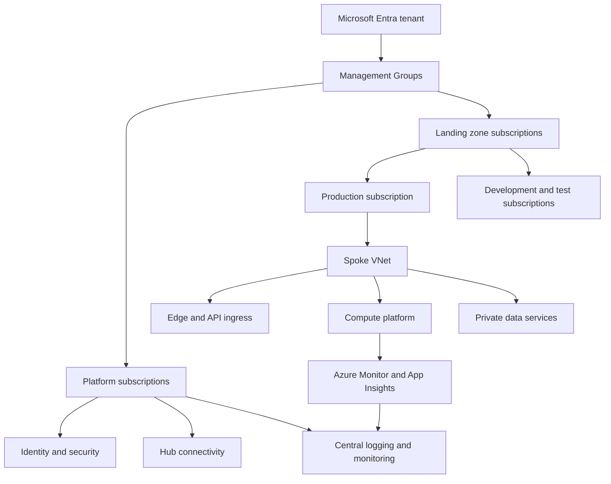
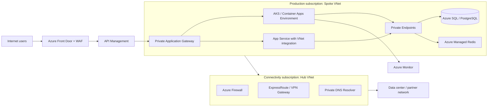
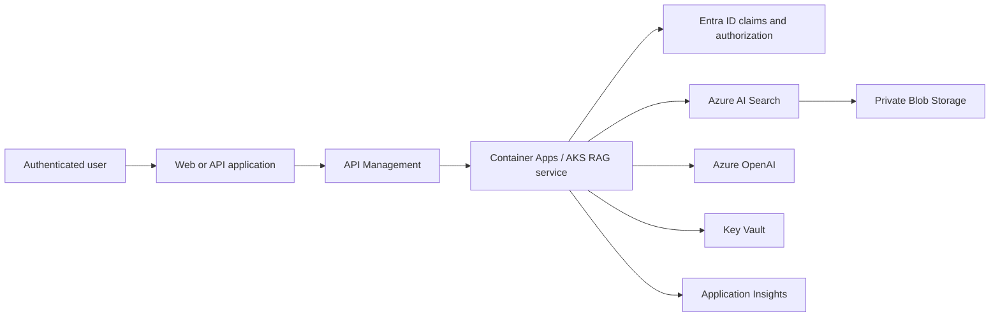

# Azure 高科技公司基础架构与服务选型指南

本文面向建设 SaaS、移动互联网、企业 AI、数据平台或 IoT 产品的高科技公司，说明 Azure 基础架构如何分层，以及常用服务在什么条件下应该或不应该使用。重点是业务目标、故障域、安全边界、数据一致性和运维能力，而不是服务清单堆砌。

> 适用原则：Azure 服务能力、区域可用性、配额和定价会变化。生产选型前应核对目标 Region 的服务可用性、SLA、合规认证、数据驻留、配额、私网支持和灾备能力。

## 1. Azure 基础架构的层次

Azure 的企业基础架构可分为六层：治理与身份、网络、计算、数据与集成、安全与可观测性、交付与运营。每一层都有自己的故障域和访问控制，不能只依赖某一个“高可用服务”。



### 1.1 基础资源层级

| 层级 | 作用 | 典型用法 | 使用条件与注意点 |
| --- | --- | --- | --- |
| Microsoft Entra tenant | 公司身份、目录、应用注册和全局 RBAC 根 | 员工 SSO、外部身份、应用服务主体 | 通常一个企业主 tenant；跨租户协作需明确 B2B/B2C、审计和离职回收流程 |
| Management Group | 在订阅上方组织策略和权限 | 按平台、生产、沙盒、受监管工作负载分层 | 适合继承 Azure Policy；层级不要过深，策略应先审计再强制 |
| Subscription | 账单、配额、资源隔离和权限边界 | 生产、非生产、共享网络、安全、数据平台独立订阅 | 不是绝对网络隔离；需要 VNet、RBAC、Policy 和私有端点配合 |
| Resource Group | 将具有相同生命周期的资源归组 | 单个产品环境或服务单元 | 不要把整个公司资源放入一个 RG；删除 RG 会删除其资源，需严格权限 |
| Resource | 实际服务实例 | AKS 集群、Storage Account、Key Vault 等 | 必须有名称、区域、标签、所有者、成本中心和数据分类 |

### 1.2 企业 Landing Zone 建议

高科技公司常采用 Azure Landing Zone 思路建立订阅与责任边界：

| 订阅类别 | 承载内容 | 不应承载的内容 |
| --- | --- | --- |
| Identity / Security | Microsoft Entra 集成、Defender、Sentinel、密钥治理与安全自动化 | 面向客户的应用和数据库 |
| Connectivity | Hub VNet、Azure Firewall、VPN/ExpressRoute Gateway、Private DNS | 业务容器和业务数据 |
| Management | Log Analytics、Azure Monitor、Azure Policy、自动化与成本管理 | 生产客户数据 |
| Production workload | 正式 API、计算、数据、消息和业务密钥引用 | 开发实验、个人测试资源 |
| Non-production workload | 开发、测试、预发布、性能压测 | 真实生产 PII 或生产凭据 |
| Data / AI platform | 数据湖、分析、共享特征与模型平台 | 无关业务的在线交易写入 |

用 Azure Policy 强制或审计以下基线：资源标签、允许区域、诊断日志、托管标识、磁盘/存储加密、禁止公开访问、私有端点、备份和 Defender 计划。Policy 是护栏，不替代应用级授权、代码评审或渗透测试。

## 2. 身份、权限和密钥

### 2.1 Microsoft Entra ID

Microsoft Entra ID 是 Azure 的身份控制平面。员工、应用、托管标识和外部协作用户都通过它获得 Azure 资源访问权。

| 能力 | 用途 | 适用条件 |
| --- | --- | --- |
| 用户、组和 RBAC | 向人员授予订阅/RG/资源操作权限 | 使用组而非单独用户授权；生产高权限采用最小权限 |
| Conditional Access | 按设备合规、地理位置、风险和 MFA 控制登录 | 有 Entra ID P1/P2 许可与安全运营能力时，应作为管理员访问基线 |
| Privileged Identity Management (PIM) | 对 Owner、Contributor 等高权限进行按需、限时激活 | 生产和订阅管理员应启用审批、MFA、理由和审计 |
| Workload Identity | 应用、CI/CD、Kubernetes 工作负载访问 Azure | 优先用托管标识或工作负载身份联合，避免长期 client secret |
| External ID / B2C | 面向消费者的注册、登录、社交身份和 MFA | 消费者身份与员工目录分离；需评估品牌、区域和合规需求 |

推荐权限路径：员工通过 Entra 组和 PIM 获得短期 Azure RBAC；应用使用 system-assigned 或 user-assigned managed identity；CI/CD 使用 workload identity federation；任何长期 client secret 都应作为例外，保存在 Key Vault 并设置轮换期限。

### 2.2 Azure Key Vault

Key Vault 保存密钥、密码、证书和敏感配置。应用通过 managed identity 在运行时读取，避免把连接字符串写入代码、镜像或流水线变量。

```text
Container App / AKS workload / Function
        -> Managed Identity
        -> Key Vault RBAC
        -> Secret, key or certificate
```

适合使用 Key Vault 的情况：数据库密码、第三方 API Token、证书私钥、客户管理密钥（CMK）和签名密钥。需要注意：

- 对生产 Vault 禁用公共网络访问，使用 Private Endpoint 和 Private DNS。
- 区分密钥管理员、密钥使用者、密钥备份恢复者；不要让应用拥有管理权限。
- 启用 soft delete 和 purge protection，避免误删后不可恢复。
- 避免高频请求路径每次调用 Key Vault；在安全的应用内缓存已轮换的配置，或使用 Key Vault references/CSI driver。
- Key Vault 不适合存储大文件、业务数据或频繁变动的用户会话。

## 3. 网络基础架构

### 3.1 Hub-Spoke 网络模型

当公司拥有多个产品、环境或订阅时，通常使用 Hub-Spoke：Hub VNet 集中管理混合连接、DNS、出口与网络检查；每个产品或环境在 Spoke VNet 内运行。小型单产品团队可以从单 VNet 开始，但应预留地址段与迁移路径。



### 3.2 网络组件与使用条件

| 组件 | 作用 | 适合使用的条件 | 不适合或需谨慎的情况 |
| --- | --- | --- | --- |
| Virtual Network (VNet) | Azure 私有网络边界，包含子网、路由、NSG 和私有端点 | 几乎所有生产 IaaS/PaaS 工作负载 | CIDR 规划不足会阻碍扩容、混合网络和并购整合 |
| Subnet | 将应用、私有端点、网关和数据服务分段 | 需要独立路由或网络策略时 | 不要依赖名称作为安全边界；委派子网需预留足够地址 |
| Network Security Group (NSG) | 有状态 L3/L4 入站/出站规则 | VM NIC、子网和部分私有工作负载的细粒度访问控制 | 不能检查 HTTP 内容，也不是 Web 应用防火墙 |
| User Defined Route (UDR) | 强制指定下一跳，例如流量经过 Firewall | 需要受控出网、混合网络或检查 VNet | 错误路由容易造成非对称流量和 PaaS 可达性故障 |
| Azure Firewall | 托管的集中网络防火墙、FQDN/网络/应用规则和威胁情报 | 多 Spoke 统一出入口、混合网络与合规审计 | 单独使用不能保护应用逻辑；需要容量、规则和日志治理 |
| Azure Front Door | 全球 L7 入口、CDN、WAF、TLS 和全局负载均衡 | 多 Region Web/API、全球低延迟、边缘防护 | 只在单 Region 内部服务时可能过度；需设计源站健康和缓存规则 |
| Application Gateway | 区域 L7 负载均衡，支持 WAF、TLS 终止和路径路由 | VNet 内 Web 工作负载、AKS/VM 后端、私有入口 | 不替代 API 网关；全局路由需要 Front Door 或 Traffic Manager |
| Azure Load Balancer | 区域 L4 TCP/UDP 负载均衡 | 非 HTTP 协议、VM/VMSS、AKS 内部或公网 L4 服务 | 不提供 URL 路由、WAF 或应用认证 |
| Azure API Management (APIM) | API 网关：认证、配额、转换、版本、开发者门户和分析 | 对外/对内 API 产品化、多后端统一治理 | 不是业务逻辑层；策略复杂时需版本控制和性能测试 |
| Private Endpoint / Private Link | 将 PaaS 服务映射为 VNet 私有 IP | 数据库、Storage、Key Vault、AI 服务等生产访问 | 要同时配置 Private DNS；仅创建 Endpoint 不会自动阻止公共入口 |
| Private DNS Zone | 让服务 FQDN 解析到 Private Endpoint IP | 任何 Private Endpoint 场景 | 多 VNet/本地 DNS 转发需统一治理，避免解析到公网 IP |
| VPN Gateway | 加密连接 Azure 与本地/合作方网络 | 中等带宽、快速接入、ExpressRoute 备份 | 高稳定性/大带宽核心系统通常需要 ExpressRoute |
| ExpressRoute | 专线私网接入 Microsoft 云网络 | 受监管数据中心、稳定大带宽、低抖动混合场景 | 仍需冗余线路、BGP 和灾备；不是“天然加密”或无限可用 |
| Azure Bastion | 浏览器中经托管跳板访问 VM | 需要少量紧急 VM 管理且不暴露 RDP/SSH | 优先使用 Azure Bastion 或 Azure Arc/Run Command，避免公网管理端口 |

### 3.3 出站与私有访问原则

1. 生产工作负载默认没有公网 IP。
2. PaaS 访问优先使用 Private Endpoint；使用 Private DNS 验证解析与路由。
3. 需要访问互联网的流量经 Azure Firewall 或 NAT Gateway，按业务要求记录并限制目标。
4. 在 Kubernetes 或容器平台中明确 SNAT、DNS、出站 IP 和第三方 allowlist，避免扩容后源地址变化。
5. 建立 VNet Flow Logs、Firewall 日志和 DNS 查询日志，并集中到 Log Analytics/Sentinel。

## 4. 计算与应用托管服务

计算服务的选择取决于运行时控制权、团队运维能力、部署模型、扩缩容曲线、网络需求和合规要求。不要因为服务“托管”就忽略镜像漏洞、身份权限、日志或应用可靠性。

| 服务 | 主要用途 | 最适合的条件 | 不适合或需要额外设计的条件 |
| --- | --- | --- | --- |
| Azure Virtual Machines | 长运行、遗留软件、特殊操作系统/驱动和需要完整 OS 控制的应用 | 无法容器化、需要特定软件许可、复杂网络 appliance | 团队不愿管理补丁、镜像、容量、备份和 HA 时，优先 PaaS/容器 |
| Virtual Machine Scale Sets | 基于同一镜像弹性扩缩的一组 VM | 可无状态化的 VM 服务、批处理 worker | 有状态节点需单独设计数据和滚动更新；不要把它当容器编排替代品 |
| Azure App Service | 托管 Web App、REST API、后台 WebJob | 标准 Web/API、快速交付、团队希望少管 OS 和集群 | 对节点级控制、复杂 sidecar、特殊协议或大规模多服务编排需求强时不够灵活 |
| Azure Functions | 事件驱动、短时执行、定时/队列/HTTP 任务 | 突发负载、文件处理、轻量集成、自动化任务 | 长事务、长连接、极低延迟持续负载或复杂调度应评估 Premium/Container Apps/AKS |
| Azure Container Apps | 托管容器、KEDA 事件扩缩、Dapr 集成、revision 流量分割 | 微服务、API、worker、快速容器平台且不想维护 Kubernetes | 需要自定义 CRD、复杂 DaemonSet、专用网络插件或 Kubernetes 生态时使用 AKS |
| Azure Kubernetes Service (AKS) | 托管 Kubernetes 控制面 | 多团队微服务平台、Kubernetes 生态、复杂网络/调度/GPU/服务网格需求 | 团队没有集群升级、安全、网络、策略、成本治理能力时会过度复杂 |
| Azure Batch | 大规模并行批处理和 HPC 任务 | 渲染、仿真、科学计算、离线大批任务 | 面向用户的低延迟 API 或细粒度事件驱动任务 |
| Azure Spring Apps | 托管 Java/Spring 微服务平台 | 大量标准 Spring Boot 服务且希望减少平台运维 | 多语言、多运行时或高度定制 Kubernetes 场景需评估其他平台 |

### 4.1 推荐的计算决策树

1. **只需 Web/API，运行时标准，优先交付速度**：先选 App Service。
2. **按事件触发、执行时间短、峰谷明显**：选 Azure Functions；评估 Consumption、Flex Consumption、Premium 或 Dedicated 计划的冷启动、VNet、并发与成本。
3. **已有容器、想要 revision 灰度和事件扩缩，但不想运营 Kubernetes**：选 Container Apps。
4. **需要 Kubernetes API、复杂编排、GPU、服务网格或多租户平台控制力**：选 AKS，并投入专门平台工程能力。
5. **无法改造的遗留系统或商业软件**：选 VM/VMSS，并明确镜像、补丁、备份、可用区和灾备责任。

### 4.2 高可用与部署

- 无状态 API 至少跨两个 Availability Zone 部署；区域不支持 AZ 时，明确替代故障模型。
- 使用 Application Gateway、Front Door、APIM 或服务平台的健康检查移除不健康实例。
- 用蓝绿、金丝雀、slot/revision 或 GitOps 实现渐进发布；数据库变更采用 expand/contract，而不是直接破坏性修改。
- 对异步 worker 按 Service Bus/Event Hubs backlog、延迟和业务 SLO 扩缩容，不能只看 CPU。
- 设置资源配额和最小副本数，避免缩容至零后不符合延迟或可用性目标。

## 5. 数据、存储与缓存

### 5.1 事务、文档与分析数据选型

| 服务 | 数据模型与用途 | 使用条件 | 核心注意点 |
| --- | --- | --- | --- |
| Azure SQL Database / Managed Instance | 托管 SQL Server 关系型事务、报表与企业集成 | 需要 T-SQL、SQL Server 生态、PaaS 管理体验 | Database 更云原生，MI 兼容性更高；设计索引、连接池、备份和故障切换 |
| Azure Database for PostgreSQL Flexible Server | PostgreSQL 事务应用、SaaS、地理/JSONB 扩展 | 团队使用 PostgreSQL 生态、需要托管备份和弹性规模 | 设置私网、HA、PITR、读副本和连接池；不因托管而忽略慢查询与 vacuum |
| Azure Cosmos DB | 全球分布式 NoSQL：文档、键值、列族、图等 API | 已知访问模式、需要低延迟/全球复制/弹性吞吐 | 分区键决定成本和性能；避免热点分区与无边界跨分区查询 |
| Azure SQL Hyperscale | 大规模 SQL Server 数据库和快速备份恢复 | SQL 模型不变但存储规模/恢复需求高 | 需评估特性兼容、成本和读扩展模式 |
| Azure Data Explorer | 高吞吐日志、指标、时序和交互式分析 | 可观测性、IoT 遥测、安全日志和时序探索 | 不是 OLTP 账本；设计摄取、保留、分区和查询成本 |
| Microsoft Fabric / Azure Databricks | 湖仓、Spark、SQL 分析、流批处理、ML 数据准备 | 跨团队数据工程、分析和 ML 工作负载 | 建立数据治理、访问控制、成本上限和生产化流水线 |
| Azure Data Factory | 批量/编排式数据集成与 ETL/ELT | SaaS、数据库、文件系统间可视化管道与调度 | 复杂业务逻辑不应全部塞进管道；版本控制、参数化和告警必不可少 |

### 5.2 存储服务

| 服务 | 常用用途 | 使用条件 | 关键控制 |
| --- | --- | --- | --- |
| Azure Blob Storage | 对象、数据湖、备份、媒体、导出文件 | 几乎所有非文件系统对象数据场景 | 禁止匿名公共访问、启用版本/软删除、生命周期、CMK（如需）和私有端点 |
| Azure Data Lake Storage Gen2 | 支持层级命名空间的数据湖 | Spark/Fabric/Databricks 分析、分区数据集 | 设计文件分区、小文件治理、RBAC 与 POSIX ACL 的组合 |
| Azure Files | SMB/NFS 共享文件系统 | 传统应用、共享配置/媒体、容器挂载 | 不适合高频事务数据库；选择合适 SKU、快照与私有访问 |
| Managed Disks | VM/AKS 节点持久块存储 | 有状态 VM、Kubernetes PV | 规划性能 SKU、快照、加密和跨 AZ/Region 恢复能力 |
| Azure NetApp Files | 高性能 NFS/SMB 文件服务 | 企业文件、SAP、HPC 或需要高 IOPS/低延迟共享存储 | 成本通常高，需基于吞吐和容量计划使用 |

### 5.3 缓存与搜索

| 服务 | 使用场景 | 不能承担的责任 |
| --- | --- | --- |
| Azure Managed Redis / 当前受支持的 Azure Redis 产品 | 热点读缓存、会话、限流、排行榜、短期协调 | 唯一账本、永久审计记录或不可丢失的业务事实 |
| Azure AI Search | 全文、向量、混合检索和 RAG 检索层 | 权威数据存储、复杂事务或权限模型的唯一执行点 |
| Cosmos DB integrated cache 等缓存机制 | 特定数据访问模式的读取加速 | 不能取消分区键、索引和数据建模设计 |

缓存使用 Cache-Aside：读缓存未命中后读取事实库并写入带 TTL 的缓存；写入事实库成功后删除或发布失效事件。必须防范缓存穿透、热点过期、雪崩、内存淘汰和缓存不可用时的回源冲击。

## 6. 消息、事件与集成

| 服务 | 消息语义与用途 | 适合使用的条件 | 设计重点 |
| --- | --- | --- | --- |
| Azure Service Bus | 企业级队列和 Topic/Subscription，支持事务、会话、死信 | 订单、支付后处理、工作流命令、可靠企业集成 | 消费者幂等、DLQ 处理、锁超时、重复检测和会话分区 |
| Azure Event Hubs | 高吞吐事件流，兼容 Kafka 生态 | 遥测、点击流、日志、IoT、实时分析 | Partition key、消费者组、保留期、吞吐单位和重复消费 |
| Azure Event Grid | 基于事件的轻量发布/订阅，支持 Azure 资源事件 | Blob 创建、资源变更、SaaS webhook、自动化触发 | 至少一次投递，订阅者要幂等并处理重试/死信 |
| Azure API Management | 同步 API 的认证、配额、版本、策略和开发者门户 | 面向外部开发者、移动端、多后端的 API 产品 | 不承担长任务；后端故障处理、限流和策略变更需测试 |
| Logic Apps | 低代码工作流与大量连接器集成 | 企业 SaaS、审批、文件/邮件/业务系统编排 | 复杂核心业务逻辑应保留代码、测试和版本管理 |
| Azure Data Factory | 数据管道编排 | 定时/批处理数据移动与转换 | 不能当作低延迟消息队列或在线事务总线 |

选择口诀：需要“命令必须处理”时考虑 Service Bus；需要“海量事件流”时考虑 Event Hubs；需要“某件事发生后通知多个订阅者”时考虑 Event Grid；需要“面向开发者的同步接口治理”时使用 APIM。

## 7. AI、机器学习与高科技产品服务

### 7.1 常用 AI 服务

| 服务 | 用途 | 使用条件 | 风险与控制 |
| --- | --- | --- | --- |
| Azure OpenAI Service | LLM 推理、对话、摘要、代码辅助和 RAG | 有明确模型、区域、配额、数据处理和评估方案 | 处理提示注入、越权工具调用、幻觉、内容安全、成本和敏感数据泄漏 |
| Azure AI Search | 向量、关键词、语义和混合检索 | RAG、文档问答、企业搜索、产品搜索 | 检索时执行租户/文档 ACL 过滤；索引延迟和删除传播需验证 |
| Azure AI Foundry / Azure Machine Learning | 模型实验、微调、评估、部署、注册表和 MLOps | 数据科学团队需要可复现训练/评估/部署 | 版本化数据、代码和模型；监控漂移、偏见、安全和成本 |
| Azure AI Document Intelligence | OCR、表单、票据、合同和结构化提取 | 大量文档自动录入与人工复核 | 置信度阈值、人工复核、PII 保护和原文件保留策略 |
| Azure AI Speech / Vision | 语音转写、合成、图像分析 | 客服、无障碍、媒体和视觉质检 | 明确同意、数据保留、区域、误识别与人类复核 |
| Azure Machine Learning managed online endpoints | 低延迟模型在线推理 | 已训练模型需要托管推理与灰度部署 | 监控吞吐/延迟、模型版本、回滚和特征一致性 |

### 7.2 一个安全的 RAG 最小架构



关键点：数据摄取时保留文档来源、分类和 ACL；检索时按用户/租户过滤，而不是先检索所有内容再由模型“决定不回答”；模型工具调用采用 allowlist 和最小权限；记录可审计的请求元数据与评估结果，但不无控制地记录敏感提示和响应。

## 8. 安全、监控与可靠性

### 8.1 常用安全服务

| 服务 | 作用 | 使用条件 |
| --- | --- | --- |
| Microsoft Defender for Cloud | 云安全态势管理、漏洞与工作负载保护建议 | 生产订阅应启用相关计划，配置修复 SLA 和例外审批 |
| Microsoft Sentinel | SIEM/SOAR，聚合日志、分析规则、调查和自动化响应 | 有安全运营团队或托管 SOC；需要控制日志成本和保留期 |
| Azure Policy | 资源创建/更新的合规审计和拒绝 | 用于标签、区域、私网、诊断和加密基线；先 test/audit 再 deny |
| Microsoft Purview | 数据目录、分类、血缘与数据治理 | 多团队数据平台、合规和敏感数据治理需求较强 |
| DDoS Protection | VNet 公网 IP 的增强 DDoS 防护与遥测 | 关键公网应用或 IP；仍需 Front Door/WAF 和应用限流 |
| Azure Firewall Premium | TLS 检查、IDPS 和 URL 分类等高级网络保护 | 受控出网与混合网络；要处理证书、隐私和性能影响 |

### 8.2 Azure Monitor 与应用可观测性

| 组件 | 主要用途 | 实践建议 |
| --- | --- | --- |
| Azure Monitor | 平台指标、活动日志、告警和自动化 | 建立服务健康、容量、成本和业务 SLO 看板 |
| Log Analytics Workspace | 集中查询资源日志和 KQL 分析 | 按环境/保留/访问边界规划；设置数据采集规则与成本控制 |
| Application Insights | 分布式追踪、依赖调用、异常、请求性能和可用性测试 | 所有 API 传递 correlation ID，避免采集 token/PII |
| Azure Managed Grafana | Prometheus/Azure Monitor 可视化 | 适合 SRE 和平台团队统一仪表盘 |
| Azure Service Health | Azure 平台维护与区域服务事件通知 | 与内部告警和事件流程集成，不等同于应用健康检查 |

必须同时监控技术和业务指标。技术层包括 P95/P99 延迟、错误率、CPU、内存、队列年龄、数据库连接、可用 IP、证书到期；业务层包括注册成功率、支付成功率、事件处理延迟、模型拒答率和关键数据延迟。

### 8.3 可靠性模式

1. **Availability Zone**：用于防范单数据中心级故障。应用、网关和支持 AZ 的数据服务跨至少两个 AZ 部署。
2. **Region Pair / 多 Region**：用于区域级灾难、全球用户或数据驻留。先定义谁可写、如何复制、如何检测和如何切回。
3. **重试与熔断**：只重试可安全重试的幂等操作，采用超时、指数退避和抖动；不能用无限重试掩盖依赖故障。
4. **异步削峰**：把长任务放入 Service Bus/Event Hubs，由可独立伸缩的消费者处理。
5. **备份与恢复**：测试恢复，不只监控备份成功。定义 RPO、RTO、数据校验和业务回切步骤。
6. **混沌与演练**：定期演练节点/AZ 故障、凭据失效、消息堆积、数据库故障转移和 Region 恢复。

## 9. 高科技公司最常用的 Azure 服务组合

### 9.1 SaaS Web 与移动产品

| 层 | 常见组合 | 适用原因 |
| --- | --- | --- |
| 边缘与 API | Front Door + WAF + APIM | 全球接入、TLS、DDoS 缓解、API 鉴权/限流/版本治理 |
| 应用 | Container Apps 或 AKS；简单 API 可选 App Service | 无状态服务、灰度发布、按请求或事件扩缩 |
| 身份 | Entra External ID/B2C 或 OIDC IdP + Managed Identity | 消费者认证与工作负载身份分离 |
| 数据 | PostgreSQL Flexible Server/Azure SQL + Redis + Blob Storage | 事务、缓存与对象存储职责清晰 |
| 异步 | Service Bus + Event Grid | 可靠命令处理和资源事件解耦 |
| 运维 | Azure Monitor + Application Insights + Defender for Cloud | 端到端可观测性与安全检测 |

### 9.2 数据与实时分析产品

| 层 | 常见组合 | 适用原因 |
| --- | --- | --- |
| 采集 | Event Hubs + IoT Hub（设备场景）+ Data Factory | 高吞吐事件和批量数据源并存 |
| 存储 | ADLS Gen2 + Delta/Parquet | 成本可控的数据湖和分析格式 |
| 处理 | Databricks、Fabric 或 Stream Analytics | 批处理、流处理、SQL BI 按团队能力选择 |
| 服务 | Azure Data Explorer、Cosmos DB 或 PostgreSQL 读模型 | 面向日志、实时仪表盘或在线查询的不同需求 |
| 治理 | Purview + Entra + Key Vault + Private Endpoint | 数据分类、血缘、访问与密钥治理 |

### 9.3 AI/RAG 产品

| 层 | 常见组合 | 适用原因 |
| --- | --- | --- |
| 用户入口 | Front Door/WAF + APIM + App Service/Container Apps | 保护并治理客户端请求 |
| 模型与检索 | Azure OpenAI + Azure AI Search | 生成和权限过滤的混合检索 |
| 知识库 | Blob Storage/ADLS + Document Intelligence | 安全存放原文并结构化提取 |
| 控制平面 | Entra ID + Key Vault + Private Endpoint | 无秘密访问与私网数据路径 |
| 质量与安全 | Azure AI Content Safety（适用时）+ Application Insights + 人工评估 | 监控安全、成本、检索质量和模型输出 |

### 9.4 IoT 与边缘产品

| 层 | 常见组合 | 适用原因 |
| --- | --- | --- |
| 设备接入 | Azure IoT Hub + DPS | 设备身份、双向消息和大规模预配 |
| 边缘 | Azure IoT Edge / Azure Arc | 本地推理、离线处理和混合管理 |
| 流处理 | Event Hubs + Stream Analytics/Databricks | 处理持续遥测流和异常检测 |
| 存储与查询 | ADLS Gen2 + Azure Data Explorer | 原始归档与低延迟时序探索 |
| 运维 | Defender for IoT + Monitor | 设备安全、更新、可见性和异常告警 |

## 10. 实施路线与上线检查

### 10.1 推荐实施顺序

1. 明确产品边界、数据分类、用户区域、合规、SLO、RPO/RTO 和容量预估。
2. 建立 Entra、Management Groups、订阅、RBAC/PIM、命名与标签规范。
3. 部署 Hub/Spoke、IPAM、DNS、Private Endpoint、Firewall、VPN/ExpressRoute 和日志。
4. 部署日志、监控、安全检测、Policy、预算和资源锁等平台基线。
5. 选择最小复杂度的计算平台，使用 IaC 建立开发、测试和生产环境。
6. 按数据特征选择事务库、对象存储、缓存和消息服务，并测试备份恢复。
7. 建立 CI/CD、镜像/依赖扫描、密钥注入、渐进发布和回滚流程。
8. 完成性能、安全、灾备、成本和运维演练后，再扩大生产流量。

### 10.2 生产上线最小验收清单

- 资源通过 IaC 创建，标签、区域、所有者和成本中心完整；生产手工漂移可检测。
- 员工访问使用 Entra SSO、MFA 和 PIM；应用使用 Managed Identity，没有嵌入长期密钥。
- 所有生产 PaaS 数据服务关闭不必要的公网入口，Private Endpoint 与 DNS 解析已测试。
- 网络流量、控制面、应用日志、审计日志和安全日志集中保存，并有最小访问权限与保留策略。
- 已设置容量、错误率、延迟、队列、数据库、证书、备份和成本异常告警，且有明确责任人。
- 已验证备份恢复、单 AZ 故障、依赖超时、错误发布、凭据轮换和高峰扩缩容。
- 已有 API、数据、模型和基础设施的版本兼容及回滚计划。

## 11. 常见误区

| 误区 | 正确理解 |
| --- | --- |
| “订阅隔离就足够安全” | 还需要 Entra RBAC、Policy、VNet、Private Endpoint、资源策略、密钥管理和应用授权。 |
| “PaaS 不需要运维” | PaaS 降低基础设施运维，但数据建模、容量、权限、备份、日志、成本和应用性能仍由团队负责。 |
| “AKS 是所有微服务的默认答案” | 对许多团队，Container Apps 或 App Service 更易运营；只有需要 Kubernetes 控制力时才承担 AKS 复杂度。 |
| “Private Endpoint 自动保证私网” | 仍要关闭/限制公共访问、正确配置 Private DNS，并验证路由和 RBAC。 |
| “消息队列能保证业务不重复” | 大多数消息语义至少一次；消费者、账本写入和外部调用必须幂等。 |
| “有备份就完成灾备” | 必须在隔离环境真实恢复，测量 RPO/RTO，并验证 DNS、身份、密钥和第三方依赖。 |
| “LLM 使用托管服务就没有数据风险” | 仍需治理提示、检索权限、日志、模型输出、工具调用、区域与敏感数据。 |

## 12. 总结

高科技公司在 Azure 上最常见、最具复用价值的组合通常是：Entra ID 与 Managed Identity 建立身份基线，Landing Zone 和 Azure Policy 建立治理，Hub-Spoke 与 Private Link 建立私网边界，Front Door/WAF/APIM 管理入口，Container Apps/AKS/App Service 承载计算，PostgreSQL/Azure SQL/Cosmos DB/Blob 负责不同数据模型，Service Bus/Event Hubs/Event Grid 解耦流程，Azure Monitor/Defender/Sentinel 提供运营与安全可见性。

服务的正确选择不取决于“功能最多”，而取决于团队能否持续、安全地运营它。先以最小复杂度满足当前 SLO 和合规要求，保留清晰的扩展、迁移、备份和故障恢复路径，通常比过早堆叠大型平台更可靠。