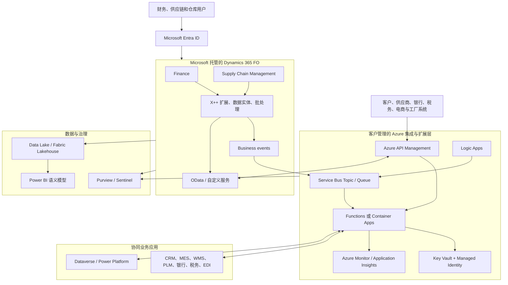
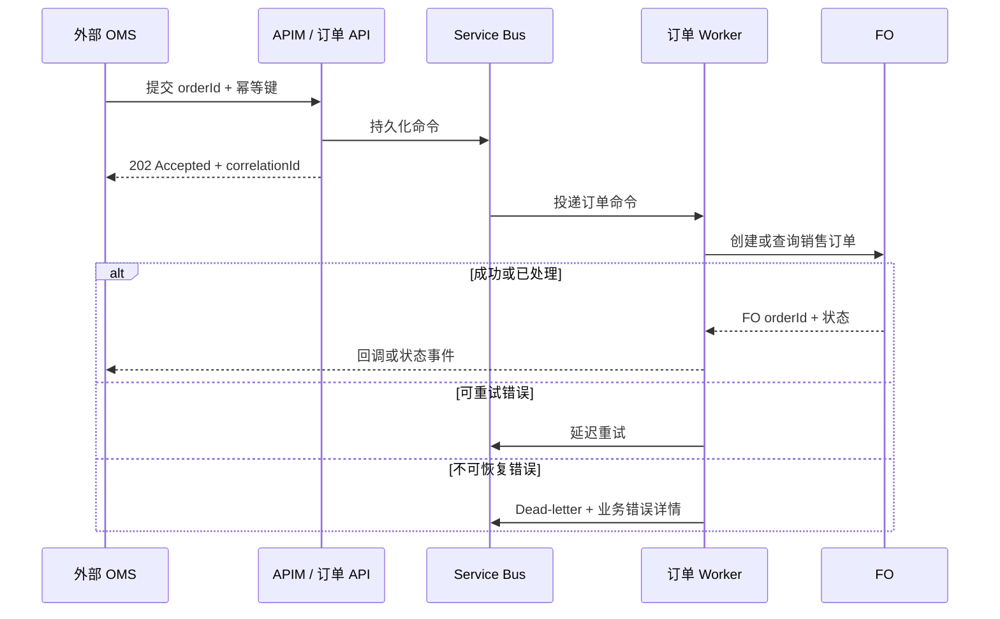

# Dynamics 365 Finance and Operations 基础、进阶架构与二次开发指南

本文面向需要实施、集成、运维或二次开发 Dynamics 365 Finance and Operations（简称 FO，通常指 Dynamics 365 Finance 与 Supply Chain Management）的架构师、功能顾问和 X++ 开发人员。目标是帮助团队从“会操作模块”进阶到“能设计可升级的 ERP 平台”。

> FO 是 Microsoft 托管的 SaaS ERP，不是客户部署在自己 Azure 订阅中的一套虚拟机。客户通常在 Azure 中建设身份、集成、数据、监控和自定义服务；FO 的核心事务、应用平台和生产环境由 Microsoft 管理。许可、区域可用性、API 配额和发布流程会变化，生产实施前应以组织购买的产品、目标区域和 Microsoft 当前文档为准。

已有跨产品选型需求时，可先阅读 [Dynamics 365 企业架构、模块与二次开发指南](dynamics-365企业架构模块与二次开发指南.md)。本文聚焦 FO 的事务边界、企业架构、X++ 扩展与交付治理。

## 1. 先建立正确的 FO 心智模型

### 1.1 FO 解决什么问题

FO 的价值不是单纯记录订单，而是让跨部门交易在受控规则下形成可审计的库存、成本、应收应付和总账事实。一个销售订单、采购收货、生产报告或项目工时，通常会经过状态控制、审批、库存影响、成本核算和会计过账；绕过这些流程直接修改表数据，往往会造成业务状态与财务事实不一致。

| 能力域 | 核心职责 | 常见业务对象 | 典型边界 |
| --- | --- | --- | --- |
| Finance | 总账、应收、应付、现金和银行、预算、固定资产、税务、财务报表 | Voucher、Journal、Customer、Vendor、Invoice、Financial dimension | 财务凭证和关账规则以 Finance 为准，不由 CRM 或报表系统改写 |
| Supply Chain Management | 产品、采购、库存、销售订单、主计划、生产、仓储、运输、质量、资产管理 | Released product、Inventory transaction、Purchase order、Sales order、Production order | 库存可用量、成本、预留与履约状态以 SCM 为准 |
| 项目与服务型运营 | 项目合同、预算、工时、费用、资源、项目会计 | Project、Funding source、Hour journal、Expense journal | 项目收入、成本和开票必须与 Finance 的会计规则对齐 |
| 组织与安全 | 法人、运营单位、仓库、站点、职责、工作流、审计 | Legal entity、Operating unit、Security role、Workflow | Entra ID 负责登录，FO 负责业务职责和记录访问 |
| 平台与数据 | 表、表单、数据实体、批处理、工作区、报表、业务事件、OData | Data entity、Batch job、Business event、Electronic reporting | 面向集成和分析暴露受控契约，不直接开放事务表 |

### 1.2 三类必须分清的边界

1. **配置与代码**：公司、科目表、财务维度、审批工作流、业务参数、编号规则、权限职责和电子报表优先通过配置实现；只有标准能力无法表达且具有长期业务价值时才编写 X++。
2. **事务与分析**：FO 是实时交易和审计事实的系统；数据湖、Fabric 和 Power BI 用于历史分析、跨系统指标和机器学习。分析结果不能绕过 FO 直接写回核心账表。
3. **FO 与 Dataverse**：Sales、Customer Service、Field Service 等通常以 Dataverse 为业务平台；Finance/SCM 是 ERP 交易平台。要指定每个主数据、价格、订单和状态的唯一事实来源，而不是做无差别双向复制。

### 1.3 业务流程是架构的起点

| 端到端流程 | FO 中的主干 | 架构师应确认的问题 |
| --- | --- | --- |
| Record to Report | 日记账、子分类账、过账、对账、关账、财务报表 | 多法人、多币种、会计日历、维度、税务和关账时限如何设计？ |
| Procure to Pay | 采购申请、审批、采购订单、收货、发票匹配、付款 | 采购目录、三单匹配、供应商主数据和付款职责如何隔离？ |
| Order to Cash | 报价、销售订单、预留、拣配发货、开票、收款 | 价格、信用、可承诺量、退货与收入确认的事实来源分别是谁？ |
| Plan to Produce | 预测、主计划、BOM、工艺路线、生产订单、报告完成、成本核算 | MRP 运行窗口、替代料、委外、批次追溯和成本模型是否可承受定制？ |
| Warehouse to Fulfillment | 到货、入库、补货、波次、拣货、装运、退货 | WMS 移动端、自动化设备、外部 WMS 与库存所有权如何划分？ |
| Project to Profit | 项目合同、预算、工时费用、开票、收入确认 | 项目类型、资助来源、资源排程和会计规则如何协同？ |

在设计模块或接口前，先画出上述流程的状态变化、审批点、责任人、账务影响和异常路径。一个“字段同步”需求常常隐藏着价格主数据、信用控制、存货预留或税务归属的决策，不能只按字段映射处理。

## 2. 从基础使用到架构能力的进阶路径

### 2.1 基础阶段：能正确运行标准流程

基础阶段的目标是用标准功能跑通真实业务，而不是尽早做大量页面与字段改造。

| 主题 | 必须掌握 | 常见误区 |
| --- | --- | --- |
| 组织模型 | 法人、运营单位、站点、仓库、成本中心、部门、财务维度 | 把部门、业务线和法人混作同一个维度，导致报告和权限无法收敛 |
| 主数据 | 客户、供应商、产品、BOM、资源、科目、税、付款条件 | 允许每个部门各自维护“客户主数据”，造成重复和对账困难 |
| 参数与编号 | 模块参数、编号规则、状态默认值、过账配置 | 用代码硬编码本应由公司参数控制的规则 |
| 会计影响 | 过账配置、成本、税、凭证、期间控制、冲销 | 只验收界面结果，没有核对库存、应收应付和总账凭证 |
| 安全职责 | Role、Duty、Privilege、Entry point、工作流参与者 | 给业务人员 System administrator 来解决权限问题 |
| 数据迁移 | 数据实体、模板、暂存校验、导入顺序、历史余额 | 在生产中用 Excel 直接“补数据”，没有批次、日志和回滚证据 |

一个健康的基础实施至少应完成：标准流程演示、关键过账凭证核对、主数据责任矩阵、权限矩阵、迁移演练、异常流程测试和月结演练。

### 2.2 中级阶段：能治理跨模块与跨系统流程

中级团队会从单据操作转向流程控制和集成质量：

1. 为每个关键主数据定义数据所有者、创建入口、审批规则、质量指标和下游订阅者。
2. 以法人、业务单元和地区为维度制定模板，明确哪些参数全局统一、哪些允许本地化。
3. 用业务事件、数据实体和受控 API 对接税务、银行、电子发票、PLM、MES、WMS、CRM、支付和电商。
4. 将批处理视为生产工作负载：明确执行窗口、并发、失败重试、告警、数据修复责任和容量影响。
5. 对关键流程建立控制点，例如信用冻结、采购审批、发票匹配、期间关闭、职责分离和审计追踪。

### 2.3 高级阶段：能控制可升级性、数据一致性与演进成本

高级架构不以“定制数量多”衡量，而以持续更新后仍可预测地运行衡量。此阶段需要具备以下判断能力：

- 将需求放入配置、扩展、外部服务、数据平台或流程重设计中的正确位置。
- 用同步查询与异步命令/事件区分用户即时反馈和后台最终一致性。
- 识别高风险领域：库存事务、成本核算、结算、过账、主计划、仓储执行、税务和银行支付。
- 让每个扩展具备所有者、测试、监控、容量假设、升级影响和退役条件。
- 在平台更新前运行回归测试，审查弃用 API、扩展冲突、性能基线和安全权限变化。

### 2.4 推荐学习路线

| 阶段 | 重点产出 | 验证标准 |
| --- | --- | --- |
| 1. 业务用户/初级顾问 | 一个法人内的采购、销售、库存和总账演练脚本 | 能解释每个交易产生的状态和会计凭证 |
| 2. 功能顾问 | Fit-gap 清单、参数手册、主数据治理、UAT 用例 | 每个 Gap 都有“配置、扩展、集成或不做”的决策 |
| 3. 技术顾问 | 数据实体、接口契约、批处理设计、权限设计 | 接口具有错误处理、幂等、审计和监控方案 |
| 4. X++ 开发 | 可扩展模型、自动化测试、部署包、代码评审记录 | 不修改基对象；能通过平台更新与回归测试 |
| 5. 解决方案架构师 | 目标架构、NFR、RTO/RPO、ALM、运营手册 | 能解释数据归属、失败恢复、成本和升级风险 |

## 3. 多数企业采用的通用 Azure + FO 架构

### 3.1 推荐的逻辑分层

最常见、也最容易长期演进的模式是“FO 作为事务核心，Azure 作为集成和扩展层，湖仓作为分析层”。它既保留 SaaS ERP 的升级能力，也避免把所有复杂性堆入低代码流程或 FO 同步请求中。

| 层 | 推荐组件 | 责任 | 不应承担的责任 |
| --- | --- | --- | --- |
| 身份与访问 | Entra ID、MFA、Conditional Access、PIM | 员工身份、应用身份、Azure 管理权限和特权访问 | 不能替代 FO 的角色、职责、记录级限制和职责分离 |
| 事务核心 | Finance、SCM、工作流、批处理、X++ 扩展 | 受控交易、库存、成本、会计、业务审批和审计事实 | 不能作为通用消息中间件、数据湖或高频 Web 会话库 |
| 集成入口 | API Management | API 认证、版本、限流、策略、可观测性和合作方入口 | 不编排长事务、不存储业务状态 |
| 异步可靠传输 | Service Bus | 命令队列、事件扇出、削峰、死信和重放 | 不保证跨 FO、外部系统和数据库的全局原子事务 |
| 编排与代码 | Logic Apps、Functions、Container Apps | SFTP/EDI、连接器、转换、验证、后台 worker、专用 API | 不把核心库存/会计规则复制一份到 Azure |
| 密钥和网络 | Key Vault、Managed Identity、Private Endpoint、RBAC | 无密钥访问、秘密轮换、网络和管理平面保护 | 不能弥补应用逻辑中的越权和数据泄漏 |
| 数据分析 | Data Lake、Fabric、Power BI | 历史分析、对账、预测、跨系统语义模型 | 不替代 FO 的实时可用库存、信用控制或总账查询 |
| 安全运营 | Azure Monitor、Application Insights、Purview、Sentinel | 运行指标、日志关联、数据分类、告警与调查 | 不能取代权限设计、测试和人工处置 |

### 3.2 数据所有权矩阵

集成失败最常见的根因不是技术，而是没有定义“谁能创建、谁能更改、谁是权威”。以下是可作为讨论起点的通用矩阵，项目必须按实际流程调整。

| 数据或状态 | 常见事实来源 | 下游系统的权限 | 同步方式 |
| --- | --- | --- | --- |
| 法人、科目表、财务维度、税务、付款条件 | FO Finance | 只读或经受控主数据流程申请 | 数据实体批量发布或 API 增量查询 |
| 供应商、采购价格、采购订单 | FO SCM / Procurement | 外部采购门户仅提交申请或确认 | 异步命令 + 状态事件 |
| 产品、BOM、工艺路线 | PLM 或 FO，二选一 | 非所有者系统只读，变更经版本流程 | 批量实体 + 变更事件 |
| 库存、可承诺量、批次状态 | FO SCM | WMS/MES 报告执行结果，不能任意覆盖余额 | 同步查询 + 异步确认 |
| 客户、商机、活动 | CRM/Dataverse | FO 接收经过治理的客户/订单相关数据 | 双向仅限明确字段与冲突规则 |
| 销售订单、发货、发票、收款 | FO 或电商 OMS，按流程确定 | 非所有者仅维护映射状态 | 幂等命令 + 业务事件 |
| 财务凭证、税务申报状态 | FO Finance | 外部系统只接收受控输出 | 异步事件、电子报表或银行接口 |

不要把“两个系统都可以改”当成双向集成。双向只能是两个受限方向的单向流程组合，并且每个字段、状态机、冲突和补偿动作都已定义。

### 3.3 四种常见企业架构与取舍

#### 架构 A：标准 FO + 少量外围集成

适用于单一或少量法人、流程较标准、外部系统数量有限的公司。FO 承担核心交易，Power BI 做报表，使用标准数据实体或受控 OData 连接少量银行、税务或电商系统。

**优点**：实施和运维成本较低，接口少、数据链路短，平台升级阻力小。

**缺点**：面对复杂 EDI、多个合作方、异步高峰或大量系统时容易演变为点对点耦合；部门可能用 Excel 或个人 Power Automate 绕开治理。

**架构建议**：即使系统少，也要定义接口所有者、错误队列、数据归属和非生产环境。不要因“接口只有一个”而把密钥写在 X++ 或客户端配置里。

#### 架构 B：FO 核心 + Azure 受控集成层

这是中大型企业最通用的目标架构。FO 用业务事件、数据实体、OData 或受控服务与 Azure 集成层交互；Azure 使用 APIM、Service Bus、Logic Apps 和代码 Worker 对接 CRM、PLM、MES、WMS、税务、银行、EDI 和电商。

**优点**：解耦合作方和 ERP；异步削峰、死信、重放、监控和 API 版本治理更成熟；复杂的协议转换留在适合的 Azure 服务中。

**缺点**：需要平台工程、消息治理、成本管理和支持团队；最终一致性要求业务接受“状态稍后更新”，不能假设每一步都是分布式事务。

**架构建议**：同步调用只满足即时校验或即时创建结果；发货、库存变动、通知和分析投影走异步。消费者以业务键幂等，失败信息包括源系统、消息 ID、业务 ID、版本、重试次数和可操作的错误原因。

#### 架构 C：制造/零售的 FO + 车间与履约生态

适用于有 MES、设备、自动化立库、运输管理、第三方仓储、POS 或高频电商订单的企业。FO 保留物料、库存账、成本和财务控制；MES/WMS/OMS 在其擅长的执行域处理扫描、排程、设备协议或波次执行。

**优点**：每个系统承担自己的专业能力，可支持更高吞吐和现场离线要求；避免为了适配设备协议而污染 ERP 核心。

**缺点**：库存、批次、序列号、单位换算、取消和退货的状态对齐非常复杂；接口延迟或重复处理可能造成超卖、重复消耗或库存差异。

**架构建议**：在设计前定义库存所有权交接点，例如“WMS 确认装运后 FO 扣减”或“FO 下达工作后 WMS 执行”。对每个物料移动建立不可变关联 ID、去重键、对账作业和人工差异处理流程。

#### 架构 D：集团多法人 + 湖仓与治理平台

适用于多国家、多法人、并购频繁或对财务合并、经营分析和合规审计要求高的企业。FO 运营交易，数据以受控方式进入 Data Lake/Fabric，Power BI 构建经认证的语义模型，Purview/Sentinel 提供分类、血缘和安全运营能力。

**优点**：分析与交易隔离，能统一 KPI、历史快照、对账和跨系统洞察；并购系统可渐进接入，而不必一次性替换所有系统。

**缺点**：数据延迟、口径分歧、数据驻留和访问控制更复杂；若没有数据产品负责人，数据湖会变成缺少定义的导出仓库。

**架构建议**：为关键指标明确事实表、维度、刷新延迟、会计期间、币种换算和行级安全。经营报表使用受认证语义模型，月结和法定报告仍以 FO 的受控流程和审计输出为准。

### 3.4 方案选择速查

| 需求特征 | 优先模式 | 关键约束 |
| --- | --- | --- |
| 少量、低频、批量主数据迁移 | 数据管理框架和数据实体 | 模板校验、导入顺序、暂存错误、批次审计 |
| 用户需要实时查询 FO 受控数据 | OData 或受控自定义服务，经 APIM 暴露 | 限流、字段最小化、版本、授权和查询性能 |
| 订单、履约、库存或状态变化通知 | Business events + Service Bus/Event Grid + Worker | 至少一次投递、幂等、死信、重放和状态可追踪 |
| 税务、银行、SFTP、EDI、邮件或审批连接器 | Logic Apps 为主，必要时调用 Worker | 连接引用、异常分支、重试边界和凭据轮换 |
| 高吞吐协议转换、复杂规则或合作方 API | Functions/Container Apps + Service Bus + APIM | 自动化测试、可观测性、版本和水平扩缩 |
| CRM 与 FO 的明确业务对象协同 | Dataverse 集成或经过设计的双向流程 | 数据归属、映射、冲突、许可和延迟预期 |
| 历史分析、预测或跨系统 KPI | 数据湖/Fabric/Power BI | 刷新 SLA、数据质量、语义层和访问控制 |

## 4. 集成设计：一致性、可恢复性与性能

### 4.1 同步和异步的正确边界

| 场景 | 推荐交互 | 原因 |
| --- | --- | --- |
| 销售员查询实时可承诺量、价格或客户信用状态 | 同步、受限查询 | 用户需要即时判断；返回最小必要数据 |
| 外部 OMS 创建订单并需要接受/拒绝结果 | 同步接入 + 异步后续履约 | 立即返回业务键和初始状态；拣货、发货、开票后续更新 |
| 产品、供应商、客户等大量初始化 | 批量数据实体 | 适合验证、暂存、错误文件和可重复导入 |
| 发货、发票、库存调整、生产完成通知 | 业务事件到消息通道 | 订阅方独立扩缩，失败不阻塞 FO 主交易 |
| 电子发票、支付状态、银行回单 | 异步编排与对账 | 外部可用性和处理时间不可控，需要重试和人工例外 |
| 机器遥测、扫码、设备心跳 | 先进入事件流/执行系统，再汇总业务结果 | FO 不适合直接接收海量设备消息 |

不要在 FO 的同步扩展逻辑中发起长时间 HTTP 请求、轮询合作方或进行文件处理。外部服务不可用时，这会占用用户会话、拖慢业务单据并扩大故障范围。应快速提交受控命令，随后由异步 Worker 完成并回写状态。

### 4.2 每个接口都需要的控制

1. **稳定业务键**：使用订单号、法人、行号、外部关联号或明确 UUID，而不是只依赖瞬时技术消息 ID。
2. **幂等性**：发送方可能重试、消息可能重复。消费者应把同一业务键的重复请求识别为成功或安全地忽略。
3. **版本化契约**：字段新增通常可向后兼容，重命名、语义改变和枚举值变动应新建版本或显式协商。
4. **可追踪性**：在 FO、APIM、消息和外部系统中传递 correlation ID，并记录业务键、法人、接口版本和处理结果。
5. **重试和死信**：只对暂时性错误自动重试；格式错误、权限错误和业务规则错误进入死信或异常工作台，由明确责任人处理。
6. **补偿而非幻想全局事务**：FO、银行、税务、仓库和消息系统通常不能参与同一个 ACID 事务。设计取消、冲销、更正和对账，而不是依赖“两边一定同时成功”。
7. **容量与限流**：为 API、批处理和消息消费者设置背压、并发上限、批次大小和告警阈值，压测要覆盖月结、促销、盘点和批量迁移。

### 4.3 接口失败处理示例：订单提交

这个模式并不意味着所有订单都必须异步。它表达的是：接收、处理、完成和通知是不同的可靠性阶段。若业务必须同步返回 FO 订单号，也应限制超时，并在超时后让客户端用幂等键安全查询结果，而不是盲目重复创建。

## 5. 定制与二次开发的决策框架

### 5.1 采用“配置优先、扩展优先、集成优先于侵入”

| 需求类型 | 首选方案 | 何时使用 | 避免的做法 |
| --- | --- | --- | --- |
| 字段显示、必填、默认值、布局、简单验证 | 个性化、参数、工作流、业务规则或表单扩展 | 不改变核心状态机和会计逻辑 | 为每个界面偏好写 X++ |
| 新增业务属性或受控 UI | 表/表单/数据实体扩展、扩展数据类型、标签 | 新字段需要出现在业务对象和接口中 | 直接改标准表、表单或 AOT 基对象 |
| 在标准业务方法前后添加轻量规则 | Chain of Command（CoC）、事件处理器、委托 | 有明确、稳定的扩展点；能保持原流程 | 复制标准方法，或修改标准源代码 |
| 长耗时、合作方协议、复杂计算 | Azure 服务 + 受控 FO 入口 | 需要独立扩缩、可靠重试、专业库或外部网络 | 在表单事件或同步过账中调用外部 API |
| 大量数据交换 | 数据实体、数据管理、业务事件、OData | 有相应的公开契约且能满足时效 | 直接连接数据库或 SQL 更新业务表 |
| 专用输出和法规格式 | Electronic Reporting、配置、报表扩展 | 规则主要是格式、映射和本地化 | 为每次版式变化重新开发核心业务逻辑 |
| 跨系统分析 | 数据湖/Fabric、Power BI 语义模型 | 需要历史、聚合、跨系统 KPI | 在 FO 在线表上持续跑大范围分析查询 |

这里的“配置优先”不是拒绝开发，而是让代码只承载真正差异化、可测试且长期存在的业务规则。每一个 Gap 都应记录业务价值、替代方案、升级影响、测试范围、性能影响和退役条件。

### 5.2 X++ 扩展模型

FO 的二开应放在独立模型和包中，引用标准公开契约，通过扩展点与基对象协作。核心原则是**扩展而不覆盖（extension, not overlayering）**。

| 扩展技术 | 适合解决的问题 | 设计要点 |
| --- | --- | --- |
| Table extension | 追加字段、索引、关系、显示方法等元数据 | 字段需有清晰所有者和数据生命周期；索引以真实查询计划为依据 |
| Form extension | 新增字段、控件、分组、数据源字段或命令 | 遵循表单模式；不要依赖控件可见性实现安全控制 |
| Data entity extension | 让新增字段参与导入、导出、OData 或集成 | 明确字段方向、验证、默认值和版本兼容性 |
| Chain of Command | 包装可扩展方法，在标准逻辑前后追加行为 | 正确调用 `next`；不改变原有事务边界、异常语义或返回契约 |
| Event handler | 对已公开事件执行前/后处理 | 处理器保持短小、确定和可测试；避免隐藏跨模块副作用 |
| Delegate / extensible enum | 为合作模块提供显式变化点、扩展分类 | 设计稳定契约；枚举新增值必须被下游映射和报表安全处理 |
| Batch / SysOperation | 可延迟、可重试、可能耗时的后台业务任务 | 支持参数化、日志、并发控制、失败恢复和可观测性 |
| Security extension | 为新入口定义 privilege、duty 和 role | 先最小权限，再组合职责；不依赖用户是否看得到菜单 |
| Reporting / ER extension | 业务报表、文档模板、法规输出 | 维护数据定义、性能和发布版本；不要把主逻辑藏在报表表达式中 |

### 5.3 CoC、事件与业务逻辑的使用准则

1. **先找公开扩展点**：确认目标方法、事件和委托的用途、调用频率、事务上下文和扩展限制。不能扩展并不意味着应该复制标准逻辑。
2. **保持扩展局部**：一个扩展最好只实现一个业务规则。将税务、审批、接口调用和 UI 控制混在同一个处理器中，会让升级和排障失去边界。
3. **保护事务一致性**：不要在过账、库存或结算核心路径内做远程调用；外部动作使用持久化状态和后台任务触发。
4. **使用领域 API**：通过业务框架、服务或公开方法创建和更新业务对象，使验证、编号、状态机和过账逻辑得到执行。直接 DML 尤其对库存、客户、供应商、订单和会计表风险极高。
5. **业务异常可读**：面向用户的错误应说明业务原因和修复动作；技术细节、堆栈和秘密只进入受控日志。

### 5.4 一个可维护的二开示例

需求：“高风险客户的销售订单在确认前必须经过风险服务检查，风险服务暂时不可用时不得阻塞下单录入。”

错误做法是在销售订单表单点击事件中同步调用外部 HTTP API：网络慢会冻结用户，超时重试可能重复调用，过账事务也可能被外部故障拖垮。

更好的拆分方式：

1. 通过表扩展记录风险状态、风险检查请求 ID 和最近检查时间；状态只允许按定义的状态机变化。
2. 在订单达到待检查状态时，以短小的扩展逻辑创建持久化请求或业务事件。
3. Azure Worker 使用受管身份调用风险服务，保存 correlation ID，并将结论通过受控入口回写。
4. 扩展订单确认的业务验证：只有状态为“通过”才能确认；“待检查”给出清晰的业务提示；“拒绝”进入可审计的例外流程。
5. 对重复事件、超时、风险服务返回未知结果和人工复核建立幂等规则与监控。

这样做将 FO 负责的订单状态与 Azure 负责的远程调用解耦，既不牺牲控制，也不把外围故障带进核心事务。

### 5.5 绝对应该避免的做法

| 反模式 | 为什么危险 | 正确方向 |
| --- | --- | --- |
| 修改标准对象或依赖覆盖层 | 平台更新冲突大，无法获得可预测支持 | 独立模型、扩展对象、CoC、事件或重设计流程 |
| 直接访问或更新 FO 数据库 | 绕过业务验证、状态机、缓存和审计，SaaS 场景通常也不受支持 | 数据实体、OData、业务服务、批处理或业务事件 |
| 在同步过账中调用外部 HTTP/SFTP | 延迟和外部失败会放大为 ERP 事务故障 | 持久化意图后异步处理，回写状态 |
| 复制标准代码后小改 | 标准修复不会自动获得，升级合并成本极高 | 组合标准能力和最小扩展；无法扩展时评估业务调整 |
| 用 UI 隐藏字段代替安全 | 用户可经 API、导入或其他入口访问数据 | Privilege、Duty、Role、数据安全策略和服务授权 |
| 用 Excel/脚本直接修复生产数据 | 缺少校验、凭证影响、可追溯性和回滚 | 受控修复作业、审批、日志、对账和测试环境复现 |
| 把 Power Automate 用作高吞吐 ERP 总线 | 连接器配额、可观测性和事务控制不适合核心高频链路 | Azure Service Bus + Worker；Power Automate 保留给审批和轻量通知 |

## 6. 数据、报表与 Power Platform 协同

### 6.1 选择正确的数据出口

| 方式 | 最适合的场景 | 优势 | 局限与控制 |
| --- | --- | --- | --- |
| Data management / Data entities | 初始迁移、批量导入导出、受控主数据交换 | 有暂存、校验、执行历史和业务对象语义 | 不适合作为极低延迟的逐笔在线接口；要管理批次和错误文件 |
| OData | 受限的在线 CRUD/查询和轻量服务集成 | 标准 HTTP、可选择字段、契约清晰 | 查询要分页、过滤和限流；避免大表全量扫描和复杂跨实体查询 |
| Business events | 将业务状态变化通知下游 | 松耦合、适合扇出和异步处理 | 通常至少一次投递；订阅方必须幂等并可重放 |
| 自定义服务/受控 API | 标准实体无法满足的专用业务操作 | 可将业务语义封装为明确契约 | 需版本、授权、性能测试和长期维护；先确认标准接口不可用 |
| BYOD/数据导出/湖仓连接 | 历史分析、数据科学、跨系统指标 | 降低对在线事务库的查询压力 | 需定义延迟、数据模型、治理和敏感数据访问 |
| Dual-write 或 Dataverse 协同模式 | 明确需要 FO 与 Dataverse 协同的实体和流程 | 适合受支持的业务协同路径 | 不是通用双向复制方案；需验证实体、映射、错误恢复和主数据所有权 |

### 6.2 数据实体、OData/REST 与批处理的交付流程

数据实体、OData/REST 和批处理是 FO 集成的三种常用承载方式，但它们服务的时效、数据量和故障模型不同。项目组应把它们作为有版本、有权限、有验收条件的产品来交付，而不是在集成测试阶段临时开放一个实体或编写一次性作业。

| 能力 | 构建方式 | 适合的场景 | 必须验证的事项 |
| --- | --- | --- | --- |
| 数据实体 | 优先复用标准实体；确有 Gap 时通过数据实体扩展或自定义实体公开受控字段、关系和验证 | 主数据迁移、批量导入导出、周期性交换 | 字段映射、默认值、业务验证、法人上下文、引用数据、导入顺序、错误暂存和重跑 |
| OData / REST | 只公开需要在线访问的数据实体或专用服务；调用方经 Entra OAuth 获取令牌，并由 APIM 统一治理 | 低频、交互式查询或受控 CRUD；外部系统需要即时结果 | 调用身份的 FO 角色、数据范围、分页、过滤、限流、版本、超时、幂等和审计日志 |
| 批处理 | 使用 SysOperation/Batch 框架将耗时业务逻辑放入后台；设置批处理组、参数、执行频率和并发策略 | 大量校验、夜间同步、状态重算、文件处理和可延迟的业务任务 | 可重入性、分片、并发冲突、失败重试、取消、运行历史、告警和容量窗口 |

#### 6.2.1 数据实体的设计与数据质量验证

数据实体不是“把表字段暴露出去”这么简单。它应代表可理解的业务契约，例如“已发布产品”“供应商开户信息”或“销售订单创建请求”，而不是让调用方了解 FO 的底层表关系。设计时应先复用标准数据实体；若新增字段，先在表和实体扩展中定义数据类型、标签、默认值、必填规则、枚举值和跨公司行为，再决定是否通过数据管理、OData 或其他方式公开。

数据导入应在暂存与目标写入两个阶段分别校验：

1. **结构质量**：文件编码、列名、字段类型、长度、日期格式、货币精度和枚举值合法。
2. **主数据与引用完整性**：法人、客户、供应商、产品、单位、仓库、财务维度、税组和编号规则存在且处于允许状态。
3. **业务规则**：状态转换、必填条件、金额范围、有效日期、重复业务键和跨字段校验均符合 FO 的领域规则。
4. **财务与库存对账**：涉及期初余额、订单、收货、发票或库存时，除检查导入行数外，还要验证库存事务、总账凭证、税额和控制总额。
5. **可追溯性**：保存数据项目、文件版本、执行 ID、导入人、时间、成功/失败行、源业务键和修复记录；失败行修复后应只重放必要记录。

例如，导入供应商时“供应商编号已创建”并不代表成功。还要验证法人范围、付款条件、税务信息、银行信息的访问控制、审批状态，以及应付模块是否能够以该供应商创建采购订单和发票。

#### 6.2.2 OData/REST 的权限与异常处理

OData 使用数据实体提供 REST 风格访问，但 FO 的授权并不会因调用方持有有效 Entra 令牌而自动放宽。应用身份或服务账户在 FO 中仍需被分配最小化的角色、职责和数据范围；API 网关权限、FO 业务权限和底层记录/法人范围必须同时通过。不要给集成账户 System administrator，也不要因为用户界面隐藏了字段就假设 API 无法读取它。

| 故障类别 | 典型原因 | 处理策略 | 责任方 |
| --- | --- | --- | --- |
| 认证或授权失败 | 令牌过期、应用未获同意、FO 角色不足、法人范围受限 | 不盲目重试；记录调用方、实体、法人和拒绝原因，按最小权限修复 | 身份与 FO 安全负责人 |
| 契约或数据错误 | 字段缺失、格式错误、枚举不支持、引用主数据不存在 | 返回可操作的业务错误；调用方修复后以同一业务键安全重试 | 上游系统与数据所有者 |
| 暂时性平台错误 | 超时、限流、网络抖动、依赖服务短暂不可用 | 指数退避重试，限制总时长；记录 correlation ID | 集成平台团队 |
| 业务规则拒绝 | 信用冻结、期间关闭、订单状态不允许、库存/税务控制失败 | 不用技术重试掩盖；进入业务例外队列并提供处理路径 | 业务流程所有者 |
| 不确定结果 | 客户端超时，无法判断 FO 是否已提交 | 用外部业务键或 correlation ID 查询；禁止生成新键重复创建 | 调用方与集成团队 |

每个 API 至少要有：请求/响应契约版本、最小字段集、调用频率和分页约定、超时与重试策略、幂等键、错误码映射、敏感字段掩码、审计和监控告警。对于高频订单或大数据量场景，应改用异步消息或数据管理框架，而不是通过 OData 并发循环全表读写。

#### 6.2.3 批处理与依赖系统的端到端验收

批处理应被视为无人值守的生产应用。作业需要明确输入、输出、批次范围、并发模型、断点恢复方式、运行时限和负责人。若作业会调用 Azure 服务、读写 SFTP、消费队列或回写 Dataverse/MES/WMS，还需在依赖系统不可用时停止或降级，而不是无限重试并重复创建业务交易。

可将端到端验收分为以下闭环：

1. 在 Sandbox 使用具备最小权限的集成身份，验证数据实体、OData/REST 和批处理均只能访问批准的实体、法人和字段。
2. 以有效、无效、重复、乱序和大批量数据验证数据质量规则、暂存错误、业务异常和幂等处理。
3. 模拟依赖系统超时、返回 4xx/5xx、重复回调、消息重放、文件缺失和密钥轮换，确认重试、死信、告警和人工修复路径有效。
4. 验证完整业务结果，而非只检查接口响应：例如订单创建后检查库存预留、信用状态、发货/发票事件和总账凭证；采购导入后检查收货、发票匹配和应付账。
5. 在发布窗口相同的批处理组、并发配置和数据量下进行容量测试，确认不会与月结、MRP、盘点或其他关键作业互相挤占。

### 6.3 Power Platform 的正确位置

Power Apps 适合补齐 FO 周边的轻量体验，例如采购申请辅助、现场盘点例外、主管审批、供应商沟通和运营看板。Power Automate 适合通知、审批和办公自动化。它们不应成为总账过账、库存可用量、付款或高频订单的唯一控制点。

实施时应使用受管理环境、Solution、连接引用、环境变量、DLP 策略和 ALM 管道。连接应采用应用身份或受控服务账号，避免让个人账户成为生产流程所有者。

### 6.4 报表层次

| 报表类型 | 首选位置 | 说明 |
| --- | --- | --- |
| 交易单据、法定格式、业务操作清单 | FO 报表、Electronic Reporting 或受控文档输出 | 需要与当前交易、凭证、法规和审计轨迹一致 |
| 实时操作看板 | FO 工作区或经过约束的 Power BI | 需明确刷新和安全上下文，避免影响在线交易 |
| 历史经营分析、跨系统 KPI、预测 | Fabric/Data Lake + Power BI 语义模型 | 适合大规模聚合、历史快照和统一口径 |
| 财务关账与法定对账 | FO 财务流程为主，分析层辅助 | 不以延迟数据湖指标取代受控总账结论 |

## 7. 安全、合规与职责分离

### 7.1 四层授权模型

| 层 | 机制 | 设计要点 |
| --- | --- | --- |
| 身份层 | Entra ID、MFA、Conditional Access、PIM | 员工身份生命周期与外部合作方身份分开；管理员权限按需、限时授予 |
| FO 业务层 | Security role、Duty、Privilege、Entry point | 以岗位职责建模，例如应付专员、付款审批人、仓库主管，而不是按个人堆权限 |
| 数据范围层 | 法人范围、组织范围、记录级限制、必要时 XDS | 确认跨法人查询、共享服务中心和审计人员的合法范围 |
| Azure 运行层 | RBAC、Managed Identity、Key Vault、私有网络 | API、Worker 和流水线使用工作负载身份，不共享个人凭据或长期明文秘密 |

### 7.2 典型职责分离检查

以下组合通常需要限制或补偿控制，具体取决于公司制度：

- 创建或修改供应商主数据，与批准付款或执行付款。
- 创建客户信用额度，与核销应收或修改收款。
- 创建采购订单，与确认收货、录入发票和审批付款。
- 维护库存调整原因，与批准库存调整或盘点差异。
- 开发和部署代码，与生产数据修复和生产管理员权限。

职责分离不仅是角色命名。应通过权限分析、工作流、审计日志、定期复核和例外审批落实。紧急访问必须限时、带理由并可审计。

### 7.3 数据与日志安全

1. 按机密性识别银行卡、税号、薪酬、供应商银行信息、客户 PII 和商业价格。
2. 在接口和日志中最小化输出敏感字段；禁止将访问令牌、密钥和完整支付信息写入遥测。
3. 为开发、测试、培训使用合成或脱敏数据，并隔离生产连接与身份。
4. 设置审计保留、导出策略、数据驻留和删除流程，满足行业与地区法规。
5. 对异常登录、权限提升、接口失败激增、批处理失败和敏感数据导出建立告警与响应手册。

## 8. ALM、测试、发布与运行

### 8.1 环境职责

| 环境 | 用途 | 数据和访问规则 |
| --- | --- | --- |
| 开发环境 | X++、元数据、数据实体和自动化测试开发 | 独立开发分支；只使用合成或严格脱敏数据 |
| 构建环境 | 可重复编译、最佳实践检查、单元测试、生成可部署工件 | 由流水线控制；不允许手工修改产物 |
| 集成测试 | FO 与 Azure、Dataverse、MES、银行或模拟器的端到端验证 | 测试身份、测试密钥、接口桩和可清理测试数据 |
| UAT / 预生产 | 关键用户验收、性能演练、发布彩排和培训 | 受控脱敏数据；变更冻结和明确验收签字 |
| 生产 | 正式交易与受控发布 | 禁止直接调试和无审批热修；最小化管理员数量 |

### 8.2 可执行的发布流水线

推荐控制：

1. 将 X++、Azure 代码、基础设施即代码、接口定义、测试脚本和运行手册放入版本控制；业务配置也应有受控迁移和变更记录。
2. 分支策略服务于发布节奏，避免长期分叉；每个变更关联需求、架构决策和测试证据。
3. 构建执行编译、最佳实践检查、自动化测试和依赖验证；将工件版本化，不从开发机复制文件到环境。
4. 在 Sandbox/UAT 验证权限、会计结果、接口重试、批处理、性能、并发和升级兼容性。
5. 生产发布需有回退或补偿方案、数据修复预案、业务停机窗口、责任人和发布后观察期。

### 8.3 使用 Azure DevOps 与 LCS 支持发布和生产运行

Azure DevOps 是团队协作、代码质量、自动化构建和测试证据的控制平面；Lifecycle Services（LCS）是 FO 项目、环境、可部署包、平台更新、环境监控和 Microsoft 支持协作的运行平面。两者共同形成从代码提交到生产稳定运行的闭环，但职责不可互相替代。

| 阶段 | Azure DevOps 的主要职责 | LCS / FO 的主要职责 | 发布门槛 |
| --- | --- | --- | --- |
| 需求与设计 | Work Item、验收条件、架构决策、代码关联和任务可追踪性 | 项目范围、环境容量、应用版本和更新计划可见 | 需求有业务所有者、影响评估和测试策略 |
| 开发与审查 | Git 分支、拉取请求、强制审查、构建策略、代码扫描和单元测试 | 确认扩展模型、包依赖和目标环境版本兼容 | 不允许绕过 PR；高风险 X++、数据实体和权限改动必须有功能与技术审查 |
| 构建与工件 | 使用受支持的构建流程编译 X++、执行最佳实践检查和自动化测试，生成版本化可部署包 | 在 LCS 中登记、保存或协调可部署包，并确认目标环境可接受该版本 | 构建可重复，工件有版本、提交 ID、依赖清单和测试结果 |
| Sandbox / UAT | 部署流水线、集成测试、回归测试、测试报告和审批记录 | 协调 Sandbox 部署、环境健康、平台更新兼容性和业务验收 | 关键流程、接口、批处理、权限、性能和会计结果通过验收 |
| 生产发布 | 发布审批、变更单、发布说明、值班与回滚/补偿任务 | 按 LCS 支持的生产部署与维护流程协调窗口、环境状态和包发布 | 明确业务停机/降级方案、责任人、验证脚本和事件联络树 |
| 生产运行 | Azure 集成、CI/CD、日志、告警和缺陷修复的持续改进 | FO 环境监控、平台更新协调、Issue search/支持请求和生产诊断 | 告警有人响应，事件有根因、修复、回归测试和预防措施 |

#### 8.3.1 代码审查、构建与可部署包发布协调

拉取请求至少应检查业务需求是否可以先通过配置解决、扩展点是否受支持、是否引入同步外部调用或直接数据操作、数据实体字段是否影响下游契约、以及新增入口是否附带最小权限。代码审查者应包含至少一名了解业务流程的功能负责人和一名技术负责人；涉及财务、库存、付款或安全的变更，还需相应控制所有者批准。

构建流水线应以干净、可重复的环境为准，执行编译、最佳实践检查、自动化测试和依赖校验。可部署包不能只以文件名区分，应关联 Git 提交、构建编号、应用/平台版本、变更单、发布说明和测试证据。发布协调人需确认包版本与目标 Sandbox/生产环境兼容，并按组织当前的 Microsoft 支持流程将工件导入或关联至 LCS，再安排部署窗口。

不要把“构建成功”误认为“可以发布”。构建只能证明代码可编译；生产发布还必须证明权限正确、数据迁移可控、接口兼容、批处理可运行、会计结果正确，并且业务能够承担发布窗口内的风险。

#### 8.3.2 生产验证与事件处置

生产部署完成后应执行预先批准的验证脚本，且由业务与技术双方确认。最小验证集包括：

1. 用最小权限业务角色登录并验证关键工作区、菜单、审批和新字段权限；同时确认集成应用只能访问预期的数据实体和法人。
2. 执行或观察代表性交易，例如销售订单、采购订单、库存移动或日记账，并核对状态、库存事务、税额和凭证。
3. 发送一笔受控集成消息或测试文件，验证 APIM、消息队列、Azure Worker、FO 实体/服务、业务事件和下游回执的 correlation ID 链路。
4. 检查关键批处理是否按预期启动、无异常积压、无权限失败，并确认发布未改变运行计划、批处理组或并发能力。
5. 检查 LCS 和 Azure 监控中的环境健康、错误率、接口延迟、死信、异常登录和容量信号；在观察期内持续跟踪。

发生生产事件时，先按业务影响分级并保护证据，而不是立即修改生产数据。事件处置流程应为：

1. **分级与遏制**：确认影响法人、业务流程、交易数量、财务期间和合规风险；必要时暂停相关接口、批处理或发布，而不是停止整个 FO 环境。
2. **联合诊断**：使用业务键和 correlation ID 关联 FO 执行历史、批处理日志、LCS 环境诊断、Azure Monitor/Application Insights、APIM 和 Service Bus 记录。
3. **恢复决策**：对未提交事务可安全重试；对已提交但下游失败的事务使用补偿、重放或受控数据修复。不要用删除记录替代冲销、对账或审计。
4. **沟通与验证**：向业务、财务、集成和管理方说明影响、临时措施、恢复时间目标和待处理交易；恢复后完成余额、库存、消息和日志对账。
5. **根因与预防**：记录根因、影响范围、修复变更、回归用例、监控改进和责任人。与 Microsoft 平台相关的问题按组织支持流程在 LCS 中建立和跟踪支持请求。

### 8.4 测试金字塔与关键场景

| 测试层 | 覆盖重点 | 示例 |
| --- | --- | --- |
| 单元测试 | 独立 X++ 规则、映射、状态转换、金额计算 | 风险状态未通过时订单确认被拒绝 |
| 集成测试 | 数据实体、API、消息、权限、Azure Worker | 同一订单消息重放两次，不产生重复销售订单 |
| 端到端测试 | 真实业务流程与会计影响 | 采购订单到收货、发票、付款和总账凭证完整一致 |
| 回归测试 | 标准流程和高风险定制 | 平台更新后库存预留、价格、税、结算、月结正常 |
| 性能与容量测试 | 批处理、并发用户、消息积压、月结峰值 | 促销订单峰值与夜间 MRP 同时运行时的响应时间 |
| 安全与恢复测试 | 权限、密钥、死信重放、故障补偿 | 撤销应用身份后接口拒绝；死信修复后安全重放 |

对于财务与供应链系统，测试断言必须包含业务状态、库存事务、凭证、税额和接口状态；只检查 HTTP 200 或表单打开成功远远不够。

### 8.5 运营指标与支持模型

| 指标类别 | 代表指标 | 用途 |
| --- | --- | --- |
| 业务质量 | 订单失败率、库存差异、未匹配发票、关账耗时、电子发票拒绝率 | 判断业务流程是否真正可用 |
| 接口可靠性 | 成功率、端到端延迟、重试次数、死信数量、重复消息率 | 发现合作方、契约或容量问题 |
| 平台性能 | 批处理队列、长运行作业、页面响应、数据库/环境健康信号 | 提前处理性能退化和容量瓶颈 |
| 安全治理 | 高权限激活、异常导出、失败登录、过期密钥、未审批连接 | 发现越权和控制失效 |
| 交付质量 | 构建成功率、回归通过率、变更失败率、平均恢复时间 | 持续改进 ALM 和支持能力 |

建立三级支持责任：一线处理业务参数和已知操作异常；二线处理配置、接口重放和数据对账；三线处理 X++、Azure 代码、性能根因和产品升级兼容性。每一类死信和数据修复都要有明确的业务所有者，而不只是技术团队“重新跑一次”。

## 9. 常见面试与架构评审问题

### 问题 1：为什么不能直接连接 FO 数据库？

FO 的业务对象有验证、状态机、缓存、权限、事务和会计影响。直接读写数据库会绕过这些控制，也不符合 SaaS 的支持边界。应根据时效和业务语义使用数据实体、OData、业务事件、受控服务或数据导出。

### 问题 2：为什么大多数接口建议经过 Azure，而不是在 FO 中直接调用？

Azure 集成层可以提供 API 认证、版本、限流、可靠队列、死信、重试、协议转换、密钥管理和集中监控。FO 保持在事务处理和业务规则的边界内，外围故障不会直接占用用户会话或破坏过账路径。

### 问题 3：CoC 和事件处理器如何选择？

当需求需要在一个可扩展标准方法调用前后包装行为、并且必须参与返回值或流程时，使用 CoC 并遵守 `next` 与原契约。对发布的事件进行附加处理时，使用事件处理器。两者都不能替代长期异步流程或不受支持的基对象修改。

### 问题 4：如何防止重复订单或重复库存扣减？

在端到端链路传递稳定的业务键和 correlation ID；消费者在持久化状态中记录已处理键；把重复提交设计为安全返回同一结果。对库存移动还要结合 FO 的业务状态、事务来源和定期对账，不能仅依赖消息中间件“去重”。

### 问题 5：哪些需求不应该通过二开解决？

仅因用户习惯旧系统而要求改变标准流程、可以通过参数或培训解决的界面偏好、需要实时大规模分析的报表、设备高频遥测、以及没有明确业务所有者的“以后可能会用”字段。先衡量业务价值、合规刚性与长期维护成本。

## 10. 实施与演进检查清单

- [ ] 已按流程而非功能清单定义范围，并识别每笔关键交易的会计、库存和审批影响。
- [ ] 已建立主数据和状态的事实来源矩阵，双向流程有字段级冲突规则。
- [ ] 已区分 FO 事务层、Azure 集成层、Dataverse 协同层和湖仓分析层。
- [ ] 每个接口都有业务键、幂等、版本、日志、重试、死信、对账和支持责任人。
- [ ] 每项定制都有“为什么不能配置”“为何不能通过外部服务解决”的记录。
- [ ] X++ 使用独立模型和公开扩展点，没有修改基对象、直连数据库或同步外部阻塞调用。
- [ ] 新增数据字段、实体、报表和安全入口具有数据分类、访问控制和生命周期定义。
- [ ] 已设计开发、测试、UAT、生产环境隔离，以及版本化构建与发布路径。
- [ ] 验收覆盖会计凭证、库存事务、权限、接口失败恢复、峰值性能和月结场景。
- [ ] 已为平台更新、回归、回退/补偿、生产监控和数据修复建立可执行运行手册。

## 11. 结论

FO 成功的关键不是把所有差异都写成 X++，而是保留 ERP 核心交易的完整性，并让变化进入正确的层次：业务参数和工作流处理可配置差异；扩展模型处理局部、可升级的业务规则；Azure 承担跨系统、异步和专业计算；数据平台承载历史分析与治理。

当团队能够明确数据所有权、事务边界、集成一致性、职责分离和发布治理时，FO 才能从一个“上线的 ERP”演进为可持续更新、可审计、可扩展的企业运营平台。