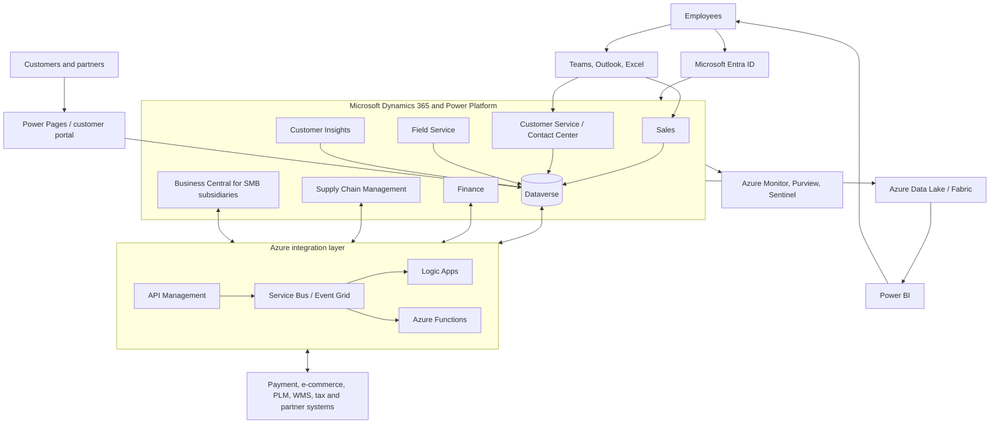
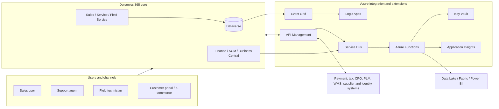
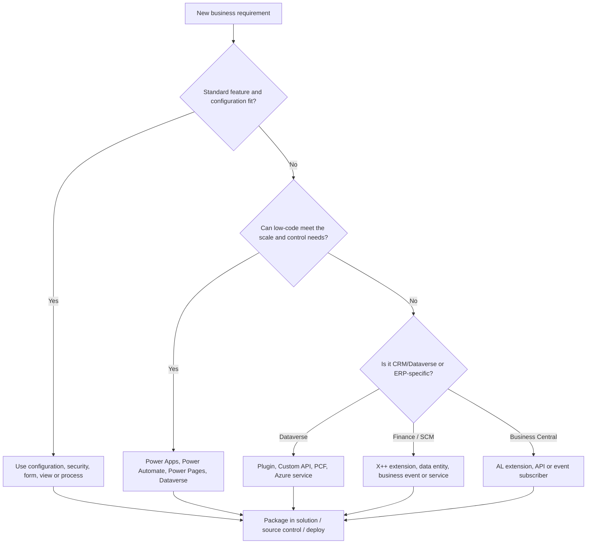

# Dynamics 365 企业架构、模块与二次开发指南

Dynamics 365 不是单一产品，而是一组面向客户关系、服务、ERP、供应链、项目与人力资源的 SaaS 业务应用。多数企业会将它与 Microsoft Entra ID、Power Platform、Microsoft 365、Azure 集成服务和数据分析平台组合使用，而非试图让某个应用承担所有业务。

本文说明常见模块的职责和使用条件、典型企业架构、组件选型，以及特定需求下如何通过配置、低代码和专业代码进行二次开发。模块功能、区域可用性、许可和生命周期会变化；实施前应以组织所购版本、目标地区和 Microsoft 当前产品文档为准。

## 1. 产品边界与总体分层

### 1.1 两类业务应用平台

Dynamics 365 常见应用可按底层平台分为两类。两者可以集成，但数据模型、扩展方式、发布节奏和运维职责不同。

| 平台 | 主要应用 | 核心特点 | 常见使用场景 |
| --- | --- | --- | --- |
| Dataverse / Power Platform | Sales、Customer Service、Field Service、Customer Insights、Customer Voice，以及大量自定义模型驱动应用 | 以 Dataverse 表、关系、安全角色、Power Apps 和 Solutions 为中心 | CRM、客服、现场服务、营销、客户数据和低代码业务应用 |
| ERP 应用平台 | Finance、Supply Chain Management、Commerce、Human Resources、Project Operations 的 ERP 能力、Business Central | 强调财务、库存、采购、制造、项目和本地化业务流程 | 财务核算、供应链、仓储、零售、项目会计、中小企业 ERP |

不要把 Dataverse 当作 ERP 事务库的直接镜像，也不要为了获得简单 CRM 功能而在 Finance/Supply Chain 中大量定制。先确定哪一个系统是某类主数据和交易数据的事实来源，再进行集成。

### 1.2 企业架构全景图

下图展示一家典型高科技制造与订阅服务公司的常见部署。它拥有销售团队、客户支持、现场安装团队、财务和供应链部门，并向客户开放自助门户。

### 1.3 基本设计原则

1. **配置优先，扩展其次，替换最后**：先用标准功能、参数、表单、流程和权限满足需求；定制代码只解决有明确业务价值的差异。
2. **明确主数据所有权**：例如客户主数据由 CRM 或 ERP 其中之一主导，价格由 ERP 主导，客户交互由 Customer Service 主导。不要让多个系统无规则地同时修改同一字段。
3. **同步最小化，事件优先**：同步 API 只用于用户需要即时结果的动作；订单履约、客户同步、通知和分析优先通过可靠消息和事件异步处理。
4. **Solutions 和 ALM 是产品功能的一部分**：不在生产环境手改组件；所有变更有源代码、版本、审批、自动测试和回滚路径。
5. **最小权限和环境隔离**：生产、预生产、开发、培训和沙盒使用不同环境；员工使用 Entra 组和短期高权限访问。

## 2. 核心模块及其使用方式

### 2.1 客户互动模块（Dataverse 平台）

| 模块 | 解决的问题 | 如何在企业中使用 | 适用条件与边界 |
| --- | --- | --- | --- |
| Dynamics 365 Sales | 潜在客户、商机、报价、销售预测、账户关系 | 销售代表维护 Lead、Account、Contact、Opportunity 和 Quote；经理使用 pipeline、预测和活动看板 | 适合 B2B/B2C 销售流程与 CRM；正式订单、开票和会计凭证应交由 ERP |
| Dynamics 365 Customer Service | Case、知识库、SLA、队列、全渠道客服与工单分派 | 邮件、聊天、电话或门户请求进入 Case；按语言、优先级、产品和技能路由给坐席 | 适合支持中心；复杂呼叫中心需评估 Contact Center、电话提供商、录音和合规需求 |
| Dynamics 365 Contact Center | 数字和语音渠道的坐席辅助、路由、实时洞察 | 把聊天、社交、短信和语音接入统一坐席工作区，由 AI 辅助摘要、知识推荐和质检 | 适合高量客服；要评估区域、语音运营商、录音保留、隐私和灾备 |
| Dynamics 365 Field Service | 工单、资产、服务协议、排程、移动技师和备件 | Customer Service 或 IoT 告警创建 Work Order；排程员分派资源，技师用移动端完成检修并回写备件/签名 | 适合安装、维修、巡检；库存和财务结算应与供应链/ERP 集成 |
| Dynamics 365 Customer Insights - Data | 多来源客户数据统一、匹配、分群和洞察 | 从 CRM、交易、网站和会员系统接入数据，定义身份匹配和统一客户档案，生成受控 segment | 适合客户 360、细分和分析；需治理同意状态、数据质量、来源和激活权限 |
| Dynamics 365 Customer Insights - Journeys | 营销旅程、触达、表单、实时事件和营销自动化 | 根据客户分群、行为事件和同意状态启动邮件、短信、推送或销售任务 | 适合 B2B/B2C 旅程；必须遵守订阅同意、退订、频率控制和地区法规 |
| Dynamics 365 Customer Voice | 问卷、反馈和满意度收集 | 在 Case 关闭、项目交付或活动后发送 NPS/CSAT 调查，将结果写回 Dataverse | 适合轻量调查；复杂研究需评估问卷逻辑、匿名性和分析能力 |
| Power Pages | 面向外部用户的低代码门户 | 客户查看工单、更新资料、提交服务申请或合作伙伴上传材料 | 适合 Dataverse 驱动的自助服务；必须设计 External ID、Web Role、表权限、WAF 和防爬策略 |

### 2.2 ERP、供应链与运营模块

| 模块 | 解决的问题 | 如何在企业中使用 | 适用条件与边界 |
| --- | --- | --- | --- |
| Dynamics 365 Finance | 总账、应收应付、预算、现金、固定资产、税务和财务报告 | 销售、采购、库存和项目等业务事件生成受控财务凭证；财务关闭期间执行对账与关账 | 适合中大型企业多实体/多币种财务；本地化、税务、审计和会计政策需由专业团队配置 |
| Dynamics 365 Supply Chain Management | 采购、库存、主计划、生产、仓库、运输、质量和资产维护 | 需求预测驱动采购/生产计划，仓库使用移动设备收发货，库存变动同步到订单履约 | 适合制造、分销和复杂库存；业务流程必须先标准化，过度修改库存逻辑风险极高 |
| Dynamics 365 Commerce | 全渠道零售、POS、电子商务、定价和促销 | 统一门店、线上渠道、商品目录、促销、订单和退货体验 | 适合零售/直营电商；支付、税务、欺诈和区域 POS 合规需单独验证 |
| Dynamics 365 Business Central | 面向中小企业或子公司的财务、销售、采购、库存和项目管理 | 单个国家/区域的子公司用标准 ERP 管理订单到现金和采购到付款，并与集团系统汇总 | 适合中小规模、较标准流程；复杂全球制造、深度仓储和大型集团财务通常应评估 Finance/SCM |
| Dynamics 365 Project Operations | 项目销售、资源排程、项目预算、工时、费用和项目会计协作 | 从 Sales 商机形成项目合同，资源经理排程顾问，员工录入工时/费用并驱动项目财务 | 适合专业服务、咨询和项目型交付；要明确与 Finance 的项目会计和收入确认边界 |
| Dynamics 365 Human Resources | 员工档案、福利、休假与人员流程 | HR 维护员工生命周期、职位和福利；通过集成向薪资、身份或报表系统同步所需数据 | 适合 HR 核心数据与流程；薪资、当地劳动法、工时和人才管理常需要本地系统或专业产品集成 |
| Dynamics 365 Guides | 混合现实的分步操作指导 | 在培训、装配、维护和现场检查中向一线员工展示标准作业步骤 | 适合高价值、重复、可视觉化流程；需评估设备、内容制作和一线网络条件 |

### 2.3 模块组合的典型企业用法

| 公司类型 | 常见组合 | 端到端流程 |
| --- | --- | --- |
| B2B SaaS 公司 | Sales + Customer Service + Customer Insights + Finance/Business Central + Power BI | 商机到合同在 Sales；客户开通与支持在 Customer Service；订阅和收款进入 ERP；使用分析平台计算留存与续费风险 |
| 制造和设备服务公司 | Sales + Field Service + SCM + Finance + Project Operations | 报价转订单；SCM 计划生产/备件；Field Service 派工安装维护；Finance 完成开票、成本和收入确认 |
| 零售/全渠道公司 | Commerce + Customer Insights + Customer Service + Finance + SCM | 商品/库存/价格来自 ERP；Commerce 提供线上线下交易；Customer Insights 运营分群；售后 Case 与退换货联动 |
| 专业服务公司 | Sales + Project Operations + Finance + Customer Service | 商机变项目合同；项目资源与工时驱动项目成本和开票；Customer Service 管理交付后的支持 |

## 3. 典型企业架构与组件选择

### 3.1 为什么多数企业使用“核心 SaaS + Azure 集成层”

Dynamics 365 适合承载标准业务流程、主数据协作和业务用户界面；Azure 更适合处理跨系统 API、异步集成、专用算法、外部合作方、复杂文档处理、数据工程和可观测性。将自定义集成直接散落在 Power Automate、插件和各系统中，会导致难以测试、难以重放和难以审计。

推荐采用受控的 Azure 集成层：

### 3.2 架构组件详解

| 组件 | 在架构中的职责 | 选择理由 | 不应承担的职责 |
| --- | --- | --- | --- |
| Microsoft Entra ID | 员工 SSO、MFA、条件访问、组和应用身份 | Dynamics 365、Power Platform 和 Azure 的统一身份平面 | 不能替代业务角色、记录级授权或客户同意管理 |
| Dataverse | Sales/Service/Field Service 的业务表、关系、审计、安全模型和低代码应用数据 | 统一元数据、解决方案、Web API、业务规则和安全角色 | 不应用作海量原始日志、数据湖或未经建模的 ERP 复制库 |
| Finance / SCM / Business Central | ERP 交易、财务、库存、采购与运营 | 标准化、受控、可审计的企业资源计划流程 | 不应成为客户聊天、Web 会话或频繁临时集成的消息代理 |
| Power Apps | 模型驱动或画布应用，为员工快速创建业务体验 | 表单、规则、移动体验和 Dataverse 安全可复用 | 复杂核心交易逻辑仍需明确服务边界和专业测试 |
| Power Automate | 通知、审批、轻量编排和用户生产力自动化 | 低代码、连接器丰富、与 Microsoft 365 集成好 | 高吞吐、低延迟、复杂重试/事务的核心集成应转移到 Azure |
| Power Pages | 面向客户/伙伴的 Dataverse 门户 | 快速构建认证、自助服务和表单体验 | 不能忽略 Web Role、表权限、速率限制和外部攻击面 |
| API Management | 对外和对内 API 的认证、版本、限流、转换、策略和可观测性 | 统一合作方与自定义服务入口，避免点对点共享密钥 | 不编排长时间任务，也不存储业务状态 |
| Service Bus | 可靠命令、订单/库存同步、死信和削峰 | 支持企业级队列、Topic 和重复处理控制 | 消费者必须幂等；不可把“至少一次”误解为恰好一次 |
| Event Grid / Business Events | 通知状态变化给订阅者 | 松耦合事件扇出、资源与业务事件处理 | 不保证业务事务跨系统原子提交 |
| Logic Apps | 基于连接器的企业集成、审批、SFTP/EDI 和简单编排 | 可视化流程、丰富连接器、异常处理 | 不把复杂领域计算、超高吞吐处理和版本化代码全部放在流程中 |
| Azure Functions / Container Apps | 专业代码的转换、验证、异步 worker 和专属 API | 可测试、可扩缩、可用 SDK 与 CI/CD 管理 | 不应在同步 Dataverse 插件中调用长时间外部网络请求 |
| Key Vault + Managed Identity | 存放秘密、证书和密钥，由工作负载无密钥访问 | 减少连接字符串和手工轮换 | 不能把秘密打印进诊断日志或开发环境配置 |
| Data Lake / Fabric | 数据导出、湖仓、历史分析和 Power BI 语义模型 | 将运营负载与分析负载解耦 | 不替代实时事务库或业务权限检查 |
| Purview / Defender / Sentinel | 数据治理、安全态势、SIEM 与审计调查 | 跨 SaaS、Azure、数据平台形成治理闭环 | 不能代替最小权限、补丁、代码安全和人工响应 |

### 3.3 数据流与一致性模式

以下是“销售报价转订单”集成的推荐流程：

1. 销售人员在 Sales 中维护商机和报价；价格/可售性通过受控 API 查询 ERP，而不是复制一份可随意修改的价格表。
2. 客户确认后，Sales 中的订单进入“待提交”状态，后台组件使用幂等业务键向 ERP 创建销售订单。
3. ERP 接受订单后，异步返回 ERP Order ID、履约状态和信用结果，并更新 Dataverse 的只读集成字段。
4. SCM 的发货、库存、退货事件经 Business Events、Service Bus 或 API 写入集成层，再更新客户可见的订单视图。
5. Finance 完成开票与收款；Customer Service 只读取必要状态，不能直接修改财务凭证。

同步调用用于“报价是否有效”“订单是否创建成功”等用户必须立即知道的结果。发货通知、分析投影、邮件、搜索索引和主数据同步应异步进行，并具备重试、死信、幂等、告警和可重放能力。

## 4. 安全、权限、合规与运营

### 4.1 访问控制模型

| 控制层 | 实施方式 | 目的 |
| --- | --- | --- |
| Entra 身份 | MFA、Conditional Access、设备合规、PIM、员工/外部用户生命周期 | 确认谁可以登录和何时获得高权限 |
| Dynamics 365 安全角色 | 按岗位授予表、字段、操作和应用权限 | 确保销售、客服、财务、仓库只访问必要功能 |
| Business Unit / Team / Owner | 按公司、区域、部门、团队或记录所有权隔离 Dataverse 记录 | 实现记录级共享与协作；模型设计过深会增加维护难度 |
| Field Security Profile | 限制敏感列的读取、创建和更新 | 保护薪酬、身份号码、信用结果等字段 |
| ERP 权限职责 | 按职责、特权和权限管理 Finance/SCM 操作 | 分离下单、审批、付款、记账和管理员职责 |
| Azure RBAC | 管理 Azure 集成层、日志、Key Vault、数据平台 | 与业务记录权限分开；采用 managed identity 和最小权限 |
| DLP Policy | 限制 Power Platform 连接器间的数据流动 | 防止业务数据被复制到个人邮箱、社交或未经批准的 SaaS |

应定期审查高权限角色、特权访问、外部用户、应用用户、连接引用和服务主体。生产管理员不应以常态权限操作；启用审计日志、保留策略和敏感数据访问记录。

### 4.2 环境与治理

| 环境 | 用途 | 数据规则 |
| --- | --- | --- |
| Development | 开发者构建 Solution、插件、PCF 和自动化测试 | 使用合成或严格脱敏数据；个人环境不连接生产系统 |
| Integration / Test | API、消息、权限和端到端集成测试 | 模拟外部系统或使用受控测试租户 |
| UAT | 关键用户验收、培训和发布演练 | 使用经批准的脱敏数据，冻结验收范围 |
| Production | 面向真实业务的受控环境 | 禁止直接调试和无审批修改；仅导入已签名/批准的 Managed Solution |
| Training / Sandbox | 培训、原型和隔离试验 | 与生产身份、连接和敏感数据隔离 |

启用 Power Platform Managed Environments、Solution Checker、环境路由、容量监控、审计和 DLP。建立命名规范、Publisher、Solution 分层、所有者、连接引用和环境变量规范，避免每个团队创建不可追踪的默认环境资产。

### 4.3 运营指标与备份

| 维度 | 关键指标 | 例行动作 |
| --- | --- | --- |
| 业务 | 商机转化、Case SLA、一次解决率、工单按时完成、库存准确率、关账状态 | 将指标与流程所有者和改进机制绑定 |
| 平台 | Dataverse API 限额、存储容量、异步作业失败、Power Automate 失败、插件耗时 | 告警并排查重试风暴、过度轮询、无界查询和插件递归 |
| 集成 | Service Bus 队列深度、DLQ 数、同步错误、接口 P95、重放成功率 | 对失败消息建立分类、修复、重放和审计流程 |
| 安全 | 管理员变更、异常登录、DLP 违规、外部共享和密钥轮换 | Sentinel/Defender 告警进入安全事件流程 |
| 恢复 | 备份状态、恢复演练耗时、RPO/RTO 达成情况 | 定期在隔离环境验证环境还原、集成重建和数据校验 |

Dynamics 365/Dataverse 的平台备份、保留和恢复能力取决于环境类型与许可。企业还需要自行设计外部集成数据、Azure 组件、文档附件、数据湖和自定义服务的备份与恢复策略。

## 5. 二次开发与定制策略

### 5.1 先选择正确的扩展层

选择原则：

1. 先验证标准字段、表单、工作流、审批、参数、电子邮件模板、BPF、权限、报表和连接器是否已满足需求。
2. 只要业务规则需要可预测的事务、复杂校验、性能控制、可测试性或跨多调用方复用，就不要仅依赖无人维护的 Power Automate 流程。
3. 对长期差异化能力，将逻辑放在独立的领域服务或 Azure 组件中，通过稳定 API/事件与 Dynamics 365 集成；不要修改产品核心对象的不可扩展实现。
4. 所有定制都必须评估升级影响、许可、数据迁移、权限、审计、性能、灾备和退出路径。

### 5.2 Dataverse 与客户互动应用的定制

| 扩展方式 | 如何使用 | 适合的需求 | 关键约束 |
| --- | --- | --- | --- |
| 自定义表、列、关系、Choice | 在 Solution 中扩展数据模型 | 增加行业字段、业务实体、关联和受控状态 | 先定义数据所有者、唯一键、级联规则、审计和数据保留；避免无边界多对多关系 |
| Model-driven app | 配置站点地图、表单、视图、命令栏和业务流程 | 内部业务人员的结构化操作界面 | 表单逻辑保持简洁，复杂交互考虑 PCF 或专用应用 |
| Canvas app | 为特定任务创建移动优先或任务导向体验 | 仓库扫码、审批、现场检查、轻量业务应用 | 管理 delegation、离线策略、性能和数据权限；不要把所有逻辑塞进单一大屏幕 |
| Business Rules / Business Process Flow | 无代码字段校验、显示隐藏、阶段推进 | 规则简单且业务用户需要维护的流程 | 不适合复杂跨记录事务、外部调用或强一致性校验 |
| Power Automate | 审批、通知、文档流转和低频连接器自动化 | 人工参与、低至中等吞吐、可容忍异步的流程 | 配置失败告警、重试与所有者；避免循环触发和直接连接生产密钥 |
| C# Plug-in | 在 Dataverse Create/Update/Delete 等消息管线执行同步/异步业务逻辑 | 必须与记录操作一致的校验、字段计算、审计或异步触发 | 同步插件必须快速、无长时间 I/O、无无限递归；错误会阻塞用户保存 |
| Custom API / Action | 暴露受控业务操作供 Power Apps、门户或服务调用 | “批准报价”“合并客户”等有业务语义的命令 | 对参数、授权、幂等与错误码版本化；不要只暴露低层字段更新 |
| PCF control | 用 TypeScript/React 等开发可复用表单控件 | 复杂选择器、地图、可视化、行业输入组件 | 管理无障碍、性能、安全、版本和浏览器兼容性 |
| Webhook / Azure Service Bus endpoint | 将 Dataverse 事件推送至外部服务 | 可靠异步集成、外部计算、通知与数据投影 | 消费者必须幂等，处理重试、签名/认证、死信和重放 |
| Virtual Table | 在 Dataverse UI 中显示外部数据而不完全复制 | 外部 ERP/目录数据只读或轻量访问 | 外部系统性能和授权会直接影响用户体验；不适合离线和复杂事务 |

**插件设计示例：客户信用状态校验**

1. 在 Opportunity 进入“提交审批”前，通过同步插件检查必要字段、信用状态快照和用户权限。
2. 只读取本地 Dataverse 数据；不要在同步插件中等待外部信用 API。
3. 若需要外部信用评估，创建异步请求记录或向 Service Bus 发布事件。
4. Azure Function 调用外部服务，写入带时间戳和来源的结果；失败进入可审查的重试/DLQ 流程。
5. 用户根据结果重新提交，或由有权限的审批者使用 Custom API 进行例外批准。

这避免了外部网络抖动阻塞 Sales 表单保存，也保留了可审计、可恢复的异步流程。

### 5.3 Finance 和 Supply Chain Management 的二次开发

Finance 和 Supply Chain Management 通常使用 extension model 扩展，而不是修改标准应用对象。升级友好是首要原则。

| 扩展方式 | 如何使用 | 适合场景 | 约束 |
| --- | --- | --- | --- |
| 参数、工作流、电子报表和配置 | 通过标准设置实现审批、凭证、税务、格式和流程差异 | 应首先评估的本地化和流程需求 | 不要为已有参数化能力创建代码分叉 |
| X++ Extension | 使用扩展类、事件处理器、Chain of Command、扩展数据源/表单/表 | 业务规则、表单字段、受控流程扩展 | 避免 overlayering 或修改基础对象；遵循扩展点和升级测试 |
| Data Entity / OData | 导入导出主数据、异步数据管理、受控 API 集成 | 批量客户、商品、订单、供应商同步 | 要处理数据验证、吞吐、批次、幂等和错误文件 |
| Business Events | 将订单、发票、库存等状态事件发送到外部 | 事件驱动集成和减少轮询 | 明确事件版本、重试、订阅失败与最终一致性 |
| Custom Service | 暴露稳定的业务服务接口 | 需要超出标准数据实体的业务命令 | 认证、节流、版本、监控和兼容性需纳入 API 治理 |
| Power Platform integration | 使用 Dataverse、Power Apps/Automate 提供补充体验 | 审批、轻量任务、客户互动与业务人员自动化 | 不要绕过 ERP 的库存、财务和权限规则直接修改底层数据 |

推荐做法：把新增计算字段、审批前校验和可配置业务规则尽可能做成扩展；把高吞吐外部集成放到数据实体/业务事件/Azure 集成层；把报表和分析负载放到数据湖/数据仓库，避免在生产 ERP 中执行无界查询。

### 5.4 Business Central 的二次开发

Business Central 使用 AL 语言和 extension package 扩展业务逻辑，遵循事件订阅和扩展对象模型。

| 扩展方式 | 使用方式 | 典型需求 |
| --- | --- | --- |
| AL Extension | 添加表、字段、页面、报表、代码单元和业务逻辑 | 公司特定单据字段、审批、行业流程、报表 |
| Event Subscriber | 订阅标准发布的事件并追加逻辑 | 在销售订单发布、过账后触发受控动作，减少对标准代码依赖 |
| Standard API / Custom API | 与电商、银行、CRM、仓储和 BI 集成 | 以 API page/query 暴露稳定数据契约，而非直连数据库 |
| Power Automate / Power Apps | 使用 Business Central 连接器完成审批、通知和轻量应用 | 低频用户生产力场景，仍需对失败和权限做治理 |

所有 AL 扩展都应拥有唯一 publisher、命名空间、版本、依赖声明、自动化测试和兼容性策略。升级前应在 sandbox 中完成 extension publish、数据升级、集成回归和性能验证。

### 5.5 集成服务的专业代码定制

| 需求 | 推荐实现 | 原因 |
| --- | --- | --- |
| 合作方 API | API Management + Functions/Container Apps + Entra OAuth/mTLS | 统一认证、限流、版本、可观测性和合作方隔离 |
| 高价值订单/发票同步 | Service Bus + 幂等 worker + 事务/Outbox 模式 | 可靠削峰、重试、死信、审计和可重放 |
| 复杂文档提取 | Blob Storage + Event Grid + Azure Functions/Document Intelligence | 文件上传与异步处理解耦，保留人工复核路径 |
| 跨系统主数据同步 | Data Factory/Logic Apps/Functions + 数据质量规则 | 支持批量、差异、错误处理和对账；明确主数据所有权 |
| 实时计算或定价 | 独立 Container Apps/AKS 服务，经 APIM 暴露 | 可独立扩缩和测试，不把复杂算法塞进插件或工作流 |
| 高级搜索/AI 助手 | Azure AI Search + Azure OpenAI + 权限过滤服务 | 从 D365 导出受控数据，避免模型绕过记录级访问控制 |

## 6. ALM、测试与发布流程

### 6.1 Dataverse/Power Platform ALM

```mermaid
flowchart LR
    Dev[Development environment] --> Unmanaged[Unmanaged Solution]
    Unmanaged --> Source[Git repository: solution, plugin, PCF, tests]
    Source --> CI[CI: build, Solution Checker, tests, package]
    CI --> Managed[Managed Solution artifact]
    Managed --> Test[Test / integration environment]
    Test --> UAT[UAT with approval]
    UAT --> Prod[Production import and post-deploy validation]
    Prod --> Monitor[Monitor, audit and rollback decision]
```

实践要求：

- 开发环境使用 Unmanaged Solution；测试、UAT 和生产导入 Managed Solution。
- 使用 Solution 分层：基础数据模型、共享组件、领域模块、集成模块和门户模块独立管理，避免一个巨型 Solution。
- 把环境变量、Connection Reference、应用注册和端点 URL 与 Solution 分离；不同环境注入不同值。
- 使用 Power Platform CLI、Azure DevOps/GitHub Actions 或 Power Platform Pipelines 自动导出、解包、比较、打包和部署。
- 运行 Solution Checker、插件单元测试、PCF 测试、API 合同测试、自动化 UI 测试与集成回归测试。
- 数据迁移与配置迁移分开管理。生产主数据或历史交易迁移需要审批、校验、重试和回滚方案。

### 6.2 ERP ALM 与发布

| 环节 | Finance/SCM 重点 | Business Central 重点 |
| --- | --- | --- |
| 开发 | 扩展模型、X++ 构建、静态检查和可升级设计 | AL 编译、app.json 版本、依赖与事件订阅 |
| 构建 | 可重复构建、代码审查、自动化测试、部署包 | CI 构建 `.app`、符号包和自动化测试 |
| 测试 | 业务流程、数据实体、工作流、报表、性能和安全角色 | Sandbox publish、升级代码、页面/API 回归和性能 |
| 发布 | 维护窗口、数据升级、Feature management、回滚/补救计划 | 按扩展版本部署，验证数据升级并保留前一稳定版本 |
| 运行 | 监控批处理、集成、性能、财务控制和可用性 | 监控 Job Queue、API 限额、扩展错误和存储容量 |

### 6.3 发布前检查清单

- 需求已映射到标准配置、低代码或代码扩展层，且记录未选择其他方式的理由。
- 所有自定义表/字段、API、事件、消息和报表有所有者、版本、数据分类和保留策略。
- 生产连接使用 managed identity 或受控应用用户，秘密保存于 Key Vault；没有硬编码凭据。
- 同步路径通过负载和超时测试；异步路径具备幂等、重试、DLQ、告警和重放程序。
- 角色、字段安全、Power Pages 表权限、DLP 和外部协作访问经过安全评审。
- 已完成升级影响评估、数据迁移演练、备份/恢复验证和业务验收。
- 上线有监控仪表盘、停止条件、回滚/补偿方案以及业务负责人。

## 7. 常见反模式与改进

| 反模式 | 风险 | 改进方式 |
| --- | --- | --- |
| 在生产环境直接修改表单、流或代码 | 无审计、无法复制到其他环境、回滚困难 | 所有变更进入 Solution、Git、流水线和审批流程 |
| 在同步插件中调用慢速外部系统 | 表单保存超时、用户受阻、级联故障 | 记录状态后发布异步事件，由 Azure worker 调用外部系统 |
| 多个系统都可修改客户、价格或订单状态 | 数据冲突、对账失败、责任不清 | 定义每个主数据/状态的 owner 和单向或受控双向同步规则 |
| 用 Power Automate 承担高吞吐关键集成 | 限额、重试风暴、定位和版本困难 | 使用 Service Bus + Functions/Container Apps；保留 Flow 给审批与轻量自动化 |
| 直接读写 ERP/Dataverse 数据库 | 破坏业务规则、升级不兼容、数据损坏 | 只用支持的 API、数据实体、Business Events 和扩展点 |
| 把 Dataverse 复制到 BI 后直接做运营决策 | 延迟、权限和数据质量未说明 | 明确数据刷新延迟、指标定义、行级安全和事实来源 |
| 将“管理员”赋给大量实施人员 | 误操作、越权和审计风险 | 通过 Entra 组、PIM、职责分离和限时授权控制 |
| 过度定制标准 ERP 流程 | 升级昂贵、性能下降、实施周期失控 | 业务流程重设计优先；只保留有量化价值且可升级的差异化扩展 |

## 8. 结论

多数公司使用 Dynamics 365 的核心方式是：用 Sales、Customer Service、Field Service 和 Customer Insights 管理客户互动；用 Finance、Supply Chain、Commerce、Business Central 或 Project Operations 承载不同规模与行业的运营；用 Dataverse、Power Apps 和 Power Automate 提升业务用户生产力；用 Azure API Management、Service Bus、Logic Apps、Functions、Data Lake 和 Power BI 建立可治理的集成与数据平台。

成功实施的关键不是购买越多模块越好，而是明确模块边界、主数据所有权、权限模型、集成一致性和可升级的定制策略。先以标准能力实现可验证的流程，再用受控的 Solutions、扩展点和 Azure 服务承载真正的差异化需求，企业才能在持续更新的 SaaS 平台上安全演进。