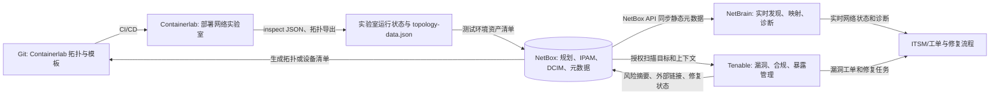

# Containerlab、NetBrain、Tenable 与 NetBox 集成指南

> 本文基于 2026-09-13 可获得的官方资料整理。产品名称、功能、许可证、价格和集成方式可能随版本、地区、合同和产品线变化；采购时应以厂商报价单、最终许可协议和目标版本文档为准。

## 1. 先看结论

这四个项目解决的问题不同：

| 产品 | 主要解决的问题 | 与 NetBox 的关系 | 开源与收费结论 |
| --- | --- | --- | --- |
| **Containerlab** | 用代码定义并启动容器化网络实验室，连接多个网络操作系统节点 | 可以从 NetBox 生成实验拓扑，也可以把运行中的实验节点信息回写到 NetBox；通常需要自定义脚本或 CI | 核心项目开源，BSD 3-Clause；软件本身免费，但网络操作系统镜像、计算资源和商业支持可能收费 |
| **NetBrain** | 实时网络发现、动态拓扑、路径分析、故障诊断、合规检查和网络自动化 | NetBrain 可以通过 NetBox API 同步静态设备和数据中心元数据，再叠加自身发现的实时网络状态 | 商业闭源产品；官网没有公开标准价格，通常通过演示和销售报价 |
| **Tenable** | 漏洞评估、资产发现、暴露管理、配置和合规检查 | NetBox 可以提供授权扫描目标和资产上下文；Tenable 的漏洞和风险结果可以摘要回写 NetBox，但不应把 NetBox 当作漏洞库 | 商业闭源安全产品族；Nessus 有免费非商业版和公开标价的商业版，Tenable Vulnerability Management、Tenable One 等通常按方案询价 |
| **NetBox** | 网络基础设施建模、IPAM、DCIM 和自动化的权威数据源 | 作为集成中心保存设备、接口、IP、站点、机柜、前缀、租户和意图数据 | 开源项目，Apache 2.0；自建软件本身免费，NetBox Cloud、企业支持和其他商业服务收费 |

最重要的架构原则是：

```text
NetBox       保存设计意图、资源关系和静态基础设施事实
Containerlab 创建可重复的网络实验拓扑
NetBrain     发现并分析实时网络行为
Tenable      发现和评估安全暴露、漏洞与合规风险
```

它们不是互相替代的产品。比较合理的方式是为每类数据指定唯一的权威来源，然后通过 API、Webhook、插件或定时同步交换必要信息。

## 2. Containerlab 是什么？

Containerlab 是一个面向网络工程的命令行实验室编排工具。它使用 YAML 拓扑文件描述：

- 实验室名称。
- 节点名称和节点类型。
- 网络操作系统或普通 Linux 容器镜像。
- 节点之间的链路和接口。
- 管理网络、IP 地址、启动配置和环境变量。
- 节点标签、分组以及导出模板。

Containerlab 会根据拓扑文件创建容器，并使用虚拟网卡、Linux 网络命名空间、Docker 或其他容器运行时把节点连接成指定拓扑。它重点支持容器化 Network Operating System，也可以通过 vrnetlab 等方式运行部分虚拟机型网络设备。

典型拓扑文件类似下面这样：

```yaml
name: spine-leaf-lab

topology:
  nodes:
    spine1:
      kind: nokia_srlinux
      image: ghcr.io/nokia/srlinux:latest
    leaf1:
      kind: nokia_srlinux
      image: ghcr.io/nokia/srlinux:latest
    client1:
      kind: linux
      image: alpine:latest

  links:
    - endpoints: ["spine1:e1-1", "leaf1:e1-1"]
    - endpoints: ["leaf1:e1-2", "client1:eth1"]
```

部署和检查实验室：

```bash
containerlab deploy -t spine-leaf.clab.yml
containerlab inspect -t spine-leaf.clab.yml -f json
containerlab destroy -t spine-leaf.clab.yml
```

Containerlab 部署后还可以自动生成：

- Ansible inventory。
- Nornir Simple Inventory。
- SSH 配置。
- `topology-data.json` 拓扑数据文件。
- 供其他工具使用的自定义导出数据。

因此，Containerlab 很适合用于：

- 网络协议和拓扑验证。
- 多厂商互操作测试。
- 网络自动化 CI 测试。
- Ansible、Nornir、Netmiko、gNMI 或 telemetry 测试。
- 课程、演示和个人实验室。
- 在提交生产配置前验证模板和意图。

### 2.1 Containerlab 的边界

Containerlab 是实验室编排工具，不是：

- 生产网络的 CMDB。
- IPAM 或 DCIM 系统。
- 漏洞管理平台。
- 完整的实时网络监控平台。
- 网络设备厂商的商业操作系统镜像仓库。

尤其要注意，Containerlab 里的管理 IP 和容器名称通常是临时的。实验室销毁并重新部署后，容器 ID、管理地址和运行状态都可能改变。因此不能直接把所有运行时字段当成生产资产事实写入 NetBox。

## 3. NetBrain 是什么？

NetBrain 是商业网络自动化和网络智能平台，关注的是“网络当前实际发生了什么，以及如何自动诊断和处理”。其典型能力包括：

- 多厂商网络发现和动态拓扑映射。
- 混合云、数据中心、园区和 SD-WAN 网络可视化。
- 端到端路径和转发路径分析。
- 设备配置、Golden Config 和配置漂移检查。
- 网络意图、合规检查和持续评估。
- 基于事件、告警或工单触发的诊断。
- 故障定位、影响分析和自动化修复。
- 通过 REST API、Webhook 和其他集成机制接入外部系统。

可以这样区分 NetBox 和 NetBrain：

```text
NetBox   = 网络资源的设计意图、静态事实和权威目录
NetBrain = 网络设备实时状态、动态拓扑和诊断自动化
```

例如，NetBox 可以记录某台设备应当位于哪个机柜、属于哪个站点、使用哪个管理 IP；NetBrain 可以连接设备并判断它现在的接口状态、路由路径、邻居关系和配置是否符合预期。

### 3.1 NetBrain 是否开源？

NetBrain 不是开源项目。它是商业闭源软件，源代码、完整平台能力和正式支持不以开源许可证公开提供。官网提供产品演示、试用/体验和销售联系入口，但没有公开一个适用于所有客户的标准价目表。

### 3.2 NetBrain 如何收费？

公开资料不足以给出一个可靠的统一价格。实际费用通常需要根据以下信息进行报价：

- 管理的网络设备规模。
- 部署模式和环境要求，例如自管理、私有环境或其他交付方式。
- 使用的模块，例如可视化、诊断、合规、自动化或 AI 能力。
- 用户、并发、数据保留和支持级别。
- 实施服务、培训、升级和专业服务。
- 合同期限、地区、渠道和折扣。

因此，NetBrain 应按“商业软件 + 许可/订阅 + 可能的实施与支持费用”进行预算，不应把它当作可免费自建的开源工具。官网的 Playground 或演示环境只适合评估，不等于生产许可。

## 4. Tenable 是什么？

Tenable 是网络安全产品和服务厂商，“Tenable”不能只理解为一个单一程序。常见产品线包括：

- **Nessus**：漏洞评估和安全配置检查工具。
- **Tenable Vulnerability Management**：云端漏洞管理和资产风险分析能力。
- **Tenable Security Center**：偏本地部署的漏洞管理平台。
- **Tenable One**：将漏洞、云、身份、外部攻击面、Web 应用和其他暴露数据统一起来的暴露管理平台。
- **Tenable Attack Surface Management**：外部攻击面发现和管理。
- **Tenable Cloud Security / Container Security**：云资源、工作负载和容器相关的暴露与漏洞管理。
- **Tenable Agent、Network Monitor、OT Security 和 Web App Scanning**：针对终端、网络、OT 和 Web 应用的不同能力。

Tenable 重点回答：

- 哪些资产存在漏洞？
- 哪些资产暴露在外部攻击面？
- 哪些问题具有最高业务风险？
- 哪些配置不符合安全或合规基线？
- 哪些漏洞需要优先修复？

它与 NetBox 的关系是互补关系：

```text
NetBox   记录设备身份、所属站点、角色、接口、IP 和业务上下文
Tenable  扫描资产并记录漏洞、风险、插件结果和修复状态
```

### 4.1 Tenable 是否开源？

Tenable 的核心产品不是开源软件。Nessus、Tenable Vulnerability Management、Tenable One、Security Center 和相关商业平台都采用厂商商业许可或订阅模式。

Tenable 提供 API、开发者文档和部分开源 SDK 或工具，例如 pyTenable，但“提供 API 或 SDK”不代表 Tenable 平台本身开源。

### 4.2 Tenable 如何收费？

收费取决于具体产品，不能用一个价格代表整个 Tenable：

| 产品或版本 | 公开的常见授权方式 | 公开价格或限制 |
| --- | --- | --- |
| Nessus Essentials | 免费评估/个人非商业使用 | 官方页面说明为 30 天免费许可，最多扫描 5 个 IP；不适合商业生产环境 |
| Nessus Essentials Plus | 面向爱好者、学生和教育场景的年度许可 | 官方页面说明为低价年度方案，最多 20 个 IP；具体价格以购买页面为准，仍不适合作为商业生产许可 |
| Nessus Professional | 商业漏洞评估许可，通常按扫描器/许可期限购买 | 官方页面在当前资料中显示 1 年 `$4,790`、2 年 `$9,331`、3 年 `$13,638`；高级支持和培训可另购 |
| Nessus Expert | 在 Nessus Pro 基础上增加现代攻击面、Web 和外部资产评估能力 | 官方页面在当前资料中显示 1 年 `$6,790`、2 年 `$13,208`、3 年 `$19,304`；支持和培训可另购 |
| Tenable Vulnerability Management、Tenable One、云、OT、容器等 | 商业订阅或组合方案，按合同定义的资产、模块、覆盖范围和服务等级计价 | 通常需要联系销售或合作伙伴获取报价，不能直接套用 Nessus 单机价格 |

上表价格是官方页面在本文整理时展示的美元标价，不包含税费、地区差异、汇率、折扣、渠道价格和额外服务。采购时应确认：

- 资产数量是按 IP、主机、实例、容器、应用还是其他指标计算。
- 扫描器、代理、云连接器和数据保留是否另计。
- 是否包含插件更新、技术支持、报告、API 和导出能力。
- 是一次性许可还是年度订阅。
- 测试环境和生产环境是否需要不同授权。

## 5. NetBox 是什么？为什么适合作为集成中心？

NetBox 是开源的网络基础设施建模、IPAM 和 DCIM 平台。它可以记录：

- Region、Site、Location、Rack 和 Tenant。
- Manufacturer、Device Type、Device Role、Platform 和 Device。
- Interface、IP Address、Prefix、VLAN、VRF、ASN 和 Cable。
- 设备管理地址、序列号、资产信息、标签和自定义字段。
- 配置上下文、事件规则、Webhook、REST API、GraphQL API、脚本和插件。

NetBox 适合作为集成中心，但不应把“中心”误解为所有数据都必须由 NetBox 产生。更准确的做法是划分数据所有权：

| 数据类型 | 建议权威来源 |
| --- | --- |
| 站点、机柜、设备角色、资产归属、规划 IP 和设计拓扑 | NetBox |
| Containerlab 拓扑源文件和实验版本 | Git 仓库/CI |
| Containerlab 当前容器状态 | Containerlab、Docker 或实验平台 |
| 设备实时接口、邻居、路径和运行配置 | NetBrain 或设备本身 |
| 漏洞、插件输出、风险评分和修复工作流 | Tenable |
| 工单、变更审批和业务服务关系 | ITSM/CMDB |

## 6. 总体集成架构

推荐使用下面的分层架构：



这套架构中，NetBox 不应该保存完整的 NetBrain 动态数据库，也不应该替代 Tenable 的漏洞详情库。NetBox 只保留用于网络运营和资产治理的摘要信息，例如最后扫描时间、风险等级、开放问题数量和外部结果链接。

## 7. Containerlab 与 NetBox 集成

### 7.1 集成模式 A：NetBox 生成 Containerlab 拓扑

这种模式适合“NetBox 中保存实验意图，Containerlab 负责执行”的流程。

#### 第一步：在 NetBox 中建立实验数据

可以为实验环境建立专用 Site，例如：

```text
Site: lab-containerlab
Tenant: network-lab
Device Role: lab-router / lab-switch / lab-host
Tags: containerlab, lab, ci
```

设备对象可以保存：

- 节点逻辑名称。
- 厂商、平台和设备类型。
- 管理 IP。
- 节点角色，例如 spine、leaf、border、client。
- 实验室名称和 Git 仓库地址。
- 使用的容器镜像和版本。
- 测试分支、拓扑版本或 CI 环境。

建议使用自定义字段，而不是把所有信息写入 Description：

| NetBox 自定义字段 | 用途 |
| --- | --- |
| `containerlab_lab` | Containerlab 实验室名称 |
| `containerlab_node` | 拓扑文件中的节点名称 |
| `containerlab_kind` | Containerlab `kind` 值 |
| `containerlab_image` | 容器镜像及固定版本 |
| `containerlab_repo` | 拓扑文件所在 Git 仓库 |
| `containerlab_branch` | 拓扑对应的分支或标签 |
| `containerlab_managed` | 是否由自动化生成 |

接口之间的连接可以用 NetBox Cable 表示，但应明确它们代表的是实验逻辑链路，不是生产机房的真实物理电缆。也可以使用 Tag 或自定义字段标注 `link_scope=containerlab`，避免和生产物理连接混淆。

#### 第二步：通过 NetBox API 查询设备和接口

只读查询示例：

```bash
export NETBOX_URL="https://netbox.example.com"
export NETBOX_TOKEN="<从密钥管理系统注入>"

curl -sS \
  -H "Authorization: Token $NETBOX_TOKEN" \
  -H "Accept: application/json" \
  "$NETBOX_URL/api/dcim/devices/?site=lab-containerlab&tag=containerlab&status=active"
```

生产脚本应处理分页、超时、TLS、HTTP 错误和 API Token 轮换，不要把 Token 写入拓扑文件、Git 或日志。

#### 第三步：渲染 `.clab.yml`

可以使用 Python、Jinja2 或 CI 模板将 NetBox 对象渲染为 Containerlab YAML。渲染时需要把 NetBox 字段映射到 Containerlab 字段：

| NetBox | Containerlab |
| --- | --- |
| Device 名称或自定义节点名称 | `topology.nodes` 下的节点名 |
| Platform 或 `containerlab_kind` | `kind` |
| `containerlab_image` | `image` |
| NetBox 接口名称 | link endpoint 的接口名 |
| 管理 IP | `mgmt-ipv4`、链路地址或运行时管理数据 |
| Device Role、Site、Tenant、Tags | 节点 labels 或模板变量 |

生成的文件应作为构建产物或临时文件使用，而不是把带有密钥的配置直接提交到 Git。

#### 第四步：部署并测试

```bash
containerlab validate -t generated.clab.yml
containerlab deploy -t generated.clab.yml
containerlab inspect -t generated.clab.yml -f json > containerlab-runtime.json
```

### 7.2 集成模式 B：Containerlab 运行状态回写 NetBox

Containerlab 每次部署后可以生成拓扑数据文件，也可以输出 Ansible/Nornir inventory。`inspect` 命令能够以 JSON 或 CSV 输出实验室、容器、镜像、kind、状态和管理地址等信息：

```bash
containerlab inspect -t generated.clab.yml -f json > containerlab-inspect.json
```

回写服务可以读取这些信息并更新 NetBox 的：

- 设备或虚拟机的管理 IP。
- 当前实验状态。
- 容器镜像版本。
- 容器 ID。
- 最后部署时间。
- CI 构建编号和 Git 提交号。
- 运行时外部链接。

不建议把临时容器状态直接覆盖 NetBox 的规划字段。例如，不能因为容器当前是 `exited`，就把生产设备状态改为 `offline`。可以使用独立的自定义字段：

```text
containerlab_runtime_state = running
containerlab_container_id = abc123...
containerlab_last_deployed_at = 2026-09-13T10:00:00Z
containerlab_commit = 1a2b3c4
```

### 7.3 Containerlab 与 NetBox 的推荐边界

推荐采用以下策略：

1. Git 保存 Containerlab 拓扑源文件和模板。
2. NetBox 保存实验资源、设备身份、接口关系和分配的地址。
3. CI 使用 NetBox API 读取数据，生成拓扑并部署 Containerlab。
4. Containerlab 输出运行状态，但只把明确的运行时字段回写到 NetBox。
5. 实验室销毁时，将实验节点标记为已销毁或过期，而不是删除所有历史对象。
6. 对临时 CI 实验使用独立 Tenant、Site 或命名空间，避免污染生产 NetBox。

## 8. NetBrain 与 NetBox 集成

### 8.1 官方集成思路

NetBrain 官方资料描述了通过 NetBox API 读取硬件安装元数据的集成模式。NetBox 保存设备的机架位置、风向、物理位置和其他设施数据；NetBrain 通过 NetBox API 拉取这些信息，并映射到 NetBrain 的自定义属性或 Automation Data Table（ADT）中。

这通常是一个 **NetBox 到 NetBrain 的单向同步**：

```text
NetBox API
   ↓ 定时或按需同步
NetBrain 自定义属性 / ADT
   ↓
NetBrain 实时拓扑、路径分析和诊断上下文
```

NetBrain 仍然通过设备连接、发现和实时采集维护网络运行视图。不要因为 NetBrain 同步了 NetBox 数据，就认为两边的所有字段会自动双向一致。

### 8.2 建议同步的 NetBox 字段

第一阶段只同步有明确用途的字段：

- Device name。
- Management IP。
- Site、Region、Location 和 Rack。
- Tenant、Device Role、Platform 和 Manufacturer。
- Serial number、asset tag 和设备型号。
- Rack position、airflow、facility 属性。
- 维护团队、环境和业务标签。
- NetBox 对象 URL 和最后修改时间。

不要同步以下内容，除非已经完成安全和权限评估：

- 数据库密码、API Token 和私钥。
- 未脱敏的用户隐私数据。
- 大量无用的 Description 文本。
- 会覆盖 NetBrain 实时状态的字段。
- 没有定义所有权的双向可写字段。

### 8.3 NetBrain 与 Containerlab 集成

Containerlab 可以作为 NetBrain 的测试网络或 CI 网络。基本流程是：

1. Containerlab 部署固定版本的网络操作系统容器。
2. 为节点分配稳定的管理地址和测试凭据。
3. 在 NetBrain 中将实验节点作为测试设备加入指定域或项目。
4. 让 NetBrain 执行发现、拓扑映射、路径和配置检查。
5. 通过 NetBox 保存实验节点的设计元数据和版本信息。
6. 测试结束后删除或归档临时设备，避免污染 NetBrain 生产资产许可和 NetBox 生产数据。

是否支持某一个具体 Network OS、容器镜像、SSH/NETCONF/gNMI 方式和采集能力，需要同时检查 NetBrain 版本、设备适配器和容器镜像行为。不能仅因为设备在 Containerlab 中启动，就假设 NetBrain 能完整发现它。

### 8.4 NetBrain 集成的权限设计

建议创建一个 NetBox 只读服务账号：

```text
用途：NetBrain-NetBox-Sync
权限：读取指定 Site、Tenant 或 Tag 范围
禁止：删除对象、修改生产 IP、修改设备拓扑
```

同步服务应记录：

- 同步时间和版本。
- 成功、跳过和失败对象数。
- NetBox 对象 ID 与 NetBrain 对象 ID 的对应关系。
- 找不到设备或管理 IP 不一致的异常。
- 字段冲突和人工处理结果。

## 9. Tenable 与 NetBox 集成

### 9.1 集成目标

Tenable 和 NetBox 的集成不应该是把所有漏洞扫描结果复制到 NetBox，而应该解决三个问题：

1. **扫描范围准确**：只扫描经过授权的 NetBox 资产。
2. **资产识别准确**：把 Tenable 发现的 IP、主机名、MAC、序列号或云标识对应到 NetBox 对象。
3. **修复上下文完整**：在 NetBox 中看到设备所属站点、租户、角色和负责人，并能跳转到 Tenable 详情或工单。

### 9.2 官方内置连接器与自定义集成的区别

Tenable 官方集成文档列出了一系列 SIEM、SOAR、ITSM、云和厂商集成，并提供 Vulnerability Management、Exposure Management 等 API。官方集成清单不等于任意 CMDB/IPAM 都有现成的双向连接器；在本文整理时，NetBox 更适合按 API 自定义集成处理。

因此，Tenable 与 NetBox 的常见对接方式是：

```text
NetBox API
   ↓ 导出经过授权的资产、管理 IP、站点和业务标签
同步服务 / CI / 扫描编排器
   ↓ 调用 Tenable API 创建或更新资产组、标签、扫描目标
Tenable 执行扫描并保存完整漏洞结果
   ↓ 定时查询风险摘要
同步服务更新 NetBox 自定义字段或标签
```

### 9.3 NetBox 到 Tenable：生成授权扫描范围

可以使用 NetBox 的状态、Tag、Site、Tenant 和管理 IP 生成扫描目标。例如只选择：

```text
status = active
AND tag = tenable-scan
AND management_ip IS NOT NULL
AND site 属于已批准范围
```

伪代码流程：

```text
读取 NetBox active 设备
过滤 tag=tenable-scan
读取每台设备的管理 IP
去重并检查是否落在授权网段
按站点、租户或环境生成 Tenable 资产标签
调用 Tenable API 创建或更新扫描目标
记录 NetBox device_id 与 Tenable asset_id 的映射
```

如果使用 Nessus 本地产品、Tenable Vulnerability Management 或 Tenable One，具体 API、认证方式、扫描对象和资产标签模型会不同，应按目标产品 API 文档实现，不要直接复用另一产品的接口。

### 9.4 Tenable 到 NetBox：回写安全摘要

建议在 NetBox Device、Virtual Machine 或相关对象上增加自定义字段：

| 字段 | 示例 | 用途 |
| --- | --- | --- |
| `tenable_asset_id` | `asset-12345` | 关联 Tenable 资产 |
| `tenable_last_scan_at` | `2026-09-13T09:30:00Z` | 最后成功扫描时间 |
| `tenable_risk_level` | `critical` | 当前风险摘要 |
| `tenable_open_findings` | `12` | 未关闭问题数量 |
| `tenable_critical_findings` | `2` | 严重问题数量 |
| `tenable_external_url` | Tenable 详情链接 | 快速跳转 |
| `tenable_sync_status` | `ok` / `error` | 同步状态 |

NetBox REST API 更新自定义字段时，可以使用类似的请求：

```bash
curl -sS -X PATCH \
  -H "Authorization: Token $NETBOX_TOKEN" \
  -H "Content-Type: application/json" \
  "$NETBOX_URL/api/dcim/devices/<device-id>/" \
  -d '{
    "custom_fields": {
      "tenable_asset_id": "asset-12345",
      "tenable_last_scan_at": "2026-09-13T09:30:00Z",
      "tenable_risk_level": "high",
      "tenable_open_findings": 12,
      "tenable_critical_findings": 2,
      "tenable_sync_status": "ok"
    }
  }'
```

在真实环境中，应先根据 IP、主机名、序列号或资产标签建立稳定映射，不能只用当前容器 IP 作为唯一身份。

### 9.5 为什么不把每条漏洞写入 NetBox？

不建议把每一条 CVE、插件输出、证据、受影响软件版本和修复历史复制到 NetBox，原因包括：

- Tenable 本身已经是漏洞数据的权威平台。
- 漏洞结果变化快，会造成 NetBox 大量无意义变更日志。
- NetBox 数据模型不是漏洞管理模型。
- 扫描证据和插件输出可能很大，增加数据库和备份压力。
- 复制数据会产生重复的关闭、重开和状态冲突。

更合理的设计是：

```text
NetBox：保存资产上下文、风险摘要、负责人和 Tenable 链接
Tenable：保存漏洞详情、扫描证据、插件、风险计算和历史
ITSM：保存修复任务、审批、SLA 和关闭证明
```

### 9.6 Containerlab 与 Tenable 集成

Containerlab 和 Tenable 可以在实验室安全测试中配合使用，但这不是“Containerlab 自动接入 Tenable”的内置关系。

常见模式有两种：

#### 模式 A：扫描容器镜像

1. Containerlab 拓扑文件引用固定版本的网络操作系统或 Linux 镜像。
2. 镜像从受控镜像仓库获取。
3. Tenable Container Security 或相关容器安全能力扫描镜像中的漏洞和策略问题。
4. CI 在部署 Containerlab 前执行安全门禁。
5. 通过后才允许把镜像部署到实验或测试环境。

这类扫描关注镜像、软件包和配置，不等同于扫描运行中网络设备的管理 IP。

#### 模式 B：扫描运行中的实验节点

1. Containerlab 使用固定管理网段和隔离的实验网络。
2. NetBox 记录实验节点的管理 IP 和实验范围。
3. 经过批准后，Tenable 对该范围执行扫描。
4. 扫描结束后，结果保留在 Tenable，NetBox 只回写摘要。
5. 实验销毁后，清理 Tenable 临时资产和 NetBox 运行时字段。

对网络操作系统容器执行漏洞扫描前，需要确认扫描插件对该系统、协议和容器网络的支持情况，并限制扫描速率，避免影响协议测试。实验网络不能与生产管理网无边界互通。

## 10. 三个集成的字段映射建议

### 10.1 资产身份

| 统一字段 | NetBox | Containerlab | NetBrain | Tenable |
| --- | --- | --- | --- | --- |
| 逻辑名称 | Device/VM name | node name | device name | asset name/hostname |
| 管理地址 | primary IP | management IP | device access IP | scan target |
| 厂商/平台 | Manufacturer/Platform | kind/image | device type/adapter | detected product |
| 站点 | Site/Location | lab/site variable | site/custom property | asset tag/context |
| 环境 | Tag/custom field | label/group | domain/group | tag/network |
| 稳定标识 | serial/asset tag | Git node ID 或自定义标签 | device ID | asset ID |

### 10.2 拓扑关系

- NetBox Cable 或接口关系表示设计拓扑或实验逻辑链路。
- Containerlab `links` 表示当前实验室如何创建虚拟链路。
- NetBrain 动态拓扑表示设备实时发现的邻居和转发关系。
- Tenable 通常不负责网络拓扑建模，而是使用资产、IP、服务和暴露关系进行风险分析。

不要把四种关系无条件合并为一张表。实际拓扑、设计拓扑和漏洞攻击路径的语义不同。

## 11. 推荐实施步骤

### 阶段一：统一命名和所有权

1. 为设备定义稳定名称、管理 IP、序列号或资产编号。
2. 在 NetBox 中定义 Site、Tenant、Device Role、Platform、Status 和 Tag 规范。
3. 定义哪些字段由 NetBox、Containerlab、NetBrain 和 Tenable 负责。
4. 先选择只读同步，暂时不要实现双向写入。

### 阶段二：先打通 NetBox 与 Containerlab

1. 在独立 Site/Tenant 建立少量实验节点。
2. 使用 NetBox API 生成一个最小拓扑文件。
3. 使用 `containerlab validate`、`deploy` 和 `inspect` 验证节点和链路。
4. 将运行状态写入独立自定义字段。
5. 销毁并重建实验室，验证对象身份没有重复或错误覆盖。

### 阶段三：接入 NetBrain

1. 创建 NetBox 只读服务账号。
2. 在 NetBrain 测试域配置 NetBox API 或官方插件。
3. 先同步 Site、Rack、Device、Platform 和管理 IP。
4. 验证 NetBrain 对象和 NetBox 对象的匹配率。
5. 再启用实时发现、动态映射和诊断流程。

### 阶段四：接入 Tenable

1. 选择具体 Tenable 产品，不要只写“接 Tenable”。
2. 建立经过批准的扫描标签和资产范围。
3. 从 NetBox 生成扫描目标，先执行只读资产同步。
4. 验证 IP、主机名、序列号和资产标签的匹配率。
5. 只把风险摘要和链接回写 NetBox。
6. 将高风险结果通过 ITSM 建立修复工单，并将工单号或状态关联到资产。

### 阶段五：建立运行治理

- 同步失败必须告警，不能静默跳过。
- 对删除和大范围更新设置审批或 dry-run。
- API Token 使用最小权限、独立账号和轮换策略。
- 所有同步任务保留审计日志和失败重试记录。
- 每次产品升级都验证 API 字段、插件兼容性和许可计量。
- 定期抽查 NetBox、NetBrain 和 Tenable 的资产匹配结果。

## 12. 常见误区

### 误区一：把 Containerlab 当作生产资产管理系统

Containerlab 负责创建实验环境，不负责长期维护生产资产、地址规划和业务归属。生产事实应回到 NetBox 或正式 CMDB。

### 误区二：把 NetBrain 当作 NetBox 的替代品

NetBrain 擅长实时网络发现、路径分析和诊断；NetBox 擅长结构化建模、IPAM、DCIM 和自动化数据治理。两者可以互补。

### 误区三：把 Tenable 风险分数写成 NetBox 的设备状态

“设备 active”表示资产生命周期状态，“Tenable risk high”表示安全风险等级，两者语义完全不同。应使用独立字段，不能覆盖 NetBox 的 Status。

### 误区四：把容器 ID 或临时管理 IP 当成永久资产身份

Containerlab 重建后这些值可能变化。应使用设备名称、Git 节点标识、序列号模拟值或显式外部 ID 作为稳定映射。

### 误区五：以为有 API 就等于有官方集成

API 只能说明系统可编程。官方插件、支持范围、版本兼容性、商业许可和专业服务范围仍需单独确认。

### 误区六：只计算软件许可费用

完整成本还包括：

- Containerlab 节点所需的计算资源。
- 商业 Network OS 镜像和订阅。
- NetBrain 的平台许可、实施、培训和支持。
- Tenable 的扫描器、资产覆盖、插件订阅、数据保留和支持。
- NetBox 的 PostgreSQL、Redis/Valkey、备份、监控和运维人员。
- API 开发、同步服务、测试和长期数据治理。

## 13. 开源与收费总结

| 对象 | 是否开源 | 软件本身是否可以免费使用 | 主要收费点 |
| --- | --- | --- | --- |
| Containerlab 核心 | 是，BSD 3-Clause | 是 | 计算资源、容器运行时、商业网络操作系统镜像、镜像仓库和可选服务 |
| NetBrain | 否，商业闭源 | 通常只能试用或使用受限体验环境 | 平台许可/订阅、模块、规模、支持、实施和培训，价格通常询价 |
| Tenable 核心产品 | 否，商业闭源 | 部分 Nessus 版本可免费用于受限的非商业场景 | Nessus 商业许可、资产/扫描覆盖、云平台、插件、支持和企业模块 |
| NetBox Community | 是，Apache 2.0 | 是 | 自建基础设施、运维、备份和支持服务 |
| NetBox Cloud/Enterprise 生态 | 核心 NetBox 仍源自开源生态，但商业服务不是免费开源产品 | 取决于具体方案 | 云托管、企业支持、SLA、商业扩展和增值产品 |

## 14. 官方资料

### Containerlab

- [Containerlab 官方网站](https://containerlab.dev/)
- [Containerlab GitHub 仓库](https://github.com/srl-labs/containerlab)
- [Containerlab License](https://github.com/srl-labs/containerlab/blob/main/LICENSE)
- [Topology definition](https://containerlab.dev/manual/topo-def-file/)
- [Inventory and topology data](https://containerlab.dev/manual/inventory/)
- [Inspect command](https://containerlab.dev/cmd/inspect/)
- [Containerlab API Server](https://containerlab.dev/manual/api-server/)

### NetBrain

- [NetBrain 官方网站](https://www.netbrain.com/)
- [Network Automation Integrations](https://www.netbrain.com/platform/network-automation-integrations/)
- [NetBrain 与 NetBox、Grafana 集成说明](https://www.netbrain.com/blog/turning-operational-truth-into-shared-insight/)
- [NetBrain Integration and Extensibility](https://www.netbrain.com/features/integrations/)
- [NetBrain 官方演示入口](https://www.netbrain.com/request-a-demo/)

### Tenable

- [Tenable 官方网站](https://www.tenable.com/)
- [Nessus Essentials](https://www.tenable.com/products/nessus/nessus-essentials)
- [Nessus Professional](https://www.tenable.com/products/nessus/nessus-professional)
- [Nessus Expert](https://www.tenable.com/products/nessus/nessus-expert)
- [Tenable One](https://www.tenable.com/products/tenable-one)
- [Tenable Integrations](https://docs.tenable.com/Integrations.htm)
- [Tenable API Explorer](https://developer.tenable.com/reference)
- [Tenable Documentation](https://docs.tenable.com/)

### NetBox

- [NetBox 官方文档](https://netboxlabs.com/docs/netbox/en/stable/)
- [NetBox REST API](https://netboxlabs.com/docs/netbox/en/stable/integrations/rest-api/)
- [NetBox Webhooks](https://netboxlabs.com/docs/netbox/en/stable/integrations/webhooks/)
- [NetBox 官方 GitHub 仓库](https://github.com/netbox-community/netbox)
- [本仓库的 NetBox 基础面试题](netbox-基础高频面试题.md)
- [本仓库的 NetBox 部署指南](netbox-从零搭建.md)
