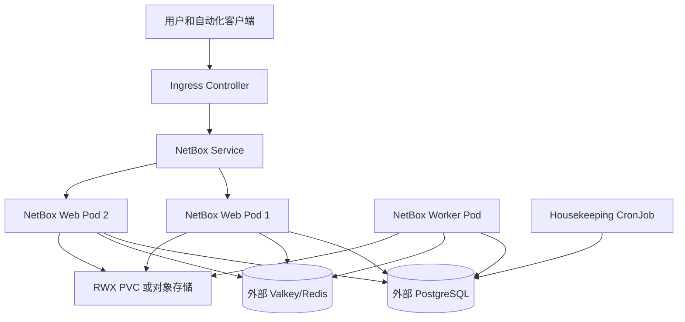

# 使用 netbox-chart 在 Kubernetes 部署 NetBox

本文基于官方 Helm Chart [`netbox-community/netbox-chart`](https://github.com/netbox-community/netbox-chart)，说明如何在 Kubernetes 中部署一套面向生产的 NetBox。示例采用以下架构：

- NetBox Web：2 个副本，由 Helm Chart 部署。
- NetBox Worker：1 个副本，负责 Webhook、脚本和后台任务。
- PostgreSQL：外部托管或由组织独立运维的高可用 PostgreSQL。
- Valkey/Redis：外部托管或独立运维的高可用键值服务。
- 媒体、脚本、报表：`ReadWriteMany`（RWX）持久卷。本指南也说明对象存储替代方案。
- 流量入口：Ingress NGINX + cert-manager + Let's Encrypt。

> 所有域名、存储类、数据库地址、密码、镜像和 Chart 版本均为示例。请替换为实际值。生产环境不要使用 Chart 的默认管理员密码、默认 API Token 或 `allowedHosts: ["*"]`。

## 1. 了解 Chart 架构

官方 Chart 会创建或管理以下 Kubernetes 对象：



Chart 也可以通过子 Chart 部署 PostgreSQL 和 Valkey，但官方生产建议是将二者外置。这能让数据库和键值服务独立升级、备份、扩容与高可用，避免将状态服务的生命周期绑定到应用 Chart。

| 组件 | 生产建议 | 原因 |
| --- | --- | --- |
| NetBox Web | 至少 2 副本 | Pod、节点维护或应用滚动升级时减少可用性中断 |
| NetBox Worker | 1 副本起步 | Worker 负责异步任务；增加副本前必须评估任务幂等性、队列能力和共享存储 |
| PostgreSQL | 外部受管/高可用服务 | 数据是 NetBox 的权威状态，要求独立备份与恢复能力 |
| Valkey/Redis | 外部受管/高可用服务 | 提供任务队列和缓存，不应依赖临时 Pod 本地状态 |
| 媒体文件 | S3 兼容对象存储优先 | 适用于多副本、多节点和跨可用区；避免 RWO PVC 挂载冲突 |
| 脚本/报表 | Git 管理或 RWX PVC | 代码应版本化、可审计、可复现 |

## 2. 前置条件

### 2.1 Kubernetes 与 Helm

官方 Chart 当前要求：

- Kubernetes `1.25+`。
- Helm `3.10+`。
- 集群中存在可用的 CNI、CoreDNS 和默认或指定的 StorageClass。
- 使用 Ingress 时，集群中已有可用 Ingress Controller。
- 使用自动 TLS 时，集群中已有 cert-manager，并配置可签发证书的 Issuer 或 ClusterIssuer。

在管理员工作站执行检查：

```bash
kubectl version --client
helm version
kubectl get nodes
kubectl get storageclass
kubectl get ingressclass
```

创建部署命名空间：

```bash
kubectl create namespace netbox
kubectl label namespace netbox app.kubernetes.io/part-of=netbox
```

### 2.2 DNS、IP 和网络

准备以下网络资源：

1. 为 Ingress Controller 的公网或内网负载均衡地址创建 DNS 记录，例如 `netbox.example.com`。
2. 如使用 Let's Encrypt，确保 DNS 已解析且外部可以访问 TCP 80 与 443。
3. 确保 NetBox Pod 可访问 PostgreSQL、Valkey/Redis、SMTP、LDAP/OIDC、对象存储、Webhook 目标和容器镜像仓库。
4. 限制 PostgreSQL 和 Valkey/Redis 的入站来源，仅允许 NetBox 所在节点或 Pod CIDR 访问。
5. 规划 Kubernetes NetworkPolicy。若集群启用 NetworkPolicy，必须显式允许 NetBox 到 DNS、数据库、键值服务、对象存储、邮件和认证服务的出站流量。

### 2.3 存储选择

NetBox 附件（Media）默认需要持久化。Chart 的 `persistence.enabled` 默认开启，但默认 `ReadWriteOnce`（RWO）卷不适合跨节点多副本。

| 方案 | 适用情况 | 关键配置 |
| --- | --- | --- |
| S3、MinIO、Ceph RGW 等对象存储 | 推荐的生产方案 | 设置 `storages`，并将 `persistence.enabled: false` |
| RWX 文件存储，如 EFS、Azure Files、CephFS、NFS | 有附件且不使用对象存储 | Web、Worker、Housekeeping 均可挂载的 `ReadWriteMany` PVC |
| 单副本 RWO PVC | 开发、测试或单节点集群 | `replicaCount: 1`，升级策略应考虑 `Recreate` |
| 不保存附件 | 极简测试环境 | `persistence.enabled: false`，不上传附件 |

本指南的完整配置使用 RWX PVC，以减少对象存储凭据和后端配置差异。生产集群已有对象存储时，建议改为对象存储并关闭 `persistence.enabled`，同时按 NetBox 官方 `storages` 配置挂载对象存储凭据。

> Web 副本、Worker 和 Housekeeping 可能在不同节点调度。只要任意一个需要访问挂载文件，RWO 卷就可能使 Pod 卡在 `ContainerCreating`。不要用单节点亲和性掩盖生产集群的存储设计问题。

## 3. 安装入口与证书组件

如果集群已经由平台团队提供 Ingress 和 cert-manager，可跳过本节，但仍需要获取 IngressClass 和 ClusterIssuer 名称。

### 3.1 安装 Ingress NGINX

以下命令在云环境中创建 `LoadBalancer` 类型入口。裸机集群应按环境使用 MetalLB、NodePort 或现有负载均衡方案。

```bash
helm repo add ingress-nginx https://kubernetes.github.io/ingress-nginx
helm repo update

helm upgrade --install ingress-nginx ingress-nginx/ingress-nginx \
  --namespace ingress-nginx \
  --create-namespace \
  --version <ingress-nginx-chart-版本> \
  --set controller.service.type=LoadBalancer \
  --wait

kubectl -n ingress-nginx get service ingress-nginx-controller
```

记录负载均衡器的地址，为 `netbox.example.com` 创建 DNS `A` 或 `CNAME` 记录。DNS 生效后再申请证书。

### 3.2 安装 cert-manager

```bash
helm repo add jetstack https://charts.jetstack.io
helm repo update

helm upgrade --install cert-manager jetstack/cert-manager \
  --namespace cert-manager \
  --create-namespace \
  --version <cert-manager-chart-版本> \
  --set crds.enabled=true \
  --wait
```

创建生产环境 ClusterIssuer。将邮箱替换为真实的告警邮箱：

```yaml
apiVersion: cert-manager.io/v1
kind: ClusterIssuer
metadata:
  name: letsencrypt-prod
spec:
  acme:
    email: admin@example.com
    server: https://acme-v02.api.letsencrypt.org/directory
    privateKeySecretRef:
      name: letsencrypt-prod-account-key
    solvers:
      - http01:
          ingress:
            ingressClassName: nginx
```

保存为 `clusterissuer-letsencrypt-prod.yaml`，并应用：

```bash
kubectl apply -f clusterissuer-letsencrypt-prod.yaml
kubectl get clusterissuer letsencrypt-prod
```

第一次验证时可以使用 Let's Encrypt staging 端点，避免多次失败触发正式环境的签发频率限制。验证成功后，再切到正式 `ClusterIssuer`。

## 4. 准备外部 PostgreSQL 与 Valkey/Redis

### 4.1 PostgreSQL 要求

为 NetBox 创建专用数据库、专用用户和强密码。不要让应用使用 PostgreSQL 超级用户。当前 NetBox 版本要求 PostgreSQL `14+`，即将发布的版本可能提高最低要求；部署与升级前必须查看对应 NetBox 发布说明。

在数据库管理员已连接的 PostgreSQL 上执行，用户名与密码按组织标准替换：

```sql
CREATE USER netbox WITH PASSWORD '<强密码>';
CREATE DATABASE netbox OWNER netbox;
REVOKE ALL ON DATABASE netbox FROM PUBLIC;
GRANT ALL PRIVILEGES ON DATABASE netbox TO netbox;
```

若数据库由云服务提供商托管，应使用其高可用、自动备份、时间点恢复（PITR）、TLS 和监控能力。记录以下连接信息：

- 数据库 FQDN、端口、库名与用户名。
- TLS 根证书、`sslmode` 和证书轮换方式。
- 备份保留策略、PITR 窗口和恢复演练频率。
- 允许访问的 Kubernetes 节点或 Pod CIDR。

### 4.2 Valkey/Redis 要求

NetBox 将数据库 `0` 用于任务队列，将数据库 `1` 用于缓存。必须为 Valkey/Redis 启用认证；生产环境建议启用 TLS 并使用高可用服务或 Sentinel。

需要准备两个密码值：

- `tasks-password`：NetBox 后台任务队列连接密码。
- `cache-password`：NetBox 缓存连接密码。

它们可以指向同一集群，但建议使用独立逻辑数据库和按组织标准区分凭据。迁移或恢复时通常不恢复缓存与队列数据，避免过期 Webhook 或 Job 在新环境重复执行。

## 5. 创建 Kubernetes Secret

Chart 支持引用已有 Secret。生产环境把敏感值存放在外部密钥管理系统、External Secrets、Sealed Secrets 或受保护的 GitOps Secret 流程中。本节使用 `kubectl` 仅演示需要的键名。

### 5.1 Secret 键名

| Secret 名称 | Chart 引用字段 | 必须的键 |
| --- | --- | --- |
| `netbox-app-secrets` | `existingSecret` | `secret_key`；可选 `api_token_peppers`、`ldap_bind_password` |
| `netbox-superuser` | `superuser.existingSecret` | `username`、`password`、`email`、`api_token` |
| `netbox-postgres` | `externalDatabase.existingSecretName` | `postgresql-password` |
| `netbox-valkey` | `tasksDatabase.existingSecretName`、`cachingDatabase.existingSecretName` | `tasks-password`、`cache-password` |
| `netbox-smtp` | `email.existingSecretName` | `email-password` |

`secret_key` 必须为至少 50 字符的随机值。`api_token_peppers` 是 JSON 格式的键值映射，旧条目不能删除，否则使用旧 Pepper 签发的 API Token 会失效。

### 5.2 使用临时文件创建示例 Secret

在受控管理员主机上创建临时目录，并确保该目录不会同步到 Git、网盘或聊天软件：

```bash
umask 077
secrets_dir=$(mktemp -d)

openssl rand -base64 48 > "$secrets_dir/secret_key"
printf '{"1":"%s"}' "$(openssl rand -base64 48)" > "$secrets_dir/api_token_peppers"
printf '%s' 'netbox-admin' > "$secrets_dir/username"
printf '%s' 'admin@example.com' > "$secrets_dir/email"
openssl rand -base64 32 > "$secrets_dir/password"
openssl rand -hex 32 > "$secrets_dir/api_token"
```

创建应用密钥和首个管理员 Secret。管理员密码与 API Token 应在执行后立即保存到密码管理器：

```bash
kubectl -n netbox create secret generic netbox-app-secrets \
  --from-file=secret_key="$secrets_dir/secret_key" \
  --from-file=api_token_peppers="$secrets_dir/api_token_peppers"

kubectl -n netbox create secret generic netbox-superuser \
  --type=kubernetes.io/basic-auth \
  --from-file=username="$secrets_dir/username" \
  --from-file=password="$secrets_dir/password" \
  --from-file=email="$secrets_dir/email" \
  --from-file=api_token="$secrets_dir/api_token"
```

创建外部服务密码 Secret。请将占位密码改为实际值；在真实生产环境应由密钥管理系统生成与同步：

```bash
printf '%s' '<PostgreSQL-强密码>' > "$secrets_dir/postgresql-password"
printf '%s' '<Valkey-任务队列密码>' > "$secrets_dir/tasks-password"
printf '%s' '<Valkey-缓存密码>' > "$secrets_dir/cache-password"
printf '%s' '<SMTP-密码或空字符串>' > "$secrets_dir/email-password"

kubectl -n netbox create secret generic netbox-postgres \
  --from-file=postgresql-password="$secrets_dir/postgresql-password"

kubectl -n netbox create secret generic netbox-valkey \
  --from-file=tasks-password="$secrets_dir/tasks-password" \
  --from-file=cache-password="$secrets_dir/cache-password"

kubectl -n netbox create secret generic netbox-smtp \
  --from-file=email-password="$secrets_dir/email-password"
```

验证 Secret 名称和键存在，但不要把 Secret 内容打印到终端或日志：

```bash
kubectl -n netbox get secret netbox-app-secrets netbox-superuser netbox-postgres netbox-valkey netbox-smtp
```

临时目录中的明文应按照组织安全流程及时销毁。`SECRET_KEY`、`api_token_peppers` 和数据库密码必须备份到受控密钥系统，否则灾难恢复后可能无法验证现有会话或 API Token。

> `superuser.existingSecret` 仅用于首次创建管理员。部署完成后修改此 Secret 不会自动修改已存在 NetBox 管理员的密码或 API Token，应通过 NetBox UI、CLI 或受控身份管理流程变更。

## 6. 编写生产 values 文件

创建目录并保存 Chart 配置。`values-production.yaml` 是非敏感配置，可纳入 GitOps 仓库；敏感值只引用 Secret 名称，不写入文件。

```bash
mkdir -p netbox-k8s
cd netbox-k8s
```

创建 `values-production.yaml`：

```yaml
# 固定 Chart 对应的 NetBox 镜像版本。升级时两个版本一起审查。
image:
  registry: ghcr.io
  repository: netbox-community/netbox
  tag: "v4.7.0"
  pullPolicy: IfNotPresent

# 不使用 Chart 内置的 PostgreSQL 与 Valkey。
postgresql:
  enabled: false

valkey:
  enabled: false

# NetBox 基础安全配置。
allowedHosts:
  - netbox.example.com

csrf:
  trustedOrigins:
    - https://netbox.example.com

loginRequired: true
debug: false
allowTokenRetrieval: false
timeZone: Asia/Shanghai
changelogRetention: 90
jobRetention: 90

cors:
  originAllowAll: false
  originWhitelist: []

# 引用第 5 节创建的应用密钥。
existingSecret: netbox-app-secrets

# 仅在首次部署时创建超级管理员。
superuser:
  existingSecret: netbox-superuser

# 外部 PostgreSQL。密码来自 Secret，不写在 values 文件中。
externalDatabase:
  host: postgres-rw.database.example.com
  port: 5432
  database: netbox
  username: netbox
  existingSecretName: netbox-postgres
  existingSecretKey: postgresql-password
  connMaxAge: 300
  disableServerSideCursors: false
  options:
    sslmode: require
    target_session_attrs: read-write

# 外部 Valkey/Redis。任务队列与缓存分开配置。
tasksDatabase:
  host: valkey.example.com
  port: 6379
  database: 0
  ssl: true
  insecureSkipTlsVerify: false
  existingSecretName: netbox-valkey
  existingSecretKey: tasks-password

cachingDatabase:
  host: valkey.example.com
  port: 6379
  database: 1
  ssl: true
  insecureSkipTlsVerify: false
  existingSecretName: netbox-valkey
  existingSecretKey: cache-password

email:
  server: smtp.example.com
  port: 587
  username: netbox@example.com
  useTLS: true
  useSSL: false
  from: netbox@example.com
  existingSecretName: netbox-smtp
  existingSecretKey: email-password

# 使用可跨节点挂载的 RWX StorageClass。
# 若改为 S3 对象存储，设置 persistence.enabled: false，并按 NetBox storages 配置对象存储后端。
persistence:
  enabled: true
  storageClass: nfs-rwx
  accessMode: ReadWriteMany
  size: 20Gi

scriptsPersistence:
  enabled: true
  storageClass: nfs-rwx
  accessMode: ReadWriteMany
  size: 2Gi

reportsPersistence:
  enabled: true
  storageClass: nfs-rwx
  accessMode: ReadWriteMany
  size: 2Gi

# 多副本 Web 与单 Worker。Worker 增加副本前要评估 Job 幂等性。
replicaCount: 2

worker:
  enabled: true
  replicaCount: 1
  resources:
    requests:
      cpu: 250m
      memory: 512Mi
    limits:
      cpu: "1"
      memory: 1Gi
  pdb:
    enabled: true
    minAvailable: 1

resources:
  requests:
    cpu: 500m
    memory: 1Gi
  limits:
    cpu: "2"
    memory: 2Gi

# 将 Web Pod 分散到不同节点，至少需要两个可调度节点。
affinity:
  podAntiAffinity:
    preferredDuringSchedulingIgnoredDuringExecution:
      - weight: 100
        podAffinityTerm:
          labelSelector:
            matchLabels:
              app.kubernetes.io/name: netbox
              app.kubernetes.io/component: netbox
          topologyKey: kubernetes.io/hostname

pdb:
  enabled: true
  minAvailable: 1

updateStrategy:
  type: RollingUpdate

# 维持最小权限运行。Chart 默认也启用，显式保留供审计。
podSecurityContext:
  enabled: true
  fsGroup: 1000

securityContext:
  enabled: true
  runAsUser: 1000
  runAsGroup: 1000
  runAsNonRoot: true
  readOnlyRootFilesystem: true
  allowPrivilegeEscalation: false
  capabilities:
    drop:
      - ALL
  seccompProfile:
    type: RuntimeDefault

serviceAccount:
  automountServiceAccountToken: false

automountServiceAccountToken: false

service:
  type: ClusterIP
  port: 80

ingress:
  enabled: true
  className: nginx
  annotations:
    cert-manager.io/cluster-issuer: letsencrypt-prod
    nginx.ingress.kubernetes.io/proxy-body-size: "25m"
    nginx.ingress.kubernetes.io/proxy-read-timeout: "120"
  hosts:
    - host: netbox.example.com
      paths:
        - /
  tls:
    - secretName: netbox-tls
      hosts:
        - netbox.example.com

# Chart 默认每天运行 housekeeping；禁止并发运行。
housekeeping:
  enabled: true
  schedule: "0 0 * * *"
  timezone: Asia/Shanghai
  concurrencyPolicy: Forbid
  successfulJobsHistoryLimit: 5
  failedJobsHistoryLimit: 5

# 仅在 Prometheus Operator 的 CRD 已存在时启用 ServiceMonitor。
metrics:
  enabled: true
  serviceMonitor:
    enabled: true
    interval: 30s
    selector:
      release: kube-prometheus-stack
```

### 6.1 根据环境调整 values 文件

部署前逐项检查：

- `image.tag` 应与要安装的 Chart 版本相匹配。不要使用浮动 `latest` 镜像标签。
- `externalDatabase.host` 应指向可写 PostgreSQL 端点。主备切换场景使用受管服务提供的读写入口。
- Valkey/Redis 使用自签名 CA 时，不能简单设置 `insecureSkipTlsVerify: true`；应通过 `extraVolumes` 和 `extraVolumeMounts` 将 CA 证书挂载到 Web、Worker 和 Housekeeping Pod，再配置相应 `caCertPath`。
- `nfs-rwx` 必须是集群中存在、支持 RWX 的 StorageClass。用 `kubectl get storageclass` 确认名称。
- `metrics.serviceMonitor` 仅在集群安装 Prometheus Operator CRD 时开启。没有该 CRD 时设为 `false`。
- Kubernetes 节点不足两台时，反亲和性只是尽力调度；不应据此宣称跨节点高可用。
- 扩大 `replicaCount` 或 `worker.replicaCount` 前，确认所有媒体、脚本、报表存储都可被并发挂载；Chart 明确要求多副本使用 RWX PVC。

### 6.2 对象存储替代方案

官方生产建议优先使用 S3 兼容对象存储，例如 AWS S3、MinIO 或 Ceph RGW。此时设置：

```yaml
persistence:
  enabled: false
```

并使用 Chart 的 `storages` 配置 NetBox 存储后端，将对象存储的访问密钥放进 Secret 后通过 `extraEnvVarsSecret` 注入。对象存储的后端名称、端点、桶名、区域、TLS 和凭据字段取决于实际使用的 `django-storages` 后端及 NetBox 版本，因此应以目标 Chart 版本的 `values.yaml` 和 NetBox 官方存储配置文档为准。上线前必须验证附件上传、下载、版本保留和灾难恢复。

## 7. 固定 Chart 版本并渲染检查

官方 Chart 可通过 OCI Registry 安装。先查看可用 Chart 元数据，选择经过测试的版本。本文编写时，官方仓库的示例 Chart 为 `8.3.70`，应用版本为 `v4.7.0`；实际部署必须以当时的发布说明与 `helm show chart` 输出为准。

```bash
export CHART_VERSION=8.3.70
export CHART_REF=oci://ghcr.io/netbox-community/netbox-chart/netbox

helm show chart "$CHART_REF" --version "$CHART_VERSION"
helm show values "$CHART_REF" --version "$CHART_VERSION" > values-defaults.yaml
```

本地渲染并用 Kubernetes API 进行服务端干运行。该检查可在真正创建资源前发现 YAML、字段和 API 版本问题：

```bash
helm template netbox "$CHART_REF" \
  --namespace netbox \
  --version "$CHART_VERSION" \
  --values values-production.yaml \
  > rendered-netbox.yaml

kubectl apply --dry-run=server -f rendered-netbox.yaml
```

在 GitOps 工作流中，提交 `values-production.yaml`、Chart 版本、镜像版本以及渲染校验结果；Secret 由独立受控流程管理。

## 8. 安装 NetBox

执行 Helm 安装并等待资源就绪：

```bash
helm upgrade --install netbox "$CHART_REF" \
  --namespace netbox \
  --version "$CHART_VERSION" \
  --values values-production.yaml \
  --wait \
  --timeout 15m
```

首次启动可能需要等待数据库连通性检查、数据库迁移、PVC 挂载与 Worker 初始化。实时检查状态：

```bash
kubectl -n netbox get deployment,pod,service,ingress,pvc
kubectl -n netbox get events --sort-by=.lastTimestamp
kubectl -n netbox rollout status deployment/netbox --timeout=15m
kubectl -n netbox logs deployment/netbox --all-containers=true --tail=200
kubectl -n netbox logs deployment/netbox-worker --all-containers=true --tail=200
```

如果使用了不同的 Helm Release 名称或 `fullnameOverride`，Deployment 名称会不同。先执行 `kubectl -n netbox get deployment`，再使用实际名称查看日志与 rollout 状态。

## 9. 验证应用、Ingress 与 TLS

### 9.1 Kubernetes 层验证

```bash
kubectl -n netbox get pods -o wide
kubectl -n netbox get pvc
kubectl -n netbox get ingress
kubectl -n netbox get certificate
kubectl -n netbox describe ingress netbox
```

所有 Web 和 Worker Pod 应处于 `Running` 与 `Ready` 状态。若启用了 cert-manager，`Certificate` 应为 `Ready=True`。如果证书未签发，查看 Order、Challenge 和 cert-manager 日志：

```bash
kubectl -n netbox get certificaterequest,order,challenge
kubectl -n cert-manager logs deployment/cert-manager --tail=200
```

### 9.2 NetBox 应用检查

从任一 Web Pod 运行 Django 健康检查：

```bash
kubectl -n netbox exec deployment/netbox -- \
  /opt/netbox/venv/bin/python /opt/netbox/netbox/manage.py check
```

检查 HTTPS 响应：

```bash
curl -I https://netbox.example.com/login/
```

登录 Web UI 后验证：

1. 使用 `netbox-superuser` 中保存的用户名和密码登录。
2. 创建最小权限的日常管理员账户；避免长期使用超级管理员。
3. 确认设备、IPAM、附件上传、附件下载、后台 Job、API Token 和 Webhook 功能符合预期。
4. 确认非认证用户无法读取资源，且 `https://netbox.example.com` 的写入请求没有 CSRF 错误。
5. 从集群外验证 DNS、TLS 证书链、HTTP 到 HTTPS 重定向和 API 认证。

在受控终端中可读取首次管理员 API Token，但该操作会显示敏感数据。读取后应立即保存到密码管理器：

```bash
kubectl -n netbox get secret netbox-superuser \
  -o jsonpath='{.data.api_token}' | base64 --decode
```

## 10. 日常运维

### 10.1 常用检查命令

```bash
helm -n netbox list
helm -n netbox status netbox
helm -n netbox get values netbox --all
helm -n netbox history netbox

kubectl -n netbox get deployment,pod,job,cronjob,pvc,ingress
kubectl -n netbox get events --sort-by=.lastTimestamp
kubectl -n netbox logs deployment/netbox --tail=200
kubectl -n netbox logs deployment/netbox-worker --tail=200
kubectl -n netbox get jobs --sort-by=.metadata.creationTimestamp
```

Housekeeping CronJob 默认每日运行 NetBox 的 housekeeping 命令，用于清理过期会话、旧变更记录和过期 Job 结果。应监控其失败次数与耗时，而不是无条件删除失败 Job。

### 10.2 监控与告警

至少建立以下告警：

- NetBox Web/Worker Deployment 的不可用副本、反复重启和镜像拉取失败。
- PostgreSQL 连接失败、慢查询、复制延迟、空间不足、备份失败和 PITR 不可用。
- Valkey/Redis 内存、连接数、主从状态、认证失败和队列积压。
- PVC 使用率、对象存储错误、证书到期、Ingress 5xx 和延迟。
- Housekeeping Job、备份 Job、Webhook 或自定义 Job 的失败。

Chart 支持 `/metrics` 和 Prometheus Operator `ServiceMonitor`。启用前确认 Metrics 不会被未经认证的公网访问；通常应只允许 Prometheus 在集群内访问。

### 10.3 备份与灾难恢复

必须备份以下内容：

| 内容 | 推荐备份方式 |
| --- | --- |
| PostgreSQL | 受管数据库自动备份与 PITR；或定时 `pg_dump` 加异地副本 |
| Media 附件 | 对象存储版本控制与跨区域复制；或 RWX 卷快照/文件备份 |
| 自定义 Scripts 与 Reports | Git 仓库，版本化发布到对应存储 |
| Helm values | GitOps 仓库，保留 Chart/镜像版本和变更历史 |
| Secret | 外部密钥管理系统的安全备份；特别保留 `secret_key` 与 `api_token_peppers` |

不要仅依赖 PVC Snapshot。数据库逻辑备份、媒体文件和关键 Secret 缺少任何一项，都可能使恢复后的系统不完整或导致现有 Token 失效。至少每季度在隔离环境执行完整恢复演练。

## 11. 升级流程

升级前必须先在测试集群用生产数据副本演练。升级包含两个维度：Chart 版本与 NetBox 镜像版本；二者应按官方发布说明配套更新。

### 11.1 升级前检查

```bash
helm -n netbox get values netbox --all > values-running.yaml
helm -n netbox history netbox
kubectl -n netbox get pods,pvc,ingress
```

检查事项：

1. 阅读当前 NetBox 到目标 NetBox 的所有发布说明，以及 `netbox-chart` 的 Chart 发布说明。
2. 检查 PostgreSQL、Valkey/Redis、插件、Python 依赖和自定义镜像的兼容性。
3. 完成 PostgreSQL、媒体、脚本、报表、Secret 引用和 Helm values 的可恢复备份。
4. 用 `helm template` 比较渲染结果，重点检查 Service、Ingress、PVC、Secret 引用、资源限制和环境变量变化。
5. 对跨 NetBox 大版本升级，按官方要求先升级至当前大版本的最后一个小版本，再进入下一大版本。

### 11.2 执行升级

将目标版本写入受版本控制的 values 或部署流水线，随后执行：

```bash
export NEW_CHART_VERSION=<目标-chart-版本>

helm upgrade netbox "$CHART_REF" \
  --namespace netbox \
  --version "$NEW_CHART_VERSION" \
  --values values-production.yaml \
  --wait \
  --timeout 20m

kubectl -n netbox rollout status deployment/netbox --timeout=20m
kubectl -n netbox rollout status deployment/netbox-worker --timeout=20m
kubectl -n netbox exec deployment/netbox -- \
  /opt/netbox/venv/bin/python /opt/netbox/netbox/manage.py check
```

数据库 schema 迁移通常由新版应用启动流程完成。若升级失败，不要仅依赖 `helm rollback`：Helm 可以回退 Kubernetes 清单，但无法自动反向回滚已执行的数据库 schema 迁移。需要依据升级前数据库备份和官方升级说明恢复。

## 12. 常见故障排查

| 现象 | 优先检查 | 处理方向 |
| --- | --- | --- |
| Web Pod 卡在 `ContainerCreating` | PVC 事件、StorageClass、访问模式、节点 | 多副本不能使用跨节点不可挂载的 RWO 卷；改用 RWX 或对象存储 |
| Pod 显示 `CrashLoopBackOff` | `kubectl logs`、数据库/Valkey Secret、网络策略 | 检查外部服务连通性、TLS、密码键名、`allowedHosts` 和配置语法 |
| Pod 显示 `ImagePullBackOff` | 镜像地址、镜像标签、出站网络、镜像拉取 Secret | 固定存在的镜像标签，配置 `imagePullSecrets` 或允许访问 GHCR |
| 登录/提交出现 CSRF 错误 | Ingress、`csrf.trustedOrigins`、外部 HTTPS 终止方式 | 将完整 `https://域名` 写入 trusted origins，确认代理转发正确协议头 |
| 出现 `DisallowedHost` | `allowedHosts` | 加入实际生产域名和临时验收域名，再执行 Helm upgrade |
| Worker 不处理任务 | Worker Pod、Valkey、队列密码、NetworkPolicy | 查看 `deployment/netbox-worker` 日志，验证数据库 0 与 Valkey 认证 |
| 插件加载失败 | 自定义镜像、插件版本、`plugins` 配置 | 在镜像构建阶段安装依赖；禁止在运行 Pod 内临时 `pip install` |
| TLS 证书未签发 | DNS、IngressClass、Certificate、Challenge | 确认域名解析到入口地址，80/443 可达，ClusterIssuer 名称正确 |
| `ServiceMonitor` 无法创建 | Prometheus Operator CRD | 未安装 CRD 时将 `metrics.serviceMonitor.enabled` 设为 `false` |
| 升级后数据库迁移失败 | NetBox 日志、发布说明、数据库版本 | 停止继续升级，依据备份恢复；不要用 Helm rollback 假设数据库已还原 |

## 13. 上线检查清单

- [ ] 已固定并记录 Kubernetes、Helm、Chart、NetBox 镜像、PostgreSQL 和 Valkey/Redis 版本。
- [ ] 已使用外部 PostgreSQL 与 Valkey/Redis，且具备高可用、TLS、监控和备份策略。
- [ ] 已通过 Secret 或外部密钥系统注入全部敏感值；`SECRET_KEY` 和 API Token Pepper 已安全备份。
- [ ] `allowedHosts`、`csrf.trustedOrigins`、`loginRequired`、CORS、Ingress 和 TLS 已按生产域名设置。
- [ ] 已部署支持 RWX 的存储或完成对象存储附件上传/下载验证。
- [ ] 已设置 Web/Worker 资源请求与限制、PDB、健康检查和跨节点调度策略。
- [ ] 已验证 Worker、Housekeeping、Webhook、邮件、LDAP/OIDC、插件、API 和附件。
- [ ] 已完成 PostgreSQL、媒体、脚本、报表、values 与 Secret 的备份和恢复演练。
- [ ] 已建立 Pod、数据库、缓存、存储、证书、Ingress 和备份失败的告警。
- [ ] 已在测试环境演练升级和数据库恢复；生产变更有可执行回滚流程。

## 参考资料

- [netbox-chart 官方仓库](https://github.com/netbox-community/netbox-chart)
- [NetBox Chart README](https://github.com/netbox-community/netbox-chart/tree/main/charts/netbox)
- [NetBox Chart 生产建议](https://github.com/netbox-community/netbox-chart/blob/main/charts/netbox/docs/prod.md)
- [NetBox Chart 迁移说明](https://github.com/netbox-community/netbox-chart/blob/main/charts/netbox/docs/migrate.md)
- [NetBox 官方安装文档](https://netboxlabs.com/docs/netbox/en/stable/installation/)
- [NetBox 官方升级文档](https://netboxlabs.com/docs/netbox/en/stable/installation/upgrading/)
- [本文关联的 Docker 部署指南](netbox-从零搭建.md)
- [本文关联的迁移指南](netbox-迁移指南.md)
