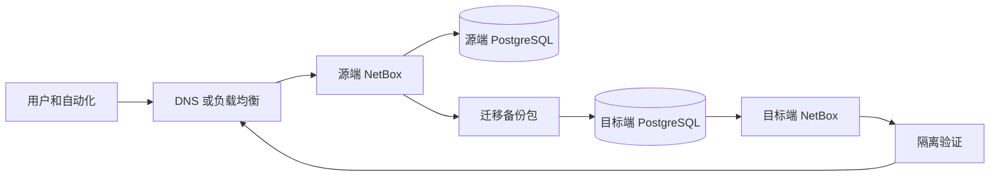

# NetBox 迁移指南

本文说明如何将一套既有 NetBox 系统迁移到新服务器或新的部署方式。目标是完整保留数据库、上传附件、定制脚本、报表、配置和自动化能力，并提供可验证、可回滚的切换流程。

适用场景：

- 旧服务器迁移到新服务器、云主机或新的数据中心。
- 从源码或系统服务安装的 NetBox 迁移到官方 `netbox-docker`。
- Docker Compose 主机迁移到另一台 Docker Compose 主机。
- 因操作系统、硬件、IP 地址、域名或反向代理调整而迁移。

> 本文以“源端”表示当前生产 NetBox，以“目标端”表示新环境。所有示例均需按实际账户、路径、域名、数据库名和版本替换。迁移前必须先在隔离测试环境完成全流程演练。

## 1. 核心原则

### 1.1 迁移与升级分离

**先迁移，后升级。** 最稳妥的顺序是：

1. 在目标端部署与源端**完全相同的 NetBox 版本**。
2. 迁移数据和文件，并完成业务验证。
3. 新旧版本一致且目标端稳定后，再根据官方发行说明执行升级。

不要同时更换服务器、部署方式、PostgreSQL 主版本、NetBox 大版本和插件版本。多个变更叠加后，故障根因会难以判断，回滚也会失去确定性。

### 1.2 需要迁移的内容

| 数据类别 | 是否必须 | 典型内容 | 迁移方式 |
| --- | --- | --- | --- |
| PostgreSQL 数据库 | 必须 | 所有 DCIM、IPAM、用户、权限、变更日志、Token 元数据和业务对象 | 使用 `pg_dump`/`pg_restore` 逻辑备份恢复 |
| Media 文件 | 必须 | 上传的图片、附件 | 复制 NetBox 的 `media` 目录或对应 Docker 卷 |
| 自定义脚本 | 必须（如有） | Scripts、Job 代码及依赖文件 | 复制 `scripts` 目录，并恢复依赖配置 |
| 自定义报表 | 必须（如有） | Reports 代码 | 复制 `reports` 目录 |
| NetBox 配置 | 必须 | `configuration.py`、`extra.py`、LDAP/SSO、邮件、日志、插件配置 | 以审计过的方式迁移，禁止直接泄露密码 |
| 插件与依赖 | 必须（如有） | `local_requirements.txt`、插件包、插件配置 | 先验证目标版本兼容性，再安装 |
| 反向代理与证书 | 必须 | Nginx、TLS、WAF、负载均衡配置 | 新主机重新部署并验证；私钥需安全迁移或重新签发 |
| Redis/Valkey 缓存与队列 | 通常不需要 | 缓存、临时会话、待处理队列 | 不恢复；迁移窗口内停止写入并在目标端重新生成 |
| 容器镜像和容器 | 不需要 | Docker 容器、镜像缓存 | 目标端按固定版本重新拉取、重新创建 |

PostgreSQL 是唯一权威业务数据源。Redis/Valkey 只承担缓存和后台任务队列，复制其数据可能导致过期任务在目标端重复执行，因此通常不迁移。

### 1.3 版本兼容矩阵

在制定迁移计划前，建立并确认下表。只要有一项未知，就不要开始正式切换。

| 项目 | 源端 | 目标端迁移阶段要求 |
| --- | --- | --- |
| NetBox | 例如 `4.6.x` | 必须与源端相同的发布版本 |
| `netbox-docker` | 例如 `5.1.0` | Docker 场景下必须与镜像支持文件匹配 |
| PostgreSQL | 例如 `15` | 目标版本应支持导入源端逻辑备份；建议相同或更高主版本 |
| Redis/Valkey | 例如 `7` | 不迁移数据；使用目标部署版本即可 |
| Python | 例如 `3.12` | 原生部署须满足目标 NetBox 的要求 |
| 插件 | 名称与版本 | 必须支持目标 NetBox 版本，且安装顺序可复现 |
| 域名与 URL | 例如 `netbox.example.com` | 使用最终生产域名或迁移期间的临时测试域名 |

获取源端版本信息的常用方法：

```bash
# Docker Compose 部署
cd /opt/netbox-docker
docker compose exec netbox /opt/netbox/venv/bin/python /opt/netbox/netbox/manage.py --version
docker compose images

git describe --tags --always

# 原生部署（路径按实际环境调整）
cd /opt/netbox
./venv/bin/python netbox/manage.py --version
psql --version
```

## 2. 迁移架构与切换方式

迁移期间应同时保留源端和目标端，但只有一个环境对用户提供写入服务。



推荐使用“停写、最终同步、DNS 切换”的方式：

1. 迁移前在目标端做一次预演，确认部署和恢复步骤。
2. 正式窗口开始时停止源端写入和自动化任务。
3. 制作最终数据库和文件备份，复制到目标端并恢复。
4. 在目标端以最终生产域名完成健康检查与业务验收。
5. 修改 DNS 或负载均衡后端，使流量切到目标端。
6. 保留源端关停状态一段观察期，确认稳定后再下线。

对于单机 NetBox，数据库逻辑备份与恢复通常产生数分钟到数小时的只读或停机窗口，具体取决于数据库、附件大小和网络带宽。需要接近零停机的场景，应采用 PostgreSQL 复制、只读演练和明确的主从切换方案，并由熟悉 PostgreSQL 高可用的团队执行。

## 3. 制定迁移计划

### 3.1 盘点源端

在源端记录以下信息并保存在受控变更单中：

```bash
# Docker Compose 环境
cd /opt/netbox-docker
docker compose ps
docker compose config > /root/netbox-compose-effective.yml
docker compose exec -T postgres psql -U netbox -d netbox -c "SELECT version();"
docker compose exec -T postgres psql -U netbox -d netbox -c "SELECT pg_size_pretty(pg_database_size(current_database()));"
du -sh configuration env

# 查看容器内主要文件的容量
for path in media scripts reports; do
  docker compose exec -T netbox du -sh "/opt/netbox/netbox/$path"
done
```

原生部署还应记录：

- NetBox 安装目录、Python 虚拟环境和 systemd 服务文件。
- `configuration.py`、`ldap_config.py`、`local_requirements.txt` 和 `gunicorn.py` 的位置。
- `MEDIA_ROOT`、`SCRIPTS_ROOT`、`REPORTS_ROOT` 的实际路径，而不是假定默认目录。
- Nginx/Apache、证书、身份认证、SMTP、LDAP/OIDC、Webhook、外部存储和监控配置。
- 所有插件及其版本，特别是存在数据库模型的插件。

### 3.2 估算窗口与资源

计算需要搬运的数据量：

```bash
# 源端 Docker 部署中的数据库逻辑备份大小预估
cd /opt/netbox-docker
docker compose exec -T postgres pg_dump --format=custom --no-owner --no-privileges -U netbox netbox > /tmp/netbox-precheck.dump
ls -lh /tmp/netbox-precheck.dump
pg_restore --list /tmp/netbox-precheck.dump | head
rm /tmp/netbox-precheck.dump
```

目标端至少应预留源端数据库、媒体文件与备份包总量的两倍可用空间，以容纳恢复过程和回滚备份。将 `netbox`、`postgres`、`redis`、`redis-cache` 和 `netbox-worker` 的健康检查纳入验收标准。

### 3.3 定义验收与回滚条件

在变更前确定：

- 允许停机或只读窗口的开始、结束和负责人。
- DNS TTL 降低时间。建议在迁移前 24 至 48 小时将 TTL 调整为 300 秒或按组织策略执行。
- 最终验收用例：登录、设备查询、IP 地址查询、附件下载、API 鉴权、后台任务、插件页面和关键自动化调用。
- 回滚触发条件：无法恢复数据库、业务验收失败、数据计数不一致、API 或后台任务异常、迁移窗口超时。
- 回滚动作：立即停止目标端写入、DNS 回指源端、重新启用源端自动化任务，并记录目标端失败原因。

## 4. 在目标端预先部署同版本环境

目标端必须先按照 [从零搭建 NetBox 系统](netbox-从零搭建.md) 完成操作系统、Docker、Nginx、防火墙和 HTTPS 基础配置，但此时不要向用户开放正式写入。

### 4.1 Docker Compose 目标端准备

使用与源端一致的 `netbox-docker` Git 标签：

```bash
sudo mkdir -p /opt
sudo chown "$USER":"$USER" /opt
git clone --branch release --single-branch https://github.com/netbox-community/netbox-docker.git /opt/netbox-docker
cd /opt/netbox-docker
git fetch --tags
git checkout <源端-netbox-docker-标签>
```

复制源端的部署配置作为基础，但应逐项审计，尤其是数据库密码、`SECRET_KEY`、`API_TOKEN_PEPPER_1`、SMTP、LDAP/OIDC Client Secret、Webhook 密钥和插件配置。对于同一套迁移实例，通常应保留源端的 `SECRET_KEY` 和 `API_TOKEN_PEPPER_1`，否则现有会话及 API Token 可能失效或无法验证。

将目标端端口先仅绑定到本机，使用临时测试域名或本机 hosts 文件验证：

```yaml
services:
  netbox:
    ports:
      - "127.0.0.1:8000:8080"
    environment:
      ALLOWED_HOSTS: "netbox.example.com netbox-migrate.example.com"
      CSRF_TRUSTED_ORIGINS: "https://netbox.example.com https://netbox-migrate.example.com"
```

首次启动目标端会创建空数据库和 Docker 卷。这是预期行为，恢复时会覆盖其中的空业务数据库：

```bash
cd /opt/netbox-docker
docker compose pull
docker compose up -d
docker compose ps
```

确认所有服务已启动后，停止应用写入，并保持数据库服务可用：

```bash
docker compose stop netbox netbox-worker
```

> 不要在目标端执行 `docker compose down -v`。该命令会删除数据库和附件卷，会破坏已恢复或待恢复的数据。

### 4.2 原生部署目标端准备

若目标端仍采用原生部署，必须安装相同 NetBox 版本和兼容的 Python、PostgreSQL、Redis。先完成虚拟环境、依赖、配置、反向代理和 systemd 服务，但不要在迁移前对目标库执行新版本数据库迁移。迁移步骤中的数据库恢复逻辑仍然相同，只是服务控制从 `docker compose` 改为 `systemctl`。

## 5. 预演迁移

正式迁移前，使用源端一次完整备份在隔离目标端走完第 6 至第 10 节。预演成功至少应满足：

1. 数据库能用 `pg_restore` 成功恢复，并可启动 NetBox。
2. 用户可登录，设备、接口、前缀、IP 地址数量符合预期。
3. 至少一个媒体附件能下载，至少一个脚本或报表能加载。
4. API Token、Webhook、LDAP/SSO、邮件、插件和自动化集成按适用范围验证。
5. 记录每一步耗时，用于计算正式窗口。
6. 删除测试环境产生的任何 Webhook、邮件、任务或外部设备变更，避免测试误触发生产系统。

建议在预演环境禁用外部副作用，例如先设置 `WEBHOOKS_ENABLED=false`，并禁止 SMTP 外发；正式切换验收后再恢复。

## 6. 正式切换前冻结源端写入

### 6.1 宣布变更并降低 DNS TTL

在维护窗口前通知用户和自动化系统，停止以下类型的写入：

- Web UI 的新增、修改、删除和批量导入。
- Ansible、Terraform、Python 脚本、Webhook 回写和 CMDB 同步。
- 自定义脚本、后台 Job 和 API 写操作。

迁移窗口开始时，在源端启用维护模式横幅并暂停服务。Docker Compose 环境可在 `docker-compose.override.yml` 的 `netbox.environment` 中添加：

```yaml
MAINTENANCE_MODE: "true"
BANNER_MAINTENANCE: "系统迁移中，请勿进行修改。"
WEBHOOKS_ENABLED: "false"
```

应用配置后重建 NetBox 应用容器：

```bash
cd /opt/netbox-docker
docker compose up -d
```

随后停止 Web 和 Worker，防止新请求写入数据库及队列；PostgreSQL 保持运行以生成一致性逻辑备份：

```bash
cd /opt/netbox-docker
docker compose stop netbox netbox-worker
```

确认不再有 NetBox 应用容器运行：

```bash
docker compose ps
```

### 6.2 原生部署冻结方式

原生部署中停止 NetBox Web 服务和 RQ Worker，但保留 PostgreSQL：

```bash
sudo systemctl stop netbox-rq
sudo systemctl stop netbox
sudo systemctl status netbox netbox-rq --no-pager
```

实际 systemd 服务名可能不同，先用 `systemctl list-units --type=service | grep -i netbox` 确认。不要停止 PostgreSQL，直到最终逻辑备份完成。

## 7. 制作最终迁移备份包

在源端创建专用备份目录，并仅授予管理员访问权限：

```bash
backup_time=$(date +%F-%H%M%S)
sudo install -d -m 0700 -o "$USER" -g "$USER" "/var/backups/netbox/$backup_time"
export backup_dir="/var/backups/netbox/$backup_time"
```

### 7.1 导出 PostgreSQL 数据库

Docker Compose 源端，使用自定义格式导出。该格式可执行内容检查和选择性恢复：

```bash
cd /opt/netbox-docker
docker compose exec -T postgres pg_dump --format=custom --no-owner --no-privileges -U netbox netbox > "$backup_dir/netbox.dump"
pg_restore --list "$backup_dir/netbox.dump" > "$backup_dir/netbox.dump.contents"
```

若数据库名或用户不是默认 `netbox`，按源端 `env/postgres.env` 中的 `POSTGRES_DB` 和 `POSTGRES_USER` 替换命令参数。确认备份不是空文件：

```bash
ls -lh "$backup_dir/netbox.dump" "$backup_dir/netbox.dump.contents"
tail -n 5 "$backup_dir/netbox.dump.contents"
```

原生部署可使用以下形式，主机、端口、用户和数据库名按 `configuration.py` 的 `DATABASES` 设置替换：

```bash
pg_dump --format=custom --no-owner --no-privileges \
  --host=127.0.0.1 --port=5432 --username=netbox --dbname=netbox \
  > "$backup_dir/netbox.dump"
pg_restore --list "$backup_dir/netbox.dump" > "$backup_dir/netbox.dump.contents"
```

不要使用只包含结构或只包含数据的导出选项。两者都缺失时，NetBox 无法完整恢复。

### 7.2 导出媒体、脚本、报表与配置

Docker Compose 源端，先创建副本目录，再从容器复制持久化文件：

```bash
cd /opt/netbox-docker
mkdir -p "$backup_dir/files"
docker compose cp netbox:/opt/netbox/netbox/media "$backup_dir/files/media"
docker compose cp netbox:/opt/netbox/netbox/scripts "$backup_dir/files/scripts"
docker compose cp netbox:/opt/netbox/netbox/reports "$backup_dir/files/reports"
cp -a configuration env docker-compose.yml docker-compose.override.yml "$backup_dir/"
```

如有其他挂载目录、插件配置、证书、自定义 CA、`local_requirements.txt` 或外部存储参数，也必须明确加入备份。不要盲目复制 Docker volume 的底层目录；应使用 `docker compose cp`、归档工具或已验证的卷备份方式。

原生部署根据实际配置复制 `MEDIA_ROOT`、`SCRIPTS_ROOT`、`REPORTS_ROOT` 以及配置文件：

```bash
sudo tar -C /opt/netbox -czf "$backup_dir/netbox-config-and-files.tar.gz" \
  netbox/media netbox/scripts netbox/reports netbox/netbox/configuration.py \
  netbox/netbox/ldap_config.py local_requirements.txt gunicorn.py
```

该命令中的路径仅适用于默认布局；执行前必须按源端实际配置修改。

### 7.3 生成完整性清单并安全传输

对备份包生成校验值和清单：

```bash
cd "$backup_dir"
find . -type f -print0 | sort -z | xargs -0 shasum -a 256 > SHA256SUMS
find . -maxdepth 3 -type f -printf '%p %s bytes\n' | sort > MANIFEST.txt
shasum -a 256 -c SHA256SUMS
```

将整个备份目录通过加密传输复制到目标端。例如使用 SSH：

```bash
rsync -aHAX --info=progress2 -e ssh "$backup_dir/" operator@target-host:/var/backups/netbox/$backup_time/
```

在目标端重新校验：

```bash
cd "/var/backups/netbox/$backup_time"
shasum -a 256 -c SHA256SUMS
```

备份中包含密码、配置与附件，不应通过邮件、即时通信工具或未加密共享目录传递。

## 8. 在目标端恢复数据

以下步骤以目标端 Docker Compose 为例。恢复前再次确认目标端的 NetBox 版本与源端版本一致，并确认目标端不接受用户写入。

### 8.1 停止目标端应用服务

```bash
cd /opt/netbox-docker
docker compose stop netbox netbox-worker
```

检查数据库容器可用：

```bash
docker compose ps postgres
docker compose exec -T postgres pg_isready -U netbox -d netbox
```

### 8.2 清空目标端空数据库并恢复

将最终备份放在目标端，并设置路径变量：

```bash
export backup_dir="/var/backups/netbox/<迁移时间戳>"
pg_restore --list "$backup_dir/netbox.dump" | head
```

删除目标端首次初始化的空数据库，并重建后恢复。运行命令前务必确认当前主机是**目标端**且数据库是待覆盖的空库：

```bash
cd /opt/netbox-docker
docker compose exec -T postgres dropdb -U netbox --if-exists netbox
docker compose exec -T postgres createdb -U netbox -O netbox netbox
docker compose exec -T postgres pg_restore -U netbox -d netbox --no-owner --no-privileges < "$backup_dir/netbox.dump"
```

恢复完成后，在目标端核对数据库能连接并有业务表：

```bash
docker compose exec -T postgres psql -U netbox -d netbox -c "SELECT COUNT(*) AS table_count FROM information_schema.tables WHERE table_schema = 'public';"
docker compose exec -T postgres psql -U netbox -d netbox -c "SELECT COUNT(*) AS user_count FROM auth_user;"
```

如果源端使用非 `netbox` 用户或数据库名，替换以上命令中的数据库用户、拥有者和数据库名。若 `pg_restore` 报角色或权限错误，先检查源端与目标端的角色策略；不要用 `--clean` 在不明确当前库归属时删除对象。

### 8.3 恢复媒体、脚本和报表

将备份文件复制到目标端运行中的 `netbox` 容器。开始前确保目标端使用的持久卷是正确的：

```bash
cd /opt/netbox-docker
docker compose cp "$backup_dir/files/media/." netbox:/opt/netbox/netbox/media/
docker compose cp "$backup_dir/files/scripts/." netbox:/opt/netbox/netbox/scripts/
docker compose cp "$backup_dir/files/reports/." netbox:/opt/netbox/netbox/reports/
```

对配置文件采用“比较后合并”策略。不要直接用源端配置覆盖目标端全部文件，因为目标端可能有新的 Compose 格式、网络地址或反向代理设置：

```bash
diff -ruN "$backup_dir/configuration" /opt/netbox-docker/configuration || true
diff -ruN "$backup_dir/env" /opt/netbox-docker/env || true
```

至少确认以下项目被正确恢复或重新配置：

- `SECRET_KEY` 和 `API_TOKEN_PEPPER_1`。
- 数据库、Redis/Valkey、SMTP、LDAP/OIDC 的凭据和目标地址。
- `ALLOWED_HOSTS`、`CSRF_TRUSTED_ORIGINS`、外部 URL、时区和安全选项。
- 已启用的插件、插件依赖和插件配置。
- `MEDIA_ROOT`、脚本和报表的挂载路径。
- `WEBHOOKS_ENABLED` 保持为 `false`，直至业务验收通过。

### 8.4 启动目标端并执行应用检查

启动全部服务。NetBox 启动时会检查并执行与当前版本匹配的数据库迁移；同版本恢复时不应出现意外的大规模迁移：

```bash
cd /opt/netbox-docker
docker compose up -d
docker compose ps
docker compose logs --tail=150 netbox
docker compose logs --tail=150 netbox-worker
docker compose exec netbox /opt/netbox/netbox/manage.py check
```

在 Web 服务可用后，通过临时域名或 hosts 映射访问目标端。确认没有 CSRF、`DisallowedHost`、插件导入或数据库连接错误。

## 9. 数据完整性和业务验收

不要仅凭页面能打开就宣布迁移成功。至少比较源端和目标端的关键对象数量。

源端和目标端分别执行以下 SQL，并记录结果。数据库账号和名称按实际修改：

```sql
SELECT 'users' AS object_type, COUNT(*) AS total FROM auth_user
UNION ALL
SELECT 'sites', COUNT(*) FROM dcim_site
UNION ALL
SELECT 'devices', COUNT(*) FROM dcim_device
UNION ALL
SELECT 'interfaces', COUNT(*) FROM dcim_interface
UNION ALL
SELECT 'prefixes', COUNT(*) FROM ipam_prefix
UNION ALL
SELECT 'ip_addresses', COUNT(*) FROM ipam_ipaddress
UNION ALL
SELECT 'vlans', COUNT(*) FROM ipam_vlan
UNION ALL
SELECT 'virtual_machines', COUNT(*) FROM virtualization_virtualmachine
ORDER BY object_type;
```

Docker Compose 下的执行方式：

```bash
cd /opt/netbox-docker
docker compose exec -T postgres psql -U netbox -d netbox
```

验收清单：

- [ ] NetBox 页面、登录、退出、权限控制正常。
- [ ] 上述对象计数与源端最终备份时一致。
- [ ] 抽查设备、接口、电缆、VRF、VLAN、前缀和 IP 地址的关联关系。
- [ ] 抽查至少一个上传附件可预览或下载。
- [ ] 自定义脚本、报表、插件页面能加载，后台 Worker 为健康状态。
- [ ] 管理员及最小权限用户均能按预期访问。
- [ ] API 使用已有服务账号 Token 成功读取；必要时验证受控写入。
- [ ] Webhook、邮件、LDAP/OIDC、外部存储和监控按适用范围完成验证。
- [ ] `docker compose exec netbox /opt/netbox/netbox/manage.py check` 无错误。

对外部系统的测试要避免重复创建工单、修改网络设备或泄露数据。先使用只读 API 调用和受控测试对象。

## 10. 执行流量切换

仅当第 9 节验收通过后，才切换生产流量：

1. 保持源端 NetBox 和 Worker 停止，确保迁移后只有目标端能写入。
2. 在目标端将最终生产域名加入 `ALLOWED_HOSTS` 和 `CSRF_TRUSTED_ORIGINS`。
3. 启用目标端的 Nginx、TLS 证书和健康检查，验证 `https://netbox.example.com/login/`。
4. 修改 DNS 记录或负载均衡后端，使流量转到目标端。
5. 从内外部网络验证新地址解析、HTTPS 证书、登录、API 和附件。
6. 取消维护模式，恢复 `WEBHOOKS_ENABLED=true`、Worker 和受控自动化任务。
7. 记录切换完成时间、DNS 生效范围、版本和验收结果。

Docker Compose 中取消维护相关设置后应用配置：

```bash
cd /opt/netbox-docker
docker compose up -d
docker compose ps
```

源端应保留在停止状态至少覆盖一个完整业务周期或按组织变更策略执行。观察期间不要重新打开源端写入服务，否则两端数据会分叉。

## 11. 回滚方案

发生下列情况应回滚：目标端无法启动、关键数据计数不一致、插件或集成无法满足业务需求、严重性能问题或迁移窗口即将超时。

回滚步骤：

1. 立即停止目标端的 NetBox 与 Worker，避免继续产生新数据。
2. DNS 或负载均衡回指源端。
3. 在源端重新启动 NetBox 与 Worker，并恢复 Webhook 和自动化任务。
4. 验证源端登录、API、后台任务和关键对象查询。
5. 保留目标端日志、恢复错误、数据库日志和备份校验结果，分析失败原因。

Docker Compose 示例：

```bash
# 目标端：停止写入
cd /opt/netbox-docker
docker compose stop netbox netbox-worker

# 源端：恢复原服务
cd /opt/netbox-docker
docker compose up -d
docker compose ps
```

以上两组命令必须在各自正确的主机执行。回滚成功后，不要直接再次尝试生产迁移；先在测试环境修复问题并重新预演。

## 12. 从原生部署迁移到 netbox-docker 的注意事项

从源码、tarball 或 Git 安装的原生 NetBox 迁移到 `netbox-docker` 时，数据库内容迁移方法不变，但配置和依赖不能机械复制。

| 原生部署项目 | Docker 目标端处理 |
| --- | --- |
| `configuration.py` | 将设置转为 `env/netbox.env`、`configuration/extra.py` 或 Compose 环境变量；保留无法用环境变量表达的 Python 设置 |
| `ldap_config.py` | 复制到 `configuration/`，并验证容器内依赖和路径 |
| `local_requirements.txt` | 通过 `plugin_requirements.txt` 或官方自定义镜像构建流程安装；不要在运行中的容器内 `pip install` |
| `gunicorn.py`、systemd 服务 | 不迁移；由 Compose 容器进程管理 |
| Nginx 配置 | 保留反向代理语义，后端改为 `127.0.0.1:8000` 或内部服务地址 |
| `media`、`scripts`、`reports` | 复制到 Docker 持久卷所挂载的容器路径 |
| PostgreSQL/Redis 服务 | 可迁移到 Compose 管理的服务，或连接外部受管服务；需重新配置地址、TLS 和密码 |

插件有时依赖操作系统库、编译工具或额外 Python 包。应基于目标 `netbox-docker` 版本构建自定义镜像，并在镜像构建阶段安装，不能临时修改运行中容器，否则容器重建后变更会丢失。

## 13. 迁移完成后再执行版本升级

目标端稳定后，如需升级 NetBox：

1. 阅读从当前版本到目标版本之间的全部官方发行说明。
2. 检查 NetBox、PostgreSQL、Python、Redis/Valkey 和插件的兼容性。
3. 对每一次跨大版本升级，先按官方要求升级到当前大版本的最后一个小版本，再跨入下一大版本。
4. 每次升级前创建新备份，并先在测试环境使用生产副本演练。
5. 升级后运行应用检查，验证 API、Worker、插件和业务验收用例。

不要依据本迁移文档跳过官方升级说明。升级会执行数据库 schema 迁移，属于不可直接用简单 DNS 回切撤销的变更；回滚需要依赖升级前的数据库备份。

## 14. 常见问题排查

| 现象 | 可能原因 | 检查与处理 |
| --- | --- | --- |
| `pg_restore` 报版本不兼容 | 目标端 `pg_restore` 比源端 `pg_dump` 旧 | 在较新的 PostgreSQL 客户端或目标 PostgreSQL 容器中执行恢复；预演时验证 |
| `role "netbox" does not exist` | 目标端数据库角色与源端不同 | 先创建目标角色或使用正确数据库用户；保留 `--no-owner --no-privileges` |
| 登录后 API Token 失效 | 未迁移或改变 `API_TOKEN_PEPPER_1` | 从受控备份恢复相同密钥，必要时按安全流程重新签发 Token |
| 登录页出现 CSRF 错误 | 域名、HTTPS 或代理头配置错误 | 检查 `CSRF_TRUSTED_ORIGINS`、Nginx 的 `Host` 与 `X-Forwarded-Proto` |
| 页面报 `DisallowedHost` | 目标域名未加入允许列表 | 更新 `ALLOWED_HOSTS` 后执行 `docker compose up -d` |
| 附件丢失或 404 | 未恢复 `media` 卷或路径错误 | 对比文件数、大小和 `MEDIA_ROOT`，重新复制媒体文件 |
| 自定义脚本或插件不可用 | 代码、依赖或插件配置未迁移 | 恢复挂载目录，按自定义镜像流程安装依赖，检查容器日志 |
| Webhook 在迁移时重复发送 | 未在迁移前禁用 Webhook 和 Worker | 在预演和切换期间设为 `WEBHOOKS_ENABLED=false`，验收后再启用 |
| 目标端数据少于源端 | 源端冻结后仍有写入，或误用旧备份 | 检查最终备份时间、服务停止状态和对象计数；回滚后重新执行最终同步 |

## 15. 最终检查清单

- [ ] 已完成隔离环境全流程预演，并记录耗时。
- [ ] 目标端在恢复阶段与源端使用相同 NetBox 版本。
- [ ] 已冻结源端 Web 写入、Worker、Webhook 和外部自动化。
- [ ] 已备份并校验 PostgreSQL、媒体、脚本、报表、配置和插件依赖。
- [ ] 已在目标端验证备份校验和与数据库恢复结果。
- [ ] 已比较关键业务对象计数并完成抽样关联检查。
- [ ] 已验证登录、权限、附件、API、Worker、插件和外部集成。
- [ ] 已完成 DNS/负载均衡、HTTPS、`ALLOWED_HOSTS` 和 CSRF 配置验证。
- [ ] 源端已停机保留，且观察期内不会发生双端写入。
- [ ] 已记录切换、回滚、备份位置和最终版本信息。

## 参考资料

- [NetBox 官方安装文档](https://netboxlabs.com/docs/netbox/en/stable/installation/)
- [NetBox 官方升级文档](https://netboxlabs.com/docs/netbox/en/stable/installation/upgrading/)
- [netbox-docker 官方仓库](https://github.com/netbox-community/netbox-docker)
- [netbox-docker Wiki](https://github.com/netbox-community/netbox-docker/wiki)
- [本文关联的部署指南](netbox-从零搭建.md)
